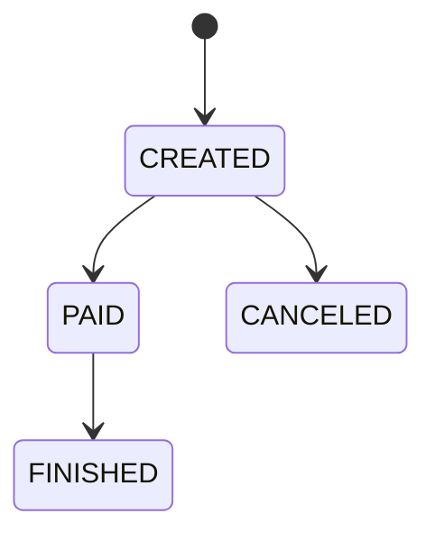

# Process Spec: {流程名称}

> 模板级别：**Full**（核心业务流程）
> 适用于涉及状态机、并发、金额计算（Decimal）、幂等性的业务操作。

---

## 0. Meta

| 项目         | 值                         |
| ------------ | -------------------------- |
| 流程名称     | {例：创建订单}             |
| 流程编号     | {例：ORDER_CREATE_V1}      |
| 负责人       | {xxx}                      |
| 最后修改     | {YYYY-MM-DD}               |
| 影响系统     | {Web / App / Mini / Admin} |
| 是否核心链路 | {是 / 否}                  |
| Spec 级别    | Full                       |

用于变更评审 / 回滚 / 风险评估。

---

## 1. Why（流程目标）

**目标**：

- {目标 1：例：在保证库存与金额一致性的前提下创建订单}
- {目标 2：例：支持 0 元 / 实付订单}
- {目标 3：例：支持并发下单与幂等重试}

**必须回答**：

- 不做这一步会发生什么？
- 哪些错误是不可接受的？

---

## 2. Input Contract

```typescript
interface {Action}Input {
  // 定义完整的输入参数类型
  // Decimal 字段须标注精度规则
}
```

### 输入规则（必须枚举）

| 字段     | 规则                 | Rule ID          |
| -------- | -------------------- | ---------------- |
| {field1} | {类型 / 精度 / 范围} | R-IN-{DOMAIN}-01 |
| {field2} | {必填 / 可选 / 格式} | R-IN-{DOMAIN}-02 |

---

## 3. PreConditions

> 前置条件失败 **不得产生任何副作用**。

| 编号 | 前置条件                                | 失败响应 | Rule ID           |
| ---- | --------------------------------------- | -------- | ----------------- |
| P1   | {例：用户必须存在且未被禁用}            | 403      | R-PRE-{DOMAIN}-01 |
| P2   | {例：SKU 必须可售}                      | 404      | R-PRE-{DOMAIN}-02 |
| P3   | {例：库存 >= 购买数量}                  | 409      | R-PRE-{DOMAIN}-03 |
| P4   | {例：相同 clientRequestId 不可重复创建} | 409      | R-PRE-{DOMAIN}-04 |

---

## 4. Happy Path（主干流程）

| 步骤 | 操作                    | 产出           | Rule ID            |
| ---- | ----------------------- | -------------- | ------------------ |
| S1   | {例：创建订单记录}      | 状态 = CREATED | R-FLOW-{DOMAIN}-01 |
| S2   | {例：计算订单金额}      | Decimal 精确值 | R-FLOW-{DOMAIN}-02 |
| S3   | {例：锁定库存}          | 库存扣减       | R-FLOW-{DOMAIN}-03 |
| S4   | {例：判断是否 0 元订单} | 进入分支       | R-FLOW-{DOMAIN}-04 |

---

## 5. Branch Rules（分支规则）

每个分支必须说明：触发条件、跳转节点、最终状态。

| 编号 | 触发条件               | 跳转     | 最终状态 | Rule ID              |
| ---- | ---------------------- | -------- | -------- | -------------------- |
| B1   | {例：totalAmount == 0} | 跳过支付 | PAID     | R-BRANCH-{DOMAIN}-01 |
| B2   | {例：商品类型 = 虚拟}  | 自动发货 | FINISHED | R-BRANCH-{DOMAIN}-02 |
| B3   | {例：商品类型 = 实物}  | 等待支付 | CREATED  | R-BRANCH-{DOMAIN}-03 |

---

## 6. State Machine（状态机定义）



### 状态转换规则

| From    | To       | 允许 | 触发条件 | Rule ID             |
| ------- | -------- | ---- | -------- | ------------------- |
| CREATED | PAID     | 是   | 支付成功 | R-STATE-{DOMAIN}-01 |
| CREATED | FINISHED | 否   | —        | R-STATE-{DOMAIN}-02 |
| PAID    | CANCELED | 否   | —        | R-STATE-{DOMAIN}-03 |

---

## 7. Exception Strategy（异常与补偿策略）

| 场景               | 策略              | 补偿操作     | Rule ID              |
| ------------------ | ----------------- | ------------ | -------------------- |
| {例：锁库存失败}   | 回滚              | 删除订单记录 | R-TXN-{DOMAIN}-01    |
| {例：金额计算异常} | 终止              | 无副作用     | R-TXN-{DOMAIN}-02    |
| {例：并发冲突}     | 重试（最多 3 次） | —            | R-CONCUR-{DOMAIN}-01 |
| {例：DB 超时}      | 标记 UNKNOWN      | 人工介入     | R-TXN-{DOMAIN}-03    |

---

## 8. Idempotency（幂等与并发规则）

| 项目         | 规则                               | Rule ID              |
| ------------ | ---------------------------------- | -------------------- |
| 幂等键       | {例：clientRequestId + userId}     | R-PRE-{DOMAIN}-04    |
| 重复请求行为 | {例：返回第一次结果，不重复执行}   | —                    |
| 并发控制     | {例：分布式锁 / 乐观锁 / 唯一约束} | R-CONCUR-{DOMAIN}-02 |

---

## 9. Observability（可观测性要求）

| 要求     | 说明                              | Rule ID           |
| -------- | --------------------------------- | ----------------- |
| 步骤追踪 | {例：每个步骤记录 step + orderId} | R-LOG-{DOMAIN}-01 |
| 金额日志 | {例：金额相关必须记录原始入参}    | R-LOG-{DOMAIN}-02 |
| 异常标识 | {例：所有异常必须带 errorCode}    | R-LOG-{DOMAIN}-03 |

---

## 10. Test Mapping（测试用例映射表）

### 输入与精度（R-IN-\*）

| Rule ID          | 测试 ID | Given      | When     | Then       |
| ---------------- | ------- | ---------- | -------- | ---------- |
| R-IN-{DOMAIN}-01 | TC-01   | {示例输入} | {action} | {预期结果} |
| R-IN-{DOMAIN}-01 | TC-02   | {边界输入} | {action} | {预期结果} |

### 前置条件（R-PRE-\*）

| Rule ID           | 测试 ID | Given        | When     | Then     |
| ----------------- | ------- | ------------ | -------- | -------- |
| R-PRE-{DOMAIN}-01 | TC-10   | {前置不满足} | {action} | {错误码} |

### 主干流程（R-FLOW-\*）

| Rule ID            | 测试 ID | Given    | When     | Then           |
| ------------------ | ------- | -------- | -------- | -------------- |
| R-FLOW-{DOMAIN}-01 | TC-15   | 合法输入 | {action} | 状态 = CREATED |

### 分支规则（R-BRANCH-\*）

| Rule ID              | 测试 ID | Given   | When     | Then        |
| -------------------- | ------- | ------- | -------- | ----------- |
| R-BRANCH-{DOMAIN}-01 | TC-19   | total=0 | {action} | 状态 = PAID |

### 状态机（R-STATE-\*）

| Rule ID             | 测试 ID | Given              | When        | Then |
| ------------------- | ------- | ------------------ | ----------- | ---- |
| R-STATE-{DOMAIN}-01 | TC-23   | CREATED → FINISHED | updateState | 400  |

### 并发与事务（R-CONCUR-_ / R-TXN-_）

| Rule ID              | 测试 ID | Given      | When             | Then      |
| -------------------- | ------- | ---------- | ---------------- | --------- |
| R-CONCUR-{DOMAIN}-01 | TC-25   | stock=1    | 并发 {action} x2 | 仅 1 成功 |
| R-TXN-{DOMAIN}-01    | TC-27   | 锁库存失败 | {action}         | 订单回滚  |

### 返回与可观测性（R-RESP-_ / R-LOG-_）

| Rule ID            | 测试 ID | Given    | When      | Then             |
| ------------------ | ------- | -------- | --------- | ---------------- |
| R-RESP-{DOMAIN}-01 | TC-29   | 查询订单 | getDetail | amount 为 string |
| R-LOG-{DOMAIN}-01  | TC-31   | 精度异常 | {action}  | 有原始入参日志   |
