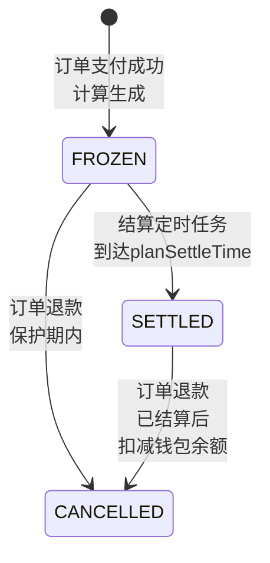

# Process Spec: 佣金计算

> 模板级别：**Full**（核心业务流程）
> 涉及金额计算（Decimal）、并发控制、状态机、异步队列

---

## 0. Meta

| 项目         | 值                         |
| ------------ | -------------------------- |
| 流程名称     | 佣金计算（L1/L2 两级分佣） |
| 流程编号     | COMMISSION_CALCULATE_V1    |
| 负责人       | Finance Team               |
| 最后修改     | 2026-03-03                 |
| 影响系统     | Backend                    |
| 是否核心链路 | 是                         |
| Spec 级别    | Full                       |

---

## 1. Why（流程目标）

**目标**：

- 订单支付成功后，根据分销配置和推荐关系链计算佣金
- 支持两级分佣（L1 直推、L2 间推）
- 防止并发超发，确保佣金总额不超过订单金额的 50%
- 通过 BullMQ 异步队列解耦，不阻塞订单主流程

**必须回答**：

- 不做这一步会发生什么？→ 分销商无法获得佣金，影响分销体系
- 哪些错误是不可接受的？→ 佣金超发、并发漏洞、重复计算

---

## 2. Input Contract

```typescript
interface TriggerCalculationInput {
  orderId: string; // 订单 ID
  tenantId: string; // 租户 ID
}

interface CalculateCommissionInput {
  orderId: string; // 订单 ID
  tenantId: string; // 租户 ID
}

interface CancelCommissionsInput {
  orderId: string; // 订单 ID
  tenantId: string; // 租户 ID
}
```

### 输入规则（必须枚举）

| 字段     | 规则                | Rule ID            |
| -------- | ------------------- | ------------------ |
| orderId  | 必填，有效的订单 ID | R-IN-COMMISSION-01 |
| tenantId | 必填，有效的租户 ID | R-IN-COMMISSION-02 |

---

## 3. PreConditions

> 前置条件失败 **不得产生任何副作用**。

| 编号 | 前置条件                                    | 失败响应 | Rule ID             |
| ---- | ------------------------------------------- | -------- | ------------------- |
| P1   | 订单必须存在且已支付                        | 404      | R-PRE-COMMISSION-01 |
| P2   | 分销功能必须启用                            | —        | R-PRE-COMMISSION-02 |
| P3   | 订单必须有分享人（shareUserId）             | —        | R-PRE-COMMISSION-03 |
| P4   | 分享人不在黑名单中                          | —        | R-PRE-COMMISSION-04 |
| P5   | 自购检测：buyerId != shareUserId 或允许自购 | —        | R-PRE-COMMISSION-05 |
| P6   | 跨店限额未超出                              | —        | R-PRE-COMMISSION-06 |
| P7   | 佣金总额 <= 订单金额 × 50%（熔断）          | —        | R-PRE-COMMISSION-07 |

---

## 4. Happy Path（主干流程）

### 4.1 触发佣金计算（triggerCalculation）

| 步骤 | 操作                   | 产出     | Rule ID              |
| ---- | ---------------------- | -------- | -------------------- |
| S1   | 推送任务到 BullMQ 队列 | 队列任务 | R-FLOW-COMMISSION-01 |
| S2   | 返回订单主流程         | 不阻塞   | R-FLOW-COMMISSION-02 |

### 4.2 异步计算佣金（calculateCommission）

| 步骤 | 操作               | 产出           | Rule ID              |
| ---- | ------------------ | -------------- | -------------------- |
| S1   | 查询订单信息       | 订单记录       | R-FLOW-COMMISSION-03 |
| S2   | 查询分销配置       | 分销规则       | R-FLOW-COMMISSION-04 |
| S3   | 获取订单商品明细   | 商品列表       | R-FLOW-COMMISSION-05 |
| S4   | 获取分享人信息     | 分享人会员信息 | R-FLOW-COMMISSION-06 |
| S5   | 自购检测           | 通过/跳过      | R-FLOW-COMMISSION-07 |
| S6   | 黑名单校验         | 通过/跳过      | R-FLOW-COMMISSION-08 |
| S7   | 计算 L1 直推佣金   | L1 佣金金额    | R-FLOW-COMMISSION-09 |
| S8   | 跨店限额校验（L1） | 通过/记录警告  | R-FLOW-COMMISSION-10 |
| S9   | 生成 L1 佣金记录   | 状态 = FROZEN  | R-FLOW-COMMISSION-11 |
| S10  | 检查 L2 推荐人     | 存在/不存在    | R-FLOW-COMMISSION-12 |
| S11  | 计算 L2 间推佣金   | L2 佣金金额    | R-FLOW-COMMISSION-13 |
| S12  | 跨店限额校验（L2） | 通过/记录警告  | R-FLOW-COMMISSION-14 |
| S13  | 生成 L2 佣金记录   | 状态 = FROZEN  | R-FLOW-COMMISSION-15 |
| S14  | 佣金上限熔断校验   | 通过/调整金额  | R-FLOW-COMMISSION-16 |

---

## 5. Branch Rules（分支规则）

| 编号 | 触发条件             | 跳转       | 最终状态   | Rule ID                |
| ---- | -------------------- | ---------- | ---------- | ---------------------- |
| B1   | 分销功能未启用       | 结束       | 不生成佣金 | R-BRANCH-COMMISSION-01 |
| B2   | 无分享人             | 结束       | 不生成佣金 | R-BRANCH-COMMISSION-02 |
| B3   | 分享人在黑名单       | 结束       | 不生成佣金 | R-BRANCH-COMMISSION-03 |
| B4   | 自购且不允许自购     | 结束       | 不生成佣金 | R-BRANCH-COMMISSION-04 |
| B5   | L1 佣金 = 0          | 跳过 L1    | 检查 L2    | R-BRANCH-COMMISSION-05 |
| B6   | L1 超出跨店限额      | 记录警告   | 不生成 L1  | R-BRANCH-COMMISSION-06 |
| B7   | 无 L2 推荐人         | 结束       | 仅 L1 佣金 | R-BRANCH-COMMISSION-07 |
| B8   | L2 佣金 = 0          | 结束       | 仅 L1 佣金 | R-BRANCH-COMMISSION-08 |
| B9   | L2 超出跨店限额      | 记录警告   | 不生成 L2  | R-BRANCH-COMMISSION-09 |
| B10  | 佣金总额超过订单 50% | 按比例调整 | 调整后生成 | R-BRANCH-COMMISSION-10 |

---

## 6. State Machine（状态机定义）



### 状态转换规则

| From      | To        | 允许 | 触发条件                 | Rule ID               |
| --------- | --------- | ---- | ------------------------ | --------------------- |
| FROZEN    | SETTLED   | 是   | 结算定时任务             | R-STATE-COMMISSION-01 |
| FROZEN    | CANCELLED | 是   | 订单退款                 | R-STATE-COMMISSION-02 |
| SETTLED   | CANCELLED | 是   | 订单退款（扣减钱包余额） | R-STATE-COMMISSION-03 |
| CANCELLED | \*        | 否   | —                        | R-STATE-COMMISSION-04 |

---

## 7. Exception Strategy（异常与补偿策略）

| 场景             | 策略 | 补偿操作       | Rule ID                |
| ---------------- | ---- | -------------- | ---------------------- |
| 订单不存在       | 终止 | 无副作用       | R-TXN-COMMISSION-01    |
| 分销配置不存在   | 终止 | 无副作用       | R-TXN-COMMISSION-02    |
| 佣金回滚余额不足 | 标记 | 待回收台账     | R-TXN-COMMISSION-03    |
| 数据库事务失败   | 回滚 | 自动回滚       | R-TXN-COMMISSION-04    |
| BullMQ 任务失败  | 重试 | 最多 3 次重试  | R-TXN-COMMISSION-05    |
| 跨店限额并发冲突 | 重试 | 使用计数器表   | R-CONCUR-COMMISSION-01 |
| 死锁风险         | 预防 | 按 ID 升序锁定 | R-CONCUR-COMMISSION-02 |

---

## 8. Idempotency（幂等与并发规则）

| 项目         | 规则                                 | Rule ID                |
| ------------ | ------------------------------------ | ---------------------- |
| 幂等键       | orderId + userId + level（唯一约束） | R-PRE-COMMISSION-08    |
| 重复请求行为 | upsert 不重复生成，返回已存在记录    | —                      |
| 并发控制     | fin_user_daily_quota 计数器表 + 行锁 | R-CONCUR-COMMISSION-03 |
| 跨店限额     | SELECT FOR UPDATE 锁定用户配额行     | R-CONCUR-COMMISSION-04 |

---

## 9. Observability（可观测性要求）

| 要求     | 说明                                 | Rule ID             |
| -------- | ------------------------------------ | ------------------- |
| 步骤追踪 | 每个步骤记录 step + orderId + userId | R-LOG-COMMISSION-01 |
| 金额日志 | 佣金计算必须记录原始入参和计算结果   | R-LOG-COMMISSION-02 |
| 异常标识 | 所有异常必须带 errorCode             | R-LOG-COMMISSION-03 |
| 跨店限额 | 超出限额时记录警告日志               | R-LOG-COMMISSION-04 |

---

## 10. Test Mapping（测试用例映射表）

### 输入校验（R-IN-\*）

| Rule ID            | 测试 ID | Given         | When               | Then         |
| ------------------ | ------- | ------------- | ------------------ | ------------ |
| R-IN-COMMISSION-01 | TC-01   | orderId 为空  | triggerCalculation | 400 参数错误 |
| R-IN-COMMISSION-02 | TC-02   | tenantId 为空 | triggerCalculation | 400 参数错误 |

### 前置条件（R-PRE-\*）

| Rule ID             | 测试 ID | Given           | When                | Then       |
| ------------------- | ------- | --------------- | ------------------- | ---------- |
| R-PRE-COMMISSION-01 | TC-10   | 订单不存在      | calculateCommission | 不生成佣金 |
| R-PRE-COMMISSION-02 | TC-11   | 分销功能未启用  | calculateCommission | 不生成佣金 |
| R-PRE-COMMISSION-03 | TC-12   | 无分享人        | calculateCommission | 不生成佣金 |
| R-PRE-COMMISSION-04 | TC-13   | 分享人在黑名单  | calculateCommission | 不生成佣金 |
| R-PRE-COMMISSION-05 | TC-14   | 自购且不允许    | calculateCommission | 不生成佣金 |
| R-PRE-COMMISSION-06 | TC-15   | 超出跨店限额    | calculateCommission | 记录警告   |
| R-PRE-COMMISSION-07 | TC-16   | 佣金超过订单50% | calculateCommission | 按比例调整 |

### 主干流程（R-FLOW-\*）

| Rule ID              | 测试 ID | Given         | When                | Then               |
| -------------------- | ------- | ------------- | ------------------- | ------------------ |
| R-FLOW-COMMISSION-01 | TC-20   | 订单支付成功  | triggerCalculation  | 任务入队           |
| R-FLOW-COMMISSION-09 | TC-21   | L1 比例 10%   | calculateCommission | L1 佣金 = 订单×10% |
| R-FLOW-COMMISSION-11 | TC-22   | L1 佣金 > 0   | calculateCommission | 生成 FROZEN 记录   |
| R-FLOW-COMMISSION-13 | TC-23   | L2 比例 5%    | calculateCommission | L2 佣金 = 订单×5%  |
| R-FLOW-COMMISSION-15 | TC-24   | L2 佣金 > 0   | calculateCommission | 生成 FROZEN 记录   |
| R-FLOW-COMMISSION-16 | TC-25   | 佣金总额超50% | calculateCommission | 按比例调整         |

### 分支规则（R-BRANCH-\*）

| Rule ID                | 测试 ID | Given        | When                | Then       |
| ---------------------- | ------- | ------------ | ------------------- | ---------- |
| R-BRANCH-COMMISSION-01 | TC-30   | 分销未启用   | calculateCommission | 不生成佣金 |
| R-BRANCH-COMMISSION-04 | TC-31   | 自购且不允许 | calculateCommission | 不生成佣金 |
| R-BRANCH-COMMISSION-07 | TC-32   | 无 L2 推荐人 | calculateCommission | 仅生成 L1  |
| R-BRANCH-COMMISSION-10 | TC-33   | 佣金超过50%  | calculateCommission | 按比例调整 |

### 状态机（R-STATE-\*）

| Rule ID               | 测试 ID | Given          | When     | Then           |
| --------------------- | ------- | -------------- | -------- | -------------- |
| R-STATE-COMMISSION-01 | TC-40   | FROZEN 状态    | 结算任务 | 变为 SETTLED   |
| R-STATE-COMMISSION-02 | TC-41   | FROZEN 状态    | 订单退款 | 变为 CANCELLED |
| R-STATE-COMMISSION-03 | TC-42   | SETTLED 状态   | 订单退款 | 变为 CANCELLED |
| R-STATE-COMMISSION-04 | TC-43   | CANCELLED 状态 | 任何操作 | 状态不变       |

### 并发与事务（R-CONCUR-_ / R-TXN-_）

| Rule ID                | 测试 ID | Given           | When                | Then       |
| ---------------------- | ------- | --------------- | ------------------- | ---------- |
| R-CONCUR-COMMISSION-01 | TC-50   | 跨店限额=100    | 并发计算 x2         | 不超发     |
| R-CONCUR-COMMISSION-02 | TC-51   | A推荐B且B推荐A  | 同时产生订单        | 无死锁     |
| R-TXN-COMMISSION-03    | TC-52   | 余额不足        | cancelCommissions   | 标记待回收 |
| R-TXN-COMMISSION-04    | TC-53   | DB 事务失败     | calculateCommission | 自动回滚   |
| R-TXN-COMMISSION-05    | TC-54   | BullMQ 任务失败 | triggerCalculation  | 自动重试   |

### 可观测性（R-LOG-\*）

| Rule ID             | 测试 ID | Given    | When                | Then               |
| ------------------- | ------- | -------- | ------------------- | ------------------ |
| R-LOG-COMMISSION-01 | TC-60   | 正常计算 | calculateCommission | 日志包含 step 信息 |
| R-LOG-COMMISSION-02 | TC-61   | 正常计算 | calculateCommission | 日志包含金额信息   |
| R-LOG-COMMISSION-04 | TC-62   | 超出限额 | calculateCommission | 记录警告日志       |
