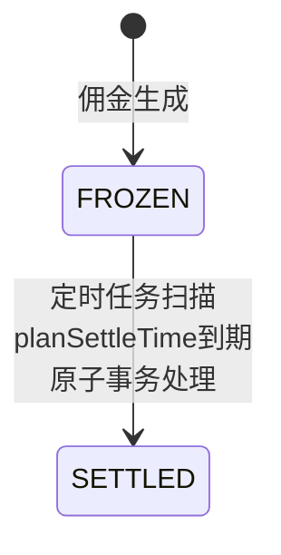

# Process Spec: 佣金结算

> 模板级别：**Full**（核心业务流程）
> 涉及状态机、分布式锁、批量处理、金额计算

---

## 0. Meta

| 项目         | 值                       |
| ------------ | ------------------------ |
| 流程名称     | 佣金结算（定时任务入账） |
| 流程编号     | SETTLEMENT_SETTLE_V1     |
| 负责人       | Finance Team             |
| 最后修改     | 2026-03-03               |
| 影响系统     | Backend                  |
| 是否核心链路 | 是                       |
| Spec 级别    | Full                     |

---

## 1. Why（流程目标）

**目标**：

- 将冻结状态的佣金在保护期结束后自动解冻并入账到用户钱包
- 在单一事务内完成佣金状态更新、钱包余额增加、交易流水记录
- 通过分布式锁保障多实例部署时的并发安全

**必须回答**：

- 不做这一步会发生什么？→ 佣金永远处于冻结状态，用户无法提现
- 哪些错误是不可接受的？→ 重复结算、漏结算、余额不一致

---

## 2. Input Contract

```typescript
interface SettleJobInput {
  // 定时任务无外部输入
}

interface SettleOneInput {
  commission: Commission; // 待结算的佣金记录
}

interface ManualSettleInput {
  commissionIds: string[]; // 手动触发结算的佣金 ID 列表
  tenantId: string; // 租户 ID
}
```

### 输入规则（必须枚举）

| 字段          | 规则                 | Rule ID            |
| ------------- | -------------------- | ------------------ |
| commission    | 必填，有效的佣金记录 | R-IN-SETTLEMENT-01 |
| commissionIds | 手动结算时必填       | R-IN-SETTLEMENT-02 |
| tenantId      | 手动结算时必填       | R-IN-SETTLEMENT-03 |

---

## 3. PreConditions

> 前置条件失败 **不得产生任何副作用**。

| 编号 | 前置条件                   | 失败响应 | Rule ID             |
| ---- | -------------------------- | -------- | ------------------- |
| P1   | 佣金状态必须为 FROZEN      | 跳过     | R-PRE-SETTLEMENT-01 |
| P2   | planSettleTime <= NOW      | 跳过     | R-PRE-SETTLEMENT-02 |
| P3   | 关联订单未退款（状态校验） | 跳过     | R-PRE-SETTLEMENT-03 |
| P4   | 分布式锁获取成功           | 跳过     | R-PRE-SETTLEMENT-04 |

---

## 4. Happy Path（主干流程）

### 4.1 定时任务入口（settleJob）

| 步骤 | 操作                    | 产出        | Rule ID              |
| ---- | ----------------------- | ----------- | -------------------- |
| S1   | 尝试获取 Redis 分布式锁 | 锁获取结果  | R-FLOW-SETTLEMENT-01 |
| S2   | 查询到期佣金（分批）    | 佣金列表    | R-FLOW-SETTLEMENT-02 |
| S3   | 遍历调用 settleOne      | 逐条处理    | R-FLOW-SETTLEMENT-03 |
| S4   | 记录统计信息            | 成功/失败数 | R-FLOW-SETTLEMENT-04 |
| S5   | 释放分布式锁            | 锁释放      | R-FLOW-SETTLEMENT-05 |

### 4.2 单笔结算处理（settleOne）

| 步骤 | 操作                           | 产出               | Rule ID              |
| ---- | ------------------------------ | ------------------ | -------------------- |
| S1   | 开启数据库事务                 | 事务开始           | R-FLOW-SETTLEMENT-06 |
| S2   | 重新查询佣金状态（FOR UPDATE） | 状态校验           | R-FLOW-SETTLEMENT-07 |
| S3   | 校验关联订单状态               | 订单未退款         | R-FLOW-SETTLEMENT-08 |
| S4   | 更新佣金状态为 SETTLED         | 状态变更           | R-FLOW-SETTLEMENT-09 |
| S5   | 增加钱包余额                   | balance += amount  | R-FLOW-SETTLEMENT-10 |
| S6   | 创建交易流水                   | COMMISSION_IN 流水 | R-FLOW-SETTLEMENT-11 |
| S7   | 提交事务                       | 事务提交           | R-FLOW-SETTLEMENT-12 |

---

## 5. Branch Rules（分支规则）

| 编号 | 触发条件          | 跳转         | 最终状态   | Rule ID                |
| ---- | ----------------- | ------------ | ---------- | ---------------------- |
| B1   | 获取锁失败        | 跳过本次执行 | 等待下次   | R-BRANCH-SETTLEMENT-01 |
| B2   | 无待结算佣金      | 结束         | 无操作     | R-BRANCH-SETTLEMENT-02 |
| B3   | 佣金状态非 FROZEN | 跳过该条     | 继续下一条 | R-BRANCH-SETTLEMENT-03 |
| B4   | 关联订单已退款    | 跳过该条     | 继续下一条 | R-BRANCH-SETTLEMENT-04 |
| B5   | 单条结算失败      | 记录错误     | 继续下一条 | R-BRANCH-SETTLEMENT-05 |
| B6   | 钱包不存在        | 自动创建     | 继续结算   | R-BRANCH-SETTLEMENT-06 |

---

## 6. State Machine（状态机定义）



### 状态转换规则

| From   | To      | 允许 | 触发条件            | Rule ID               |
| ------ | ------- | ---- | ------------------- | --------------------- |
| FROZEN | SETTLED | 是   | planSettleTime 到期 | R-STATE-SETTLEMENT-01 |

---

## 7. Exception Strategy（异常与补偿策略）

| 场景           | 策略       | 补偿操作     | Rule ID                |
| -------------- | ---------- | ------------ | ---------------------- |
| 锁超时         | 看门狗续期 | 自动续期     | R-TXN-SETTLEMENT-01    |
| 单条结算失败   | 重试       | 指数退避重试 | R-TXN-SETTLEMENT-02    |
| 数据库事务失败 | 回滚       | 自动回滚     | R-TXN-SETTLEMENT-03    |
| 钱包服务异常   | 重试       | 最多 3 次    | R-TXN-SETTLEMENT-04    |
| 批量处理中断   | 断点续传   | 记录进度     | R-TXN-SETTLEMENT-05    |
| 并发重入       | 锁保护     | 跳过执行     | R-CONCUR-SETTLEMENT-01 |
| 重复结算       | 状态校验   | 跳过该条     | R-CONCUR-SETTLEMENT-02 |

---

## 8. Idempotency（幂等与并发规则）

| 项目         | 规则                        | Rule ID                |
| ------------ | --------------------------- | ---------------------- |
| 幂等键       | commissionId（状态校验）    | R-PRE-SETTLEMENT-01    |
| 重复请求行为 | 状态非 FROZEN 则跳过        | —                      |
| 并发控制     | Redis 分布式锁 + 看门狗续期 | R-CONCUR-SETTLEMENT-03 |
| 状态校验     | 事务内 SELECT FOR UPDATE    | R-CONCUR-SETTLEMENT-04 |

---

## 9. Observability（可观测性要求）

| 要求     | 说明                             | Rule ID             |
| -------- | -------------------------------- | ------------------- |
| 步骤追踪 | 每个步骤记录 step + commissionId | R-LOG-SETTLEMENT-01 |
| 统计信息 | 每次任务记录成功/失败数量        | R-LOG-SETTLEMENT-02 |
| 异常标识 | 所有异常必须带 errorCode         | R-LOG-SETTLEMENT-03 |
| 性能监控 | 记录批次处理耗时                 | R-LOG-SETTLEMENT-04 |

---

## 10. Test Mapping（测试用例映射表）

### 输入校验（R-IN-\*）

| Rule ID            | 测试 ID | Given              | When         | Then         |
| ------------------ | ------- | ------------------ | ------------ | ------------ |
| R-IN-SETTLEMENT-01 | TC-01   | commission 为空    | settleOne    | 跳过         |
| R-IN-SETTLEMENT-02 | TC-02   | commissionIds 为空 | manualSettle | 400 参数错误 |

### 前置条件（R-PRE-\*）

| Rule ID             | 测试 ID | Given                | When      | Then     |
| ------------------- | ------- | -------------------- | --------- | -------- |
| R-PRE-SETTLEMENT-01 | TC-10   | 状态非 FROZEN        | settleOne | 跳过该条 |
| R-PRE-SETTLEMENT-02 | TC-11   | planSettleTime > NOW | settleJob | 不处理   |
| R-PRE-SETTLEMENT-03 | TC-12   | 订单已退款           | settleOne | 跳过该条 |
| R-PRE-SETTLEMENT-04 | TC-13   | 获取锁失败           | settleJob | 跳过本次 |

### 主干流程（R-FLOW-\*）

| Rule ID              | 测试 ID | Given       | When      | Then               |
| -------------------- | ------- | ----------- | --------- | ------------------ |
| R-FLOW-SETTLEMENT-01 | TC-20   | 锁可用      | settleJob | 获取锁成功         |
| R-FLOW-SETTLEMENT-02 | TC-21   | 有到期佣金  | settleJob | 查询到佣金列表     |
| R-FLOW-SETTLEMENT-07 | TC-22   | FROZEN 状态 | settleOne | 状态校验通过       |
| R-FLOW-SETTLEMENT-09 | TC-23   | 结算成功    | settleOne | 状态变为 SETTLED   |
| R-FLOW-SETTLEMENT-10 | TC-24   | 结算成功    | settleOne | 钱包余额增加       |
| R-FLOW-SETTLEMENT-11 | TC-25   | 结算成功    | settleOne | 创建 COMMISSION_IN |

### 分支规则（R-BRANCH-\*）

| Rule ID                | 测试 ID | Given         | When      | Then         |
| ---------------------- | ------- | ------------- | --------- | ------------ |
| R-BRANCH-SETTLEMENT-01 | TC-30   | 锁被占用      | settleJob | 跳过本次执行 |
| R-BRANCH-SETTLEMENT-02 | TC-31   | 无待结算佣金  | settleJob | 无操作       |
| R-BRANCH-SETTLEMENT-03 | TC-32   | 状态非 FROZEN | settleOne | 跳过该条     |
| R-BRANCH-SETTLEMENT-04 | TC-33   | 订单已退款    | settleOne | 跳过该条     |
| R-BRANCH-SETTLEMENT-05 | TC-34   | 单条失败      | settleJob | 继续下一条   |
| R-BRANCH-SETTLEMENT-06 | TC-35   | 钱包不存在    | settleOne | 自动创建     |

### 状态机（R-STATE-\*）

| Rule ID               | 测试 ID | Given       | When      | Then         |
| --------------------- | ------- | ----------- | --------- | ------------ |
| R-STATE-SETTLEMENT-01 | TC-40   | FROZEN 状态 | settleOne | 变为 SETTLED |

### 并发与事务（R-CONCUR-_ / R-TXN-_）

| Rule ID                | 测试 ID | Given            | When         | Then          |
| ---------------------- | ------- | ---------------- | ------------ | ------------- |
| R-CONCUR-SETTLEMENT-01 | TC-50   | 多实例同时执行   | settleJob    | 仅 1 个执行   |
| R-CONCUR-SETTLEMENT-02 | TC-51   | 同一佣金并发结算 | settleOne x2 | 仅 1 次成功   |
| R-CONCUR-SETTLEMENT-04 | TC-52   | 事务内状态变更   | settleOne    | FOR UPDATE 锁 |
| R-TXN-SETTLEMENT-01    | TC-53   | 锁即将超时       | settleJob    | 自动续期      |
| R-TXN-SETTLEMENT-02    | TC-54   | 单条失败         | settleOne    | 指数退避重试  |
| R-TXN-SETTLEMENT-03    | TC-55   | DB 事务失败      | settleOne    | 自动回滚      |
| R-TXN-SETTLEMENT-05    | TC-56   | 批量处理中断     | settleJob    | 断点续传      |

### 可观测性（R-LOG-\*）

| Rule ID             | 测试 ID | Given    | When      | Then               |
| ------------------- | ------- | -------- | --------- | ------------------ |
| R-LOG-SETTLEMENT-01 | TC-60   | 正常结算 | settleOne | 日志包含 step 信息 |
| R-LOG-SETTLEMENT-02 | TC-61   | 批次完成 | settleJob | 记录统计信息       |
| R-LOG-SETTLEMENT-04 | TC-62   | 批次完成 | settleJob | 记录处理耗时       |
