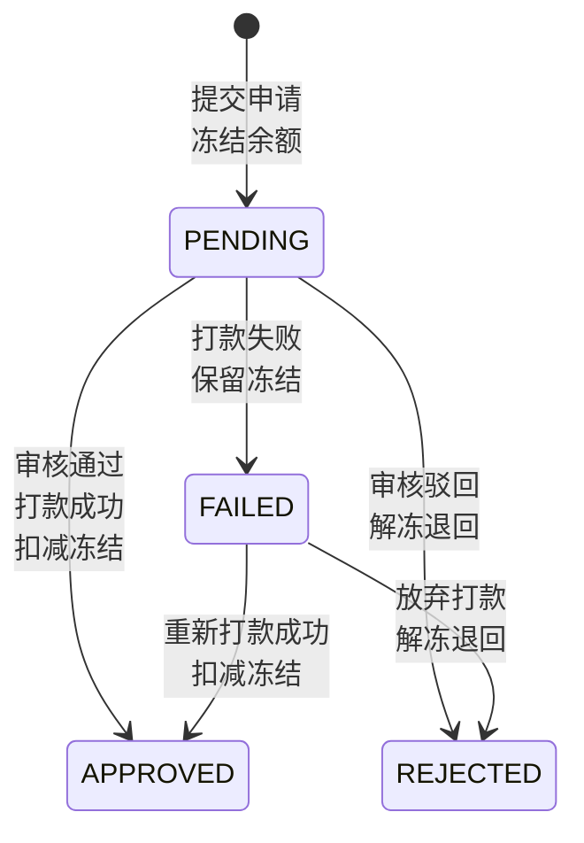

# Process Spec: 提现申请

> 模板级别：**Full**（核心业务流程）
> 涉及状态机、金额计算、三方支付对接、并发控制

---

## 0. Meta

| 项目         | 值                       |
| ------------ | ------------------------ |
| 流程名称     | 提现申请与审核           |
| 流程编号     | WITHDRAWAL_APPLY_V1      |
| 负责人       | Finance Team             |
| 最后修改     | 2026-03-03               |
| 影响系统     | Backend / Admin / Client |
| 是否核心链路 | 是                       |
| Spec 级别    | Full                     |

---

## 1. Why（流程目标）

**目标**：

- 用户可申请将钱包余额提现到银行卡/微信零钱
- 申请即冻结，防止超额提现
- 支持人工审核和自动审核两种模式
- 对接三方支付接口完成打款

**必须回答**：

- 不做这一步会发生什么？→ 用户无法将佣金变现，影响分销积极性
- 哪些错误是不可接受的？→ 重复提现、超额提现、打款失败资金丢失

---

## 2. Input Contract

```typescript
interface ApplyWithdrawalInput {
  userId: string; // 用户 ID
  amount: Decimal; // 提现金额，精度 2 位，> 0
  tenantId: string; // 租户 ID
}

interface AuditWithdrawalInput {
  withdrawalId: string; // 提现申请 ID
  action: 'approve' | 'reject'; // 审核动作
  remark?: string; // 审核备注
  operatorId: string; // 操作人 ID
}
```

### 输入规则（必须枚举）

| 字段         | 规则                          | Rule ID            |
| ------------ | ----------------------------- | ------------------ |
| userId       | 必填，有效的用户 ID           | R-IN-WITHDRAWAL-01 |
| amount       | 必填，Decimal，精度 2 位，> 0 | R-IN-WITHDRAWAL-02 |
| amount       | >= 最小提现金额（配置化）     | R-IN-WITHDRAWAL-03 |
| amount       | <= 最大提现金额（配置化）     | R-IN-WITHDRAWAL-04 |
| withdrawalId | 审核时必填                    | R-IN-WITHDRAWAL-05 |
| action       | 审核时必填，approve/reject    | R-IN-WITHDRAWAL-06 |

---

## 3. PreConditions

> 前置条件失败 **不得产生任何副作用**。

| 编号 | 前置条件                       | 失败响应 | Rule ID             |
| ---- | ------------------------------ | -------- | ------------------- |
| P1   | 用户钱包必须存在               | 404      | R-PRE-WITHDRAWAL-01 |
| P2   | 余额充足：balance >= amount    | 409      | R-PRE-WITHDRAWAL-02 |
| P3   | 单日提现次数未超限             | 429      | R-PRE-WITHDRAWAL-03 |
| P4   | 单日提现金额未超限             | 429      | R-PRE-WITHDRAWAL-04 |
| P5   | 防重：1 秒内不可重复提交       | 429      | R-PRE-WITHDRAWAL-05 |
| P6   | 审核时：提现状态必须为 PENDING | 400      | R-PRE-WITHDRAWAL-06 |

---

## 4. Happy Path（主干流程）

### 4.1 提现申请（apply）

| 步骤 | 操作                    | 产出           | Rule ID              |
| ---- | ----------------------- | -------------- | -------------------- |
| S1   | 防重校验（Redis setnx） | 通过           | R-FLOW-WITHDRAWAL-01 |
| S2   | 校验提现金额            | 金额合法       | R-FLOW-WITHDRAWAL-02 |
| S3   | 校验单日限额            | 未超限         | R-FLOW-WITHDRAWAL-03 |
| S4   | 开启数据库事务          | 事务开始       | R-FLOW-WITHDRAWAL-04 |
| S5   | 冻结提现金额            | balance→frozen | R-FLOW-WITHDRAWAL-05 |
| S6   | 创建提现记录            | 状态 = PENDING | R-FLOW-WITHDRAWAL-06 |
| S7   | 提交事务                | 事务提交       | R-FLOW-WITHDRAWAL-07 |

### 4.2 审核通过（approve）

| 步骤 | 操作                | 产出              | Rule ID              |
| ---- | ------------------- | ----------------- | -------------------- |
| S1   | 查询提现记录        | 提现记录          | R-FLOW-WITHDRAWAL-08 |
| S2   | 校验状态为 PENDING  | 状态合法          | R-FLOW-WITHDRAWAL-09 |
| S3   | 调用三方支付接口    | 打款结果          | R-FLOW-WITHDRAWAL-10 |
| S4   | 开启数据库事务      | 事务开始          | R-FLOW-WITHDRAWAL-11 |
| S5   | 更新状态为 APPROVED | 状态变更          | R-FLOW-WITHDRAWAL-12 |
| S6   | 扣减冻结金额        | frozen -= amount  | R-FLOW-WITHDRAWAL-13 |
| S7   | 创建交易流水        | WITHDRAW_OUT 流水 | R-FLOW-WITHDRAWAL-14 |
| S8   | 提交事务            | 事务提交          | R-FLOW-WITHDRAWAL-15 |

### 4.3 审核驳回（reject）

| 步骤 | 操作                      | 产出           | Rule ID              |
| ---- | ------------------------- | -------------- | -------------------- |
| S1   | 查询提现记录              | 提现记录       | R-FLOW-WITHDRAWAL-16 |
| S2   | 校验状态为 PENDING/FAILED | 状态合法       | R-FLOW-WITHDRAWAL-17 |
| S3   | 开启数据库事务            | 事务开始       | R-FLOW-WITHDRAWAL-18 |
| S4   | 更新状态为 REJECTED       | 状态变更       | R-FLOW-WITHDRAWAL-19 |
| S5   | 解冻退回余额              | frozen→balance | R-FLOW-WITHDRAWAL-20 |
| S6   | 创建交易流水              | UNFREEZE 流水  | R-FLOW-WITHDRAWAL-21 |
| S7   | 提交事务                  | 事务提交       | R-FLOW-WITHDRAWAL-22 |

---

## 5. Branch Rules（分支规则）

| 编号 | 触发条件       | 跳转        | 最终状态 | Rule ID                |
| ---- | -------------- | ----------- | -------- | ---------------------- |
| B1   | 余额不足       | 终止        | 申请失败 | R-BRANCH-WITHDRAWAL-01 |
| B2   | 单日次数超限   | 终止        | 申请失败 | R-BRANCH-WITHDRAWAL-02 |
| B3   | 单日金额超限   | 终止        | 申请失败 | R-BRANCH-WITHDRAWAL-03 |
| B4   | 打款失败       | 标记 FAILED | 等待重试 | R-BRANCH-WITHDRAWAL-04 |
| B5   | 打款超时       | 标记 FAILED | 对账补偿 | R-BRANCH-WITHDRAWAL-05 |
| B6   | 状态非 PENDING | 终止        | 审核失败 | R-BRANCH-WITHDRAWAL-06 |

---

## 6. State Machine（状态机定义）



### 状态转换规则

| From     | To       | 允许 | 触发条件            | Rule ID               |
| -------- | -------- | ---- | ------------------- | --------------------- |
| PENDING  | APPROVED | 是   | 审核通过 + 打款成功 | R-STATE-WITHDRAWAL-01 |
| PENDING  | REJECTED | 是   | 审核驳回            | R-STATE-WITHDRAWAL-02 |
| PENDING  | FAILED   | 是   | 打款失败            | R-STATE-WITHDRAWAL-03 |
| FAILED   | APPROVED | 是   | 重新打款成功        | R-STATE-WITHDRAWAL-04 |
| FAILED   | REJECTED | 是   | 放弃打款            | R-STATE-WITHDRAWAL-05 |
| APPROVED | \*       | 否   | —                   | R-STATE-WITHDRAWAL-06 |
| REJECTED | \*       | 否   | —                   | R-STATE-WITHDRAWAL-07 |

---

## 7. Exception Strategy（异常与补偿策略）

| 场景           | 策略        | 补偿操作         | Rule ID                |
| -------------- | ----------- | ---------------- | ---------------------- |
| 余额不足       | 终止        | 无副作用         | R-TXN-WITHDRAWAL-01    |
| 打款失败       | 标记 FAILED | 保留冻结，可重试 | R-TXN-WITHDRAWAL-02    |
| 打款超时       | 对账补偿    | 定时任务轮询终态 | R-TXN-WITHDRAWAL-03    |
| 数据库事务失败 | 回滚        | 自动回滚         | R-TXN-WITHDRAWAL-04    |
| 三方支付异常   | 重试        | 最多 3 次重试    | R-TXN-WITHDRAWAL-05    |
| 重复提交       | 防重        | Redis setnx      | R-CONCUR-WITHDRAWAL-01 |
| 并发审核       | 状态校验    | 乐观锁           | R-CONCUR-WITHDRAWAL-02 |

---

## 8. Idempotency（幂等与并发规则）

| 项目         | 规则                         | Rule ID                |
| ------------ | ---------------------------- | ---------------------- |
| 幂等键       | userId + timestamp（1 秒内） | R-PRE-WITHDRAWAL-05    |
| 重复请求行为 | 返回 429，不重复执行         | —                      |
| 并发控制     | Redis setnx 防重 + 状态校验  | R-CONCUR-WITHDRAWAL-03 |
| 审核幂等     | 状态非 PENDING/FAILED 则拒绝 | R-CONCUR-WITHDRAWAL-04 |

---

## 9. Observability（可观测性要求）

| 要求     | 说明                             | Rule ID             |
| -------- | -------------------------------- | ------------------- |
| 步骤追踪 | 每个步骤记录 step + withdrawalId | R-LOG-WITHDRAWAL-01 |
| 金额日志 | 提现金额必须记录原始入参         | R-LOG-WITHDRAWAL-02 |
| 异常标识 | 所有异常必须带 errorCode         | R-LOG-WITHDRAWAL-03 |
| 打款日志 | 三方支付调用必须记录请求和响应   | R-LOG-WITHDRAWAL-04 |
| 审核日志 | 审核操作必须记录操作人和时间     | R-LOG-WITHDRAWAL-05 |

---

## 10. Test Mapping（测试用例映射表）

### 输入校验（R-IN-\*）

| Rule ID            | 测试 ID | Given             | When  | Then              |
| ------------------ | ------- | ----------------- | ----- | ----------------- |
| R-IN-WITHDRAWAL-01 | TC-01   | userId 为空       | apply | 400 参数错误      |
| R-IN-WITHDRAWAL-02 | TC-02   | amount = 0        | apply | 400 金额必须大于0 |
| R-IN-WITHDRAWAL-03 | TC-03   | amount < 最小金额 | apply | 400 低于最小金额  |
| R-IN-WITHDRAWAL-04 | TC-04   | amount > 最大金额 | apply | 400 超过最大金额  |
| R-IN-WITHDRAWAL-05 | TC-05   | withdrawalId 为空 | audit | 400 参数错误      |
| R-IN-WITHDRAWAL-06 | TC-06   | action 无效       | audit | 400 参数错误      |

### 前置条件（R-PRE-\*）

| Rule ID             | 测试 ID | Given               | When  | Then           |
| ------------------- | ------- | ------------------- | ----- | -------------- |
| R-PRE-WITHDRAWAL-01 | TC-10   | 钱包不存在          | apply | 404 钱包不存在 |
| R-PRE-WITHDRAWAL-02 | TC-11   | balance=50, amt=100 | apply | 409 余额不足   |
| R-PRE-WITHDRAWAL-03 | TC-12   | 单日次数已达上限    | apply | 429 次数超限   |
| R-PRE-WITHDRAWAL-04 | TC-13   | 单日金额已达上限    | apply | 429 金额超限   |
| R-PRE-WITHDRAWAL-05 | TC-14   | 1秒内重复提交       | apply | 429 请求过快   |
| R-PRE-WITHDRAWAL-06 | TC-15   | 状态非 PENDING      | audit | 400 状态错误   |

### 主干流程（R-FLOW-\*）

| Rule ID              | 测试 ID | Given       | When      | Then                 |
| -------------------- | ------- | ----------- | --------- | -------------------- |
| R-FLOW-WITHDRAWAL-01 | TC-20   | 首次提交    | apply     | 防重校验通过         |
| R-FLOW-WITHDRAWAL-05 | TC-21   | balance=100 | apply(50) | balance=50,frozen=50 |
| R-FLOW-WITHDRAWAL-06 | TC-22   | 申请成功    | apply     | 状态 = PENDING       |
| R-FLOW-WITHDRAWAL-10 | TC-23   | 打款成功    | approve   | 三方支付成功         |
| R-FLOW-WITHDRAWAL-12 | TC-24   | 审核通过    | approve   | 状态 = APPROVED      |
| R-FLOW-WITHDRAWAL-13 | TC-25   | 审核通过    | approve   | frozen -= amount     |
| R-FLOW-WITHDRAWAL-14 | TC-26   | 审核通过    | approve   | 创建 WITHDRAW_OUT    |
| R-FLOW-WITHDRAWAL-19 | TC-27   | 审核驳回    | reject    | 状态 = REJECTED      |
| R-FLOW-WITHDRAWAL-20 | TC-28   | 审核驳回    | reject    | frozen→balance       |

### 分支规则（R-BRANCH-\*）

| Rule ID                | 测试 ID | Given          | When    | Then          |
| ---------------------- | ------- | -------------- | ------- | ------------- |
| R-BRANCH-WITHDRAWAL-01 | TC-30   | 余额不足       | apply   | 申请失败      |
| R-BRANCH-WITHDRAWAL-02 | TC-31   | 单日次数超限   | apply   | 申请失败      |
| R-BRANCH-WITHDRAWAL-03 | TC-32   | 单日金额超限   | apply   | 申请失败      |
| R-BRANCH-WITHDRAWAL-04 | TC-33   | 打款失败       | approve | 状态 = FAILED |
| R-BRANCH-WITHDRAWAL-05 | TC-34   | 打款超时       | approve | 状态 = FAILED |
| R-BRANCH-WITHDRAWAL-06 | TC-35   | 状态非 PENDING | audit   | 审核失败      |

### 状态机（R-STATE-\*）

| Rule ID               | 测试 ID | Given         | When         | Then          |
| --------------------- | ------- | ------------- | ------------ | ------------- |
| R-STATE-WITHDRAWAL-01 | TC-40   | PENDING 状态  | approve      | 变为 APPROVED |
| R-STATE-WITHDRAWAL-02 | TC-41   | PENDING 状态  | reject       | 变为 REJECTED |
| R-STATE-WITHDRAWAL-03 | TC-42   | PENDING 状态  | 打款失败     | 变为 FAILED   |
| R-STATE-WITHDRAWAL-04 | TC-43   | FAILED 状态   | 重新打款成功 | 变为 APPROVED |
| R-STATE-WITHDRAWAL-05 | TC-44   | FAILED 状态   | 放弃打款     | 变为 REJECTED |
| R-STATE-WITHDRAWAL-06 | TC-45   | APPROVED 状态 | 任何操作     | 状态不变      |
| R-STATE-WITHDRAWAL-07 | TC-46   | REJECTED 状态 | 任何操作     | 状态不变      |

### 并发与事务（R-CONCUR-_ / R-TXN-_）

| Rule ID                | 测试 ID | Given            | When     | Then          |
| ---------------------- | ------- | ---------------- | -------- | ------------- |
| R-CONCUR-WITHDRAWAL-01 | TC-50   | 1秒内重复提交    | apply x2 | 仅 1 次成功   |
| R-CONCUR-WITHDRAWAL-02 | TC-51   | 同一提现并发审核 | audit x2 | 仅 1 次成功   |
| R-TXN-WITHDRAWAL-02    | TC-52   | 打款失败         | approve  | 状态 = FAILED |
| R-TXN-WITHDRAWAL-03    | TC-53   | 打款超时         | approve  | 对账补偿      |
| R-TXN-WITHDRAWAL-04    | TC-54   | DB 事务失败      | apply    | 自动回滚      |
| R-TXN-WITHDRAWAL-05    | TC-55   | 三方支付异常     | approve  | 重试后成功    |

### 可观测性（R-LOG-\*）

| Rule ID             | 测试 ID | Given    | When    | Then               |
| ------------------- | ------- | -------- | ------- | ------------------ |
| R-LOG-WITHDRAWAL-01 | TC-60   | 正常申请 | apply   | 日志包含 step 信息 |
| R-LOG-WITHDRAWAL-02 | TC-61   | 正常申请 | apply   | 日志包含金额信息   |
| R-LOG-WITHDRAWAL-04 | TC-62   | 打款调用 | approve | 记录请求和响应     |
| R-LOG-WITHDRAWAL-05 | TC-63   | 审核操作 | audit   | 记录操作人和时间   |
