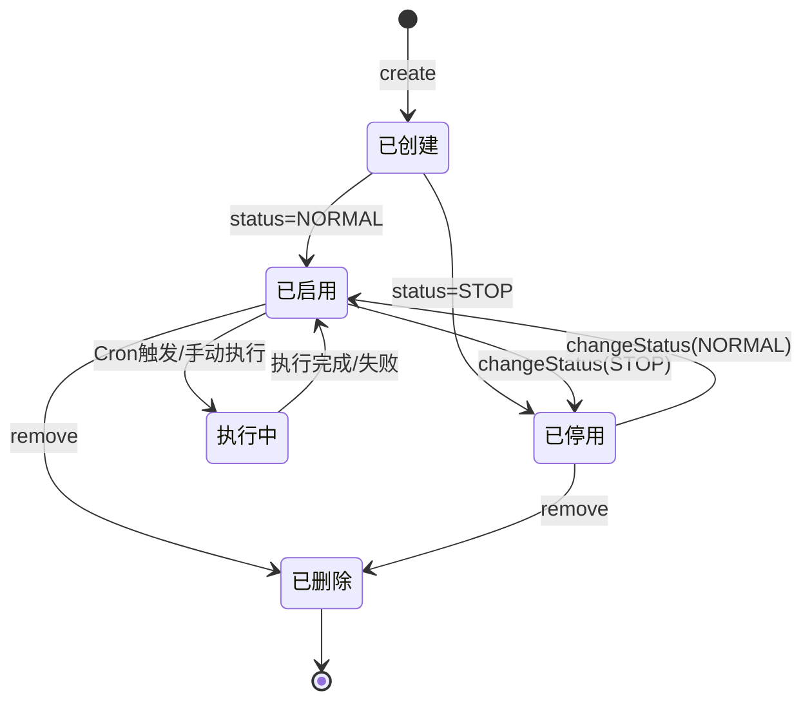

# Process Spec: 定时任务管理

> 模板级别：**Full**（状态机 + 分布式锁 + 并发控制）

---

## 0. Meta

| 项目         | 值                     |
| ------------ | ---------------------- |
| 流程名称     | 定时任务全生命周期管理 |
| 流程编号     | JOB_MANAGE_V1          |
| 负责人       | -                      |
| 最后修改     | 2026-03-03             |
| 影响系统     | Admin                  |
| 是否核心链路 | 否（运维支撑）         |
| Spec 级别    | Full                   |

---

## 1. Why（流程目标）

**目标**：

- 提供定时任务的全生命周期管理（创建、修改、删除、启停、立即执行）
- 通过 @Task 装饰器动态注册任务方法，支持运行时发现和调用
- 通过 Redis 分布式锁防止多实例环境下任务重复执行
- 完整记录任务执行日志（开始时间、结束时间、耗时、状态、异常信息）

**不做会怎样**：

- 无法自动化执行存储配额预警、文件版本清理、数据库备份等周期性任务
- 分布式部署时任务重复执行导致数据不一致

**不可接受的错误**：

- 任务状态与调度器状态不一致（数据库显示启用但调度器未运行）
- 分布式锁失效导致同一任务并发执行
- 任务执行失败但无日志记录

---

## 2. Input Contract

### CreateJobDto

```typescript
interface CreateJobInput {
  jobName: string; // 1-64字符，租户内唯一
  jobGroup: string; // 1-64字符，SYSTEM | DEFAULT
  invokeTarget: string; // 1-500字符，格式：方法名 或 方法名(参数)
  cronExpression: string; // 标准 Cron 格式
  misfirePolicy?: string; // 1=立即执行 2=执行一次 3=放弃执行
  concurrent?: string; // 0=允许 1=禁止
  status: StatusEnum; // 0=正常 1=暂停
  remark?: string;
}
```

### 输入规则

| 字段           | 规则                                    | Rule ID     |
| -------------- | --------------------------------------- | ----------- |
| jobName        | 必填，1-64字符                          | R-IN-JOB-01 |
| jobGroup       | 必填，1-64字符                          | R-IN-JOB-02 |
| invokeTarget   | 必填，1-500字符，格式：方法名或方法名() | R-IN-JOB-03 |
| cronExpression | 必填，标准 Cron 格式                    | R-IN-JOB-04 |
| status         | 必填，0 或 1                            | R-IN-JOB-05 |

---

## 3. PreConditions

| 编号 | 前置条件                          | 失败响应             | Rule ID      |
| ---- | --------------------------------- | -------------------- | ------------ |
| P1   | 任务必须存在（update/delete/run） | 404 任务不存在       | R-PRE-JOB-01 |
| P2   | 调用目标方法必须已通过@Task注册   | 404 任务方法不存在   | R-PRE-JOB-02 |
| P3   | invokeTarget 格式必须合法         | 400 调用目标格式错误 | R-PRE-JOB-03 |

---

## 4. Happy Path（主干流程）

### create

| 步骤 | 操作                       | 产出             | Rule ID       |
| ---- | -------------------------- | ---------------- | ------------- |
| S1   | 保存任务配置到数据库       | SysJob 记录      | R-FLOW-JOB-01 |
| S2   | 若状态为正常，添加到调度器 | CronJob 实例运行 | R-FLOW-JOB-02 |

### update

| 步骤 | 操作                     | 产出                | Rule ID       |
| ---- | ------------------------ | ------------------- | ------------- |
| S1   | 检测配置是否变更         | hasJobConfigChanged | R-FLOW-JOB-03 |
| S2   | 若变更，删除旧调度并重建 | 调度器同步          | R-FLOW-JOB-04 |
| S3   | 更新数据库记录           | SysJob 更新         | R-FLOW-JOB-05 |

### remove

| 步骤 | 操作               | 产出         | Rule ID       |
| ---- | ------------------ | ------------ | ------------- |
| S1   | 从调度器中删除任务 | CronJob 移除 | R-FLOW-JOB-06 |
| S2   | 从数据库中删除记录 | SysJob 删除  | R-FLOW-JOB-07 |

### run（立即执行）

| 步骤 | 操作                  | 产出            | Rule ID       |
| ---- | --------------------- | --------------- | ------------- |
| S1   | 查询任务配置          | SysJob          | R-FLOW-JOB-08 |
| S2   | 调用 TaskService 执行 | 执行结果 + 日志 | R-FLOW-JOB-09 |

### executeTask（TaskService）

| 步骤 | 操作                    | 产出          | Rule ID       |
| ---- | ----------------------- | ------------- | ------------- |
| S1   | 解析 invokeTarget       | 方法名 + 参数 | R-FLOW-JOB-10 |
| S2   | 从 taskMap 获取任务方法 | taskFn        | R-FLOW-JOB-11 |
| S3   | 执行任务方法            | 执行结果      | R-FLOW-JOB-12 |
| S4   | 记录执行日志            | SysJobLog     | R-FLOW-JOB-13 |

---

## 5. Branch Rules（分支规则）

| 编号 | 触发条件                         | 行为                     | Rule ID         |
| ---- | -------------------------------- | ------------------------ | --------------- |
| B1   | create 时 status=NORMAL          | 添加到调度器并启动       | R-BRANCH-JOB-01 |
| B2   | create 时 status=STOP            | 仅保存配置，不添加调度器 | R-BRANCH-JOB-02 |
| B3   | update 时配置未变更              | 仅更新数据库             | R-BRANCH-JOB-03 |
| B4   | update 时配置变更且新状态=NORMAL | 删除旧调度，创建新调度   | R-BRANCH-JOB-04 |
| B5   | update 时配置变更且新状态=STOP   | 删除旧调度，不创建新调度 | R-BRANCH-JOB-05 |
| B6   | changeStatus 启用，调度器无任务  | 创建新 CronJob           | R-BRANCH-JOB-06 |
| B7   | changeStatus 启用，调度器有任务  | 调用 cronJob.start()     | R-BRANCH-JOB-07 |
| B8   | changeStatus 停用，调度器有任务  | 调用 cronJob.stop()      | R-BRANCH-JOB-08 |
| B9   | executeTask 成功                 | 日志 status=NORMAL       | R-BRANCH-JOB-09 |
| B10  | executeTask 失败                 | 日志 status=STOP         | R-BRANCH-JOB-10 |

---

## 6. State Machine（状态机定义）



### 状态转换规则

| From   | To     | 允许 | 触发条件             | Rule ID        |
| ------ | ------ | ---- | -------------------- | -------------- |
| 已启用 | 已停用 | 是   | changeStatus(STOP)   | R-STATE-JOB-01 |
| 已停用 | 已启用 | 是   | changeStatus(NORMAL) | R-STATE-JOB-02 |
| 已启用 | 已删除 | 是   | remove               | R-STATE-JOB-03 |
| 已停用 | 已删除 | 是   | remove               | R-STATE-JOB-04 |

---

## 7. Exception Strategy（异常与补偿策略）

| 场景                  | 策略 | 补偿操作              | Rule ID      |
| --------------------- | ---- | --------------------- | ------------ |
| 任务方法不存在        | 终止 | 记录失败日志          | R-TXN-JOB-01 |
| 任务执行抛出异常      | 捕获 | 记录失败日志+异常信息 | R-TXN-JOB-02 |
| 删除调度器任务失败    | 忽略 | 继续删除数据库记录    | R-TXN-JOB-03 |
| invokeTarget 格式错误 | 终止 | 记录失败日志          | R-TXN-JOB-04 |

---

## 8. Idempotency（幂等与并发规则）

| 项目         | 规则                                 | Rule ID         |
| ------------ | ------------------------------------ | --------------- |
| 分布式锁键   | `sys:job:{jobName}`，TTL 30秒        | R-CONCUR-JOB-01 |
| 未获取锁行为 | 跳过本次执行，记录 warn 日志         | R-CONCUR-JOB-02 |
| 锁释放       | finally 块中释放，确保异常时也能释放 | R-CONCUR-JOB-03 |

---

## 9. Observability（可观测性要求）

| 要求     | 说明                                                   | Rule ID      |
| -------- | ------------------------------------------------------ | ------------ |
| 执行日志 | 每次执行记录 jobName/jobGroup/invokeTarget/status/耗时 | R-LOG-JOB-01 |
| 异常日志 | 失败时记录 exceptionInfo                               | R-LOG-JOB-02 |
| 调度日志 | 任务启动/停止时 logger.warn                            | R-LOG-JOB-03 |

---

## 10. Test Mapping（测试用例映射表）

### 前置条件（R-PRE-\*）

| Rule ID      | Given                   | When              | Then                   |
| ------------ | ----------------------- | ----------------- | ---------------------- |
| R-PRE-JOB-01 | jobId 不存在            | getJob/update/run | 抛出 BusinessException |
| R-PRE-JOB-02 | invokeTarget 方法未注册 | executeTask       | 抛出 BusinessException |
| R-PRE-JOB-03 | invokeTarget 格式非法   | executeTask       | 抛出 BusinessException |

### 主干流程（R-FLOW-\*）

| Rule ID       | Given                   | When        | Then                         |
| ------------- | ----------------------- | ----------- | ---------------------------- |
| R-FLOW-JOB-01 | 合法 CreateJobDto       | create      | 数据库创建记录               |
| R-FLOW-JOB-02 | status=NORMAL           | create      | 调度器添加 CronJob           |
| R-FLOW-JOB-03 | cron/target/status 变更 | update      | hasJobConfigChanged=true     |
| R-FLOW-JOB-04 | 配置变更                | update      | 删除旧调度，重建新调度       |
| R-FLOW-JOB-05 | 合法更新数据            | update      | 数据库更新记录               |
| R-FLOW-JOB-06 | 任务存在于调度器        | remove      | 从调度器删除                 |
| R-FLOW-JOB-07 | 任务 ID 列表            | remove      | 数据库批量删除               |
| R-FLOW-JOB-08 | jobId 存在              | run         | 查询任务配置                 |
| R-FLOW-JOB-09 | 任务配置有效            | run         | 调用 taskService.executeTask |
| R-FLOW-JOB-10 | invokeTarget 有参数     | executeTask | 解析出方法名和参数           |
| R-FLOW-JOB-11 | 方法名已注册            | executeTask | 从 taskMap 获取方法          |
| R-FLOW-JOB-12 | taskFn 执行成功         | executeTask | 返回 true                    |
| R-FLOW-JOB-13 | 任务执行完成            | executeTask | 记录日志含耗时               |

### 分支规则（R-BRANCH-\*）

| Rule ID         | Given                  | When         | Then               |
| --------------- | ---------------------- | ------------ | ------------------ |
| R-BRANCH-JOB-01 | status=NORMAL          | create       | 添加到调度器       |
| R-BRANCH-JOB-02 | status=STOP            | create       | 不添加到调度器     |
| R-BRANCH-JOB-03 | 配置未变更             | update       | 仅更新数据库       |
| R-BRANCH-JOB-04 | 配置变更+新状态=NORMAL | update       | 重建调度           |
| R-BRANCH-JOB-05 | 配置变更+新状态=STOP   | update       | 删除旧调度不重建   |
| R-BRANCH-JOB-06 | 启用+调度器无任务      | changeStatus | 创建新 CronJob     |
| R-BRANCH-JOB-07 | 启用+调度器有任务      | changeStatus | cronJob.start()    |
| R-BRANCH-JOB-08 | 停用+调度器有任务      | changeStatus | cronJob.stop()     |
| R-BRANCH-JOB-09 | 任务执行成功           | executeTask  | 日志 status=NORMAL |
| R-BRANCH-JOB-10 | 任务执行失败           | executeTask  | 日志 status=STOP   |

### 状态机（R-STATE-\*）

| Rule ID        | Given  | When                 | Then   |
| -------------- | ------ | -------------------- | ------ |
| R-STATE-JOB-01 | 已启用 | changeStatus(STOP)   | 已停用 |
| R-STATE-JOB-02 | 已停用 | changeStatus(NORMAL) | 已启用 |
| R-STATE-JOB-03 | 已启用 | remove               | 已删除 |
| R-STATE-JOB-04 | 已停用 | remove               | 已删除 |

### 并发与事务（R-CONCUR-_ / R-TXN-_）

| Rule ID         | Given                  | When        | Then                     |
| --------------- | ---------------------- | ----------- | ------------------------ |
| R-CONCUR-JOB-01 | 分布式锁键格式         | addCronJob  | 锁键为 sys:job:{name}    |
| R-CONCUR-JOB-02 | 未获取到锁             | Cron触发    | 跳过执行                 |
| R-CONCUR-JOB-03 | 执行完成（成功或失败） | Cron触发    | finally 释放锁           |
| R-TXN-JOB-01    | 任务方法不存在         | executeTask | 记录失败日志             |
| R-TXN-JOB-02    | 任务方法抛出异常       | executeTask | 捕获异常，记录失败日志   |
| R-TXN-JOB-03    | 调度器删除失败         | remove      | 忽略错误，继续删除数据库 |
| R-TXN-JOB-04    | invokeTarget 格式错误  | executeTask | 记录失败日志             |

### 可观测性（R-LOG-\*）

| Rule ID      | Given        | When        | Then                       |
| ------------ | ------------ | ----------- | -------------------------- |
| R-LOG-JOB-01 | 任务执行完成 | executeTask | 日志含 jobName/耗时/status |
| R-LOG-JOB-02 | 任务执行失败 | executeTask | 日志含 exceptionInfo       |

### 返回（R-RESP-\*）

| Rule ID       | Given        | When   | Then                       |
| ------------- | ------------ | ------ | -------------------------- |
| R-RESP-JOB-01 | 查询任务列表 | list   | 返回 rows + total 分页结构 |
| R-RESP-JOB-02 | 查询任务详情 | getJob | 返回 Result.ok(job)        |
| R-RESP-JOB-03 | 导出任务     | export | 调用 ExportTable           |
