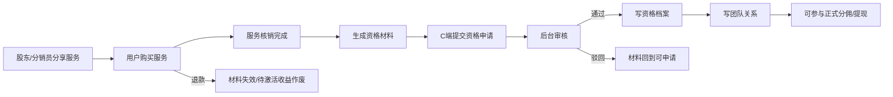

# 分销资格域重建交付总结

## 1. 交付范围

本次按方案 C 完成分销资格域重建的主要闭环：

- 服务策略：新增服务是否可分佣、是否可作为资格材料、LV0 是否允许分享与待激活收益模式。
- 资格材料：服务订单核销后生成资格材料；退款后材料失效，待激活收益作废。
- 资格申请：C 端提交申请，后台审核；审核通过后写入资格档案和团队关系。
- 资格事实源：`sys_dist_distributor_profile` 作为 C1/C2 分销资格事实源，`ums_member.levelId` 仅保留兼容投影。
- 团队关系：`sys_dist_relation` 只记录正式分销员团队归属，佣金链路最多读取 L1/L2，不递归扩展层级。
- 财务边界：正式 ACTIVE C1/C2 才能获得正式佣金和提现；LV0 待激活收益保留在独立表，不直接进入钱包。
- 前端入口：后台分销申请页扩展为资格治理页；小程序分销中心支持普通用户查看材料、申请、待激活收益。

## 2. 核心流程

## 3. 关键代码位置

- `apps/backend/prisma/schema.prisma`：新增分销资格、材料、申请、档案、归因、关系、待激活收益模型。
- `apps/backend/prisma/migrations/20260425120000_add_distribution_qualification_models/migration.sql`：新增对应表结构与索引。
- `apps/backend/src/module/store/distribution/qualification/`：资格治理 repository、service、controller、DTO、VO 和测试。
- `apps/backend/src/module/store/order/store-order.service.ts`：服务核销生成材料，退款失效材料和待激活收益。
- `apps/backend/src/module/finance/commission/services/l1-calculator.service.ts`：一级佣金优先校验新资格档案。
- `apps/backend/src/module/finance/commission/services/l2-calculator.service.ts`：二级佣金优先读取 `sys_dist_relation`。
- `apps/backend/src/module/finance/withdrawal/withdrawal.service.ts`：提现前校验正式资格档案。
- `apps/admin-web/src/views/store/distribution/distribution-application/index.vue`：后台资格治理 tabs。
- `apps/miniapp-client/src/pages/distribution/index.vue`：小程序资格中心。

## 4. 逻辑矫正

- 不再把“购买服务”直接等同于“升级资格”；购买并完成服务只产生申请材料。
- 分享服务可以产生销售佣金，但购买人未审批前不能提现、不能发展团队、不能成为正式分销员。
- 团队关系只在资格审核通过后建立，最多保留邀请人和一个团队归属 C2，不做无限层级。
- 旧 `levelId` 仍同步写入，目的是兼容历史页面和旧数据，不再作为新链路唯一事实源。
- 冻结/撤销资格后，新财务链路按资格档案阻断分佣和提现。

## 5. 验证结果

已执行并通过：

- `pnpm typecheck:backend`
- `pnpm --filter @apps/backend test -- qualification.service.spec.ts store-order.service.spec.ts withdrawal.service.spec.ts commission.service.spec.ts commission-coupon-points.spec.ts commission-calculator-level-integration.spec.ts`
- `pnpm generate-types`
- `pnpm typecheck:admin`
- `pnpm verify:admin-view-types`
- `pnpm lint:h5`
- `pnpm typecheck:h5`

验证备注：

- 后端测试通过 6 个 suite，104 个用例通过，2 个既有 todo。
- `pnpm lint:h5` 仍提示一个既有 UnoCSS 顺序 warning，路径为 `apps/miniapp-client/src/pages/index/components/home-address-confirm-popup.vue`，不属于本功能改动。
- 刷新 OpenAPI 时短暂启动了已构建 backend，用于更新 `apps/backend/public/openApi.json` 后再执行类型生成。

## 6. 后续建议

- 增加待激活收益释放到正式佣金或钱包的后台审核动作，目前只做到资格通过后从 `FROZEN` 标记为 `ELIGIBLE`。
- 对历史 `levelId` 分销员做一次回填，补齐 `sys_dist_distributor_profile` 和 `sys_dist_relation` 后再移除财务兼容 fallback。
- 将服务策略和资格规则从当前列表能力扩展为可编辑表单，便于运营配置 SKU、商品、分类策略。
- 若实名条件需要启用，应先补会员实名事实源；当前规则中 `requireRealName=true` 会阻断申请。
