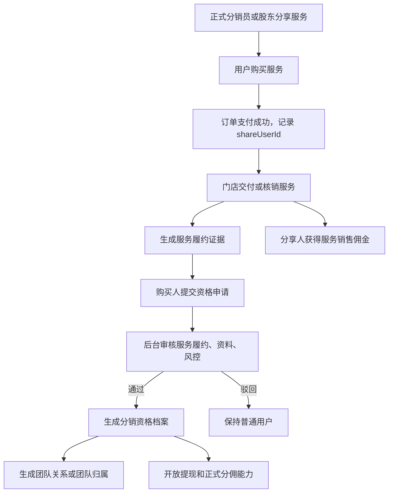

# 方案文档：分销资格域重建设计

## 1. 任务定义

本方案用于重建门店分销中的资格、服务履约、团队关系、佣金入账边界。

目标不是把“购买服务”直接做成分销资格，而是建立以下闭环：

```text
服务可销售分佣；
服务完成可作为资格申请材料；
资格由后台审批产生；
资格生效后才进入团队和提现体系。
```

核心业务结论：

- 股东或正式分销员分享真实服务，用户购买并完成服务后，分享人可以获得服务销售佣金。
- 购买人不会因为购买自动获得分销资格，只会获得申请材料。
- 未审批通过前，不写团队关系，不允许提现。
- 佣金最多计算一级和二级，不允许无限层级。

## 2. 目标与约束

### 2.1 业务目标

- 支持服务类商品参与分销销售佣金。
- 支持服务履约完成后触发分销资格申请条件。
- 支持 C1/C2 资格审批、冻结、撤销和审计。
- 支持 LV0 普通用户分享但不直接提现、不进入团队关系。
- 支持股东、分销员、普通用户在后台和小程序端有清晰身份展示。

### 2.2 技术约束

- 现有 `ums_member.levelId` 仍需兼容历史页面和计算逻辑，但不能继续作为唯一事实源。
- 现有 `oms_order.shareUserId` 仍作为订单归因快照保留。
- 现有 `fin_commission`、`fin_wallet` 仍是正式佣金和钱包事实源。
- Prisma schema、migration、财务链路、跨 app 类型均为高风险改动，必须分阶段落地。

### 2.3 合规边界

避免以下组合：

```text
购买服务 = 获得分销资格；
购买资格服务 = 上级拿资格奖励；
购买人立即发展下级；
多层下线销售业绩持续返利。
```

推荐表达：

```text
购买真实服务；
完成服务履约；
提交资格申请；
后台审批通过后授予分销身份；
后续真实订单按规则分佣。
```

## 3. 当前实现问题

关键代码位置：

- `apps/backend/prisma/schema.prisma:681`：`UmsMember.levelId` 同时承载身份、资格和能力。
- `apps/backend/prisma/schema.prisma:689`：`parentId` / `indirectParentId` 承载上下级关系，缺少资格状态和审计边界。
- `apps/backend/prisma/schema.prisma:2065`：`SysDistApplication` 申请表过薄，缺少服务订单、履约证据、资格生效时间。
- `apps/backend/prisma/schema.prisma:2204`：`OmsOrder.shareUserId` 是订单归因字段，但当前容易被当成团队关系。
- `apps/backend/src/module/store/distribution/services/share-token.service.ts:499`：分享绑定会直接写 `parentId`。
- `apps/backend/src/module/finance/commission/services/l1-calculator.service.ts:58`：一级佣金直接读取 `shareUserId || member.parentId`。
- `apps/backend/src/module/finance/commission/services/l2-calculator.service.ts:60`：二级佣金依赖分享人的 `parentId` 或购买人的 `indirectParentId`。
- `apps/backend/src/module/store/order/store-order.service.ts:518`：服务核销入口已经存在，可用于生成履约证据。
- `apps/backend/src/module/finance/withdrawal/withdrawal.service.ts:126`：提现申请缺少分销资格校验。

当前主要问题：

- 身份、关系、归因、佣金、提现混在一起。
- LV0 打开后可能形成 `LV0 -> LV0 -> LV0` 的无限关系链。
- 服务订单是否可分佣、是否可作为资格申请条件没有稳定配置。
- 服务完成、资格申请、资格生效之间没有明确状态机。

## 4. 目标流程



## 5. 领域拆分

### 5.1 订单归因域

职责：

- 记录一次订单来自谁的分享。
- 记录点击、绑定、购买等归因事件。
- 不直接决定团队关系。

关键字段：

- `oms_order.shareUserId`：订单级归因快照。
- 新增 `sys_dist_attribution_bind`：客户和分享人的短期或长期归因绑定。

边界：

- `shareUserId` 只代表这笔订单的销售来源。
- `shareUserId` 不等于购买人的上级。

### 5.2 服务策略域

职责：

- 定义服务商品是否可分佣。
- 定义服务商品是否可作为资格申请条件。
- 定义 LV0 是否可分享该服务以及是否产生待激活收益。

建议新增表：

```text
sys_dist_service_policy
```

关键字段：

| 字段                  | 说明                                                 |
| --------------------- | ---------------------------------------------------- |
| tenantId              | 租户                                                 |
| targetType            | PRODUCT / SKU / CATEGORY                             |
| targetId              | 商品、SKU 或分类 ID                                  |
| commissionEligible    | 是否可产生销售佣金                                   |
| qualificationEligible | 是否可作为资格申请条件                               |
| allowLv0Share         | 是否允许普通用户分享                                 |
| lv0RewardMode         | NONE / PENDING                                       |
| requireRiskConfirm    | 当服务同时可分佣且可作为资格条件时，是否要求风险确认 |
| isActive              | 是否启用                                             |

规则：

- 普通服务可 `commissionEligible=true`。
- 资格服务可 `qualificationEligible=true`。
- 同时为 true 时，后台必须强提示风险，并要求管理端确认。

### 5.3 服务履约证据域

职责：

- 在服务订单完成或核销后生成可审计证据。
- 为资格申请提供材料。
- 处理退款、撤销、重复使用等状态。

建议新增表：

```text
sys_dist_qualification_evidence
```

关键字段：

| 字段              | 说明                                                    |
| ----------------- | ------------------------------------------------------- |
| tenantId          | 租户                                                    |
| memberId          | 购买服务的会员                                          |
| orderId           | 服务订单                                                |
| orderItemId       | 服务订单明细                                            |
| productId / skuId | 服务商品                                                |
| sourceShareUserId | 服务订单的分享人                                        |
| evidenceStatus    | PENDING_DELIVERY / ELIGIBLE / USED / INVALID / REFUNDED |
| verifiedAt        | 服务核销或完成时间                                      |
| usedApplicationId | 被哪条申请使用                                          |
| invalidReason     | 失效原因                                                |

触发点：

- `store-order.service.verifyService` 核销服务后生成或更新证据。
- 订单退款后将证据标记为 `REFUNDED` 或 `INVALID`。

### 5.4 资格规则域

职责：

- 定义申请 C1/C2 的条件。
- 定义是否需要人工审核。
- 定义申请材料和服务完成要求。

建议新增表：

```text
sys_dist_qualification_rule
```

关键字段：

| 字段                     | 说明                     |
| ------------------------ | ------------------------ |
| tenantId                 | 租户                     |
| targetLevelId            | 申请目标等级，1=C1，2=C2 |
| requiredEvidenceCount    | 需要几条服务证据         |
| requiredServicePolicyIds | 需要哪些服务策略         |
| requireManualReview      | 是否必须人工审核         |
| minOrderAmount           | 服务订单最低金额         |
| minRegisterDays          | 注册天数                 |
| requireRealName          | 是否实名                 |
| isActive                 | 是否启用                 |

规则：

- 支付成功不能直接满足条件，必须以服务完成或核销为准。
- 规则命中只代表可以提交或通过申请，不代表自动授予资格。

### 5.5 资格申请域

职责：

- 替代现有过薄的 `sys_dist_application`。
- 记录申请目标、服务证据、审核过程和资格生效结果。

建议新增表：

```text
sys_dist_qualification_application
```

关键字段：

| 字段              | 说明                                             |
| ----------------- | ------------------------------------------------ |
| tenantId          | 租户                                             |
| memberId          | 申请人                                           |
| targetLevelId     | 申请目标等级                                     |
| evidenceIds       | 使用的服务证据                                   |
| status            | PENDING_REVIEW / APPROVED / REJECTED / CANCELLED |
| reviewerId        | 审核人                                           |
| reviewTime        | 审核时间                                         |
| reviewRemark      | 审核备注                                         |
| approvedProfileId | 审批通过后生成的资格档案                         |
| applyReason       | 申请说明                                         |

兼容策略：

- 保留现有 `sys_dist_application`，短期作为旧接口兼容。
- 新接口写新表。
- 旧表历史数据可通过迁移脚本生成新申请记录，无法补齐的证据字段标记为 `LEGACY_IMPORT`。

### 5.6 分销资格档案域

职责：

- 成为分销身份事实源。
- 承载资格状态、等级、生效时间、能力开关。
- `ums_member.levelId` 只作为兼容投影。

建议新增表：

```text
sys_dist_distributor_profile
```

关键字段：

| 字段                         | 说明                      |
| ---------------------------- | ------------------------- |
| tenantId                     | 租户                      |
| memberId                     | 会员                      |
| status                       | ACTIVE / FROZEN / REVOKED |
| levelId                      | 1=C1，2=C2                |
| qualifiedAt                  | 资格生效时间              |
| sourceApplicationId          | 来源申请                  |
| canWithdraw                  | 是否能提现                |
| canBindRelation              | 是否可建立团队关系        |
| canEarnL2                    | 是否可拿二级佣金          |
| frozenReason / revokedReason | 冻结或撤销原因            |

投影规则：

- 审批通过时写 `sys_dist_distributor_profile`。
- 同步更新 `ums_member.levelId`，只为兼容旧页面和旧查询。
- 后续新逻辑以 `sys_dist_distributor_profile` 为准。

### 5.7 归因绑定域

职责：

- 替代 `parentId` 作为“客户默认分享人”的来源。
- 用于无 sid 下单时查找默认归因人。
- 不等于团队关系。

建议新增表：

```text
sys_dist_attribution_bind
```

关键字段：

| 字段        | 说明                                       |
| ----------- | ------------------------------------------ |
| tenantId    | 租户                                       |
| memberId    | 被归因客户                                 |
| shareUserId | 默认归因人                                 |
| sourceSid   | 来源分享凭证                               |
| bindMode    | FIRST_TOUCH / LAST_TOUCH / FIRST_BIND_LOCK |
| expireAt    | 归因有效期                                 |
| status      | ACTIVE / EXPIRED / REPLACED / CANCELLED    |

规则：

- LV0 分享可以创建归因绑定，但不能创建团队关系。
- 下单时优先本次 `shareUserId`，其次归因绑定，再无兜底。
- 不再从 `ums_member.parentId` 获取默认归因。

### 5.8 团队关系域

职责：

- 管理正式分销员之间的团队归属。
- 限制关系深度。
- 提供可审计关系变更。

建议新增表：

```text
sys_dist_relation
sys_dist_relation_log
```

`sys_dist_relation` 关键字段：

| 字段                | 说明                             |
| ------------------- | -------------------------------- |
| tenantId            | 租户                             |
| distributorMemberId | 分销员                           |
| teamOwnerMemberId   | 团队归属股东，通常为 C2          |
| inviterMemberId     | 邀请人，可为 C1/C2，仅审计和展示 |
| sourceApplicationId | 来源申请                         |
| status              | ACTIVE / FROZEN / CANCELLED      |
| effectiveAt         | 生效时间                         |

关系规则：

- 团队关系只在资格审批通过后建立。
- `teamOwnerMemberId` 必须是 ACTIVE C2，或为空表示未归属股东团队。
- C1 邀请 C1 时，新 C1 不挂在邀请 C1 下，而是归属邀请 C1 的 C2 团队。
- 佣金只计算 L1 和 L2，不递归计算团队链。

### 5.9 待激活收益域

职责：

- 承载 LV0 分享产生但不可提现的收益。
- 资格通过后按规则释放。
- 资格未通过、退款、超期时作废。

建议新增表：

```text
sys_dist_pending_reward
```

关键字段：

| 字段                  | 说明                                  |
| --------------------- | ------------------------------------- |
| tenantId              | 租户                                  |
| memberId              | LV0 分享人                            |
| orderId / orderItemId | 来源订单                              |
| amount                | 待激活收益                            |
| status                | FROZEN / ELIGIBLE / RELEASED / VOIDED |
| releaseProfileId      | 释放到哪个资格档案                    |
| voidReason            | 作废原因                              |

资金规则：

- LV0 待激活收益不进入 `fin_wallet.balance`。
- LV0 待激活收益不允许提现。
- 资格通过后，可按业务规则转为 `fin_commission` 或直接通过财务入账流程释放。
- 退款后待激活收益必须作废。

## 6. 分佣规则

### 6.1 正式分销员分享服务

```text
ACTIVE C1/C2 分享服务订单
-> 订单记录 shareUserId
-> 服务核销完成
-> 进入 fin_commission
-> 到期结算到 fin_wallet
```

这部分是服务销售佣金，和购买人是否申请资格无直接关系。

### 6.2 LV0 分享普通商品或普通服务

```text
LV0 分享
-> 订单记录 shareUserId
-> 若策略允许 LV0 待激活收益
-> 写 sys_dist_pending_reward
-> 不进入团队关系
-> 不进入可提现余额
```

### 6.3 资格服务订单

推荐默认规则：

- ACTIVE C1/C2 分享资格服务，可获得服务销售佣金。
- 购买人服务完成后获得资格申请证据。
- LV0 分享资格服务默认不产生待激活收益，除非后台风险确认。
- 资格服务订单不能自动升级购买人。

### 6.4 二级佣金

二级佣金只来自团队关系：

```text
L1 受益人为 C1
-> 查 sys_dist_relation.teamOwnerMemberId
-> teamOwner 为 ACTIVE C2
-> C2 获得 L2
```

不再从 `ums_member.indirectParentId` 读取二级受益人。

## 7. API 方案

### 7.1 后台管理端

建议新增接口前缀：

```text
/store/distribution/qualification
```

接口清单：

| 方法 | 路径                       | 职责             |
| ---- | -------------------------- | ---------------- |
| GET  | `/service-policies`        | 服务策略列表     |
| POST | `/service-policies`        | 新增服务策略     |
| PUT  | `/service-policies/:id`    | 修改服务策略     |
| GET  | `/rules`                   | 资格规则列表     |
| POST | `/rules`                   | 新增资格规则     |
| PUT  | `/rules/:id`               | 修改资格规则     |
| GET  | `/evidence`                | 服务履约证据列表 |
| GET  | `/applications`            | 资格申请列表     |
| POST | `/applications/:id/review` | 审核申请         |
| GET  | `/profiles`                | 分销资格档案列表 |
| POST | `/profiles/:id/freeze`     | 冻结资格         |
| POST | `/profiles/:id/revoke`     | 撤销资格         |
| GET  | `/relations`               | 团队关系列表     |
| GET  | `/pending-rewards`         | 待激活收益列表   |

### 7.2 C 端

建议新增接口：

| 方法 | 路径                                                      | 职责                 |
| ---- | --------------------------------------------------------- | -------------------- |
| GET  | `/client/distribution/capability`                         | 返回当前用户分销能力 |
| GET  | `/client/distribution/qualification/evidence`             | 我的可申请服务证据   |
| POST | `/client/distribution/qualification/applications`         | 提交资格申请         |
| GET  | `/client/distribution/qualification/applications/current` | 当前申请状态         |
| GET  | `/client/distribution/rewards/pending`                    | 我的待激活收益       |

`capability` 建议返回：

```json
{
  "canShare": true,
  "canEarnCommission": false,
  "canWithdraw": false,
  "canBindRelation": false,
  "levelId": 0,
  "profileStatus": "NONE",
  "pendingRewardAmount": 0
}
```

## 8. 模块影响范围

| 模块                                         | 改动类型 | 说明                                           |
| -------------------------------------------- | -------- | ---------------------------------------------- |
| `apps/backend/prisma`                        | 新增     | 新增资格域、关系域、待激活收益表和枚举         |
| `apps/backend/src/module/store/distribution` | 重构     | 新增 qualification 子域，旧接口保留兼容        |
| `apps/backend/src/module/store/order`        | 修改     | 服务核销后生成资格证据                         |
| `apps/backend/src/module/client/order`       | 修改     | 归因兜底从 parentId 改为 attribution bind      |
| `apps/backend/src/module/finance/commission` | 修改     | 佣金计算读取 profile 和 relation 端口          |
| `apps/backend/src/module/finance/withdrawal` | 修改     | 提现校验 ACTIVE C1/C2                          |
| `apps/admin-web`                             | 修改     | 新增资格规则、申请、档案、关系、待激活收益页面 |
| `apps/miniapp-client`                        | 修改     | 分销中心按 capability 展示入口和申请状态       |
| `libs/common-types`                          | 生成     | 后端契约变更后执行 `pnpm generate-types`       |

## 9. 迁移策略

### 9.1 第一阶段：新增表，不切换事实源

- 新增表和枚举。
- 旧 `sys_dist_application`、`ums_member.levelId`、`parentId` 继续运行。
- 新增后台接口仅用于灰度页面和数据准备。

### 9.2 第二阶段：双写和投影

- 新申请写新表。
- 审批通过写 `sys_dist_distributor_profile`。
- 同步更新 `ums_member.levelId` 作为兼容投影。
- 关系写 `sys_dist_relation`，不再写新的 `parentId`。

### 9.3 第三阶段：读路径切换

- 佣金计算从新端口读取资格和关系。
- C 端归因从 `sys_dist_attribution_bind` 读取。
- 提现从 `sys_dist_distributor_profile` 校验。

### 9.4 第四阶段：历史数据回填

回填建议：

- `ums_member.levelId >= 1` 生成 ACTIVE profile。
- `parentId / indirectParentId` 尽量转换为 relation 和 attribution bind。
- 无法判断团队归属的数据标记为 `LEGACY_IMPORT`，后台待人工清理。

### 9.5 第五阶段：旧字段降级

- `ums_member.levelId` 保留投影。
- `parentId / indirectParentId` 不再作为新逻辑事实源。
- 旧 `sys_dist_application` 可只读保留，或后续迁移完成后归档。

## 10. 风险与回滚

| 风险                   | 影响               | 回滚方案                                                  |
| ---------------------- | ------------------ | --------------------------------------------------------- |
| 佣金计算错误           | 资金损失或多发少发 | 先双跑新旧计算并对账，不立即切生产                        |
| 历史关系迁移不准       | 团队归属错误       | 回填标记 `LEGACY_IMPORT`，人工确认后启用                  |
| LV0 待激活收益释放错误 | 提现前后金额不一致 | 待激活收益独立表，不直接进钱包                            |
| 资格服务表达不当       | 合规风险           | 页面文案统一为服务履约和资格申请，不写购买资格            |
| 跨 app 类型不同步      | 前端运行异常       | 后端变更后强制 `pnpm generate-types` 和受影响端 typecheck |

## 11. 逻辑矫正

必须落地的逻辑矫正：

```text
shareUserId = 订单归因，不是团队关系。
qualificationEvidence = 申请材料，不是资格。
distributorProfile = 分销资格事实源，不只是 levelId。
distRelation = 团队关系事实源，不再依赖 parentId。
pendingReward = LV0 待激活收益，不是可提现余额。
finCommission / finWallet = 正式财务事实源，不承载资格语义。
```

直接上下游必须同步：

- 分享解析不能随意写团队关系。
- 下单归因不能继续兜底 `parentId`。
- 佣金计算不能继续直接依赖 `parentId / indirectParentId`。
- 提现申请必须校验 ACTIVE C1/C2。
- 小程序不能继续只用 `levelId > 0` 判断所有分销能力。

## 12. 注释审查与注释方案

需要补注释的位置：

- 服务核销生成证据：说明服务履约证据只作为资格申请材料，不自动授予资格。
- 佣金计算端口：说明订单归因和团队关系分离，佣金最多两级。
- 资格审批：说明审批通过才产生 profile，并同步旧 `levelId` 只是兼容投影。
- 待激活收益释放：说明 LV0 收益不可提现，不进入 `fin_wallet.balance`。
- 归因绑定：说明 attribution bind 不等于团队关系。

不建议补逐行解释性注释。注释只放在状态切换、资金边界、兼容投影和合规边界处。

## 13. 测试与回归建议

### 13.1 后端行为测试

- 股东分享服务，用户购买并核销，股东获得服务销售佣金。
- 购买人服务未完成时不能通过资格申请。
- 服务完成后提交申请，审核通过生成 profile。
- 审核通过后同步 `ums_member.levelId`。
- LV0 分享不写团队关系。
- LV0 待激活收益不进入钱包。
- 资格撤销后不能提现。
- 退款后证据失效，待激活收益作废，未结算佣金取消。

### 13.2 财务测试

- L1 从订单归因读取。
- L2 从 `sys_dist_relation.teamOwnerMemberId` 读取。
- C2 无上级时全拿逻辑是否保留，需要配置化确认。
- 跨租户佣金仍受原配置控制。
- 提现申请只允许 ACTIVE C1/C2。

### 13.3 前端测试

- admin-web 服务策略页、资格规则页、申请审核页、资格档案页。
- miniapp 分销中心按 capability 展示分享、申请、提现入口。
- LV0 可分享但不能提现。
- 审核通过后刷新用户能力状态。

### 13.4 验证命令

跨 app 和高风险改动完成后至少执行：

```powershell
pnpm typecheck:backend
pnpm generate-types
pnpm typecheck:admin
pnpm verify:admin-view-types
pnpm lint:h5
pnpm typecheck:h5
```

涉及 Prisma 和财务行为时，还应补对应 backend 行为测试和集成测试。

## 14. 实施切片

### 切片 1：Schema 与端口

- 新增资格域表和枚举。
- 新增 `QualificationService`、`DistributorProfileService`、`RelationService`。
- 新增 finance 读取资格和关系的 port。

### 切片 2：服务履约证据

- 服务核销后生成 evidence。
- 退款后更新 evidence 和 pending reward。

### 切片 3：资格申请

- C 端提交申请。
- 后台审核。
- 审核通过生成 profile 和 relation。

### 切片 4：归因与团队关系切换

- 分享不直接写 `parentId`。
- 下单归因从 attribution bind 读取。
- 佣金 L2 从 relation 读取。

### 切片 5：资金边界

- LV0 收益写 pending reward。
- ACTIVE C1/C2 佣金写 fin_commission。
- 提现校验 profile。

### 切片 6：前端页面

- admin-web 新增资格域管理页面。
- miniapp 新增 capability、申请、待激活收益展示。

## 15. 未决问题

进入代码实现前需要业务确认：

1. 资格服务是否允许 LV0 分享并产生待激活收益。推荐默认不允许。
2. C1 邀请新 C1 时，新 C1 是否归属 C1 的 C2 团队。推荐归属 C2，不挂 C1。
3. C2 无上级时是否继续保留 L1+L2 全拿。推荐保留但配置化。
4. 历史 `parentId / indirectParentId` 是否需要全部回填为新关系。推荐先回填 ACTIVE profile，再人工清理团队关系。
5. 资格撤销后，历史已结算佣金是否追回。推荐不自动追回，只冻结提现并人工处理。
