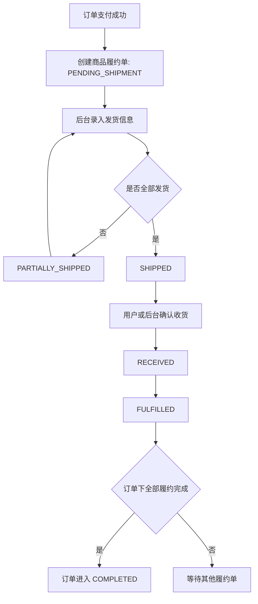
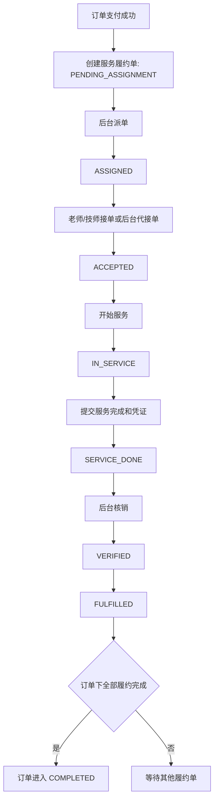

# 履约域前后端对齐设计草案

## 1. 背景与目标

当前订单链路已经具备创建订单、支付成功、库存扣减、门店发货/核销/退款等片段能力，但还没有独立的履约域。现有 `OrderStatus.SHIPPED` 同时承担商品发货、服务执行中、可确认收货等语义，继续扩展会让订单、库存、技师、售后、财务结算互相缠绕。

本设计先定下履约域边界，再进入代码实现。目标如下：

- 把交易状态与履约状态拆开，订单只表达交易事实，履约表达商品配送或服务执行事实。
- 补齐商品发货信息录入能力，支持快递公司、运单号、发货时间、包裹明细与操作备注。
- 支持完整服务履约流：待派单、已派单、已接单、服务中、已完成、已核销、已履约。
- 支持后台先人工推进，后续技师端/老师端复用同一套履约服务与状态机。
- 通过事件表沉淀履约时间线，避免前端继续依赖订单表上的零散时间字段。
- 为退款、异常、部分发货、多包裹、后续库存出库台账预留模型空间。

暂不在本阶段实现的内容：

- 实时物流轨迹订阅与三方物流回调。
- 自动派单、抢单、复杂排班算法。
- 完整售后系统和资金结算系统重构。
- 技师端/老师端页面实现；本阶段只预留 worker 入口和 actor 语义。

## 2. 权威边界

| 领域          | 负责什么                                             | 不负责什么                             |
| ------------- | ---------------------------------------------------- | -------------------------------------- |
| 订单域        | 下单、支付态、取消、退款态、交易完成态               | 发货单、服务执行、技师接单、履约时间线 |
| 履约域        | 商品配送、服务执行、履约状态机、履约事件、操作人审计 | 支付成功、退款入账、库存成本、佣金结算 |
| 库存域        | 库存占用、扣减、释放、后续出入库台账                 | 决定订单是否完成、决定服务是否核销     |
| 财务域        | 支付、退款、结算、佣金触发                           | 履约状态推进本身                       |
| 后台管理端    | 人工发货、派单、代接单、代完成、核销、异常处理       | 直接绕过履约状态机修改订单状态         |
| C 端          | 查看履约进度、商品确认收货、查看服务结果             | 直接派单、直接核销                     |
| 技师端/老师端 | 接单、开始服务、提交完成凭证                         | 决定交易完成或财务结算                 |

建议新增后端模块：`apps/backend/src/module/fulfillment`。订单模块只通过端口调用履约域，避免继续把配送和服务执行逻辑塞进 `store/order` 或 `client/order`。

## 3. 当前实现问题

| 问题                   | 现状位置                                                                                       | 风险                                                             |
| ---------------------- | ---------------------------------------------------------------------------------------------- | ---------------------------------------------------------------- |
| 订单状态承载过多       | `apps/backend/prisma/schema.prisma` 中 `OrderStatus` 包含 `SHIPPED`                            | 商品发货与服务进行中混用，后续售后和核销判断会冲突               |
| 发货接口不足           | `apps/backend/src/module/store/order/store-order.controller.ts` 的 `/store/order/batch/status` | 只能改状态和备注，不能录入快递公司、运单号、包裹明细             |
| 服务履约链路不完整     | `apps/backend/src/module/store/order/store-order.service.ts` 的派单、核销逻辑                  | 派单、接单、开始、完成、核销之间没有统一状态机                   |
| C 端收货依赖订单态     | `apps/backend/src/module/client/order/order.service.ts` 的确认收货逻辑                         | 只能判断 `SHIPPED`，无法表达部分发货、多包裹或服务订单           |
| 前端详情期望时间线字段 | `apps/admin-web/src/views/store/order/detail` 相关页面                                         | 前端展示需要 `shipTime`、`acceptTime` 等，但后端契约没有统一来源 |
| 服务预约缺少真实锁定   | `apps/backend/src/module/client/service/service-slot.service.ts`                               | 预约时段存在并发占用风险，后续应与履约分配闭环                   |

## 4. 状态模型

### 4.1 订单交易状态

订单状态只表达交易事实：

```text
PENDING_PAY -> PAID -> COMPLETED
PENDING_PAY -> CANCELLED
PAID -> REFUNDING -> REFUNDED
PAID -> CANCELLED
```

兼容建议：

- 现有 `OrderStatus.SHIPPED` 可作为历史兼容状态保留一段时间。
- 新履约逻辑不再把 `SHIPPED` 当成商品或服务的权威状态。
- 前端订单进度应优先读取履约状态和履约事件，不再从订单状态推导发货或服务进度。

### 4.2 商品履约状态

商品订单建议使用独立状态：

```text
PENDING_SHIPMENT
  -> PARTIALLY_SHIPPED
  -> SHIPPED
  -> RECEIVED
  -> FULFILLED
```

异常分支：

```text
PENDING_SHIPMENT | PARTIALLY_SHIPPED | SHIPPED | RECEIVED
  -> EXCEPTION
  -> CANCELLED
```

状态含义：

| 状态                | 含义         | 关键进入条件                             |
| ------------------- | ------------ | ---------------------------------------- |
| `PENDING_SHIPMENT`  | 待发货       | 订单支付成功后创建商品履约单             |
| `PARTIALLY_SHIPPED` | 部分发货     | 至少一个包裹已发出，但订单商品未全部发出 |
| `SHIPPED`           | 已全部发货   | 商品明细数量全部进入发货包裹             |
| `RECEIVED`          | 已收货       | 用户或后台确认收货                       |
| `FULFILLED`         | 商品履约完成 | 收货确认完成，满足订单完成判断           |
| `EXCEPTION`         | 履约异常     | 丢件、拦截、售后、人工暂停等             |
| `CANCELLED`         | 履约取消     | 订单取消或退款导致无需继续履约           |

### 4.3 服务履约状态

服务订单建议使用独立状态：

```text
PENDING_ASSIGNMENT
  -> ASSIGNED
  -> ACCEPTED
  -> IN_SERVICE
  -> SERVICE_DONE
  -> VERIFIED
  -> FULFILLED
```

异常分支：

```text
PENDING_ASSIGNMENT | ASSIGNED | ACCEPTED | IN_SERVICE | SERVICE_DONE
  -> EXCEPTION
  -> CANCELLED
```

状态含义：

| 状态                 | 含义             | 关键进入条件                                         |
| -------------------- | ---------------- | ---------------------------------------------------- |
| `PENDING_ASSIGNMENT` | 待派单           | 服务订单支付成功后创建服务履约单                     |
| `ASSIGNED`           | 已派单           | 后台指定老师/技师                                    |
| `ACCEPTED`           | 已接单           | 老师/技师接单；后台可代操作但 actor 必须记录为 admin |
| `IN_SERVICE`         | 服务中           | 老师/技师开始服务                                    |
| `SERVICE_DONE`       | 服务已完成待核销 | 老师/技师提交完成，可附凭证                          |
| `VERIFIED`           | 已核销           | 后台或系统按规则确认服务完成                         |
| `FULFILLED`          | 服务履约完成     | 允许触发订单完成和后续结算                           |
| `EXCEPTION`          | 履约异常         | 用户爽约、老师无法服务、投诉、人工暂停等             |
| `CANCELLED`          | 履约取消         | 订单取消或退款导致无需继续服务                       |

### 4.4 防止状态混乱的规则

- 只有履约域的状态机服务能推进履约状态，Controller、订单 Service、前端都不能直接写状态字段。
- 每个状态变更必须带 `fromStatus`、`toStatus`、`eventType`、`actorType`、`actorId`、`operationId`。
- 状态更新使用版本号或条件更新，例如只允许 `status = expectedStatus` 时更新；更新失败即返回状态冲突。
- `operationId` 做幂等键，同一操作重复提交只能产生一次状态变更和一次事件。
- 订单完成由聚合规则判断：同一订单下所有必需履约单达到 `FULFILLED` 后，才允许订单进入 `COMPLETED`。
- 退款、取消、异常必须进入履约中断分支，禁止直接跳过履约状态机把订单改成最终态。

## 5. 数据模型草案

> 以下是设计草案，不代表已经可以直接修改 Prisma schema。进入实现时，新增表和迁移属于高风险操作，需要按仓库高风险流程再次确认。

### 5.1 `fulfillment_order`

履约单主表，一张订单可有多个履约单。

| 字段                      | 含义                                          |
| ------------------------- | --------------------------------------------- |
| `id`                      | 履约单 ID                                     |
| `tenantId`                | 租户 ID                                       |
| `orderId`                 | 订单 ID                                       |
| `orderItemId`             | 订单明细 ID，可为空；混合订单或拆分履约时使用 |
| `type`                    | `PRODUCT` / `SERVICE`                         |
| `status`                  | 商品或服务履约状态                            |
| `version`                 | 乐观锁版本                                    |
| `completedAt`             | 履约完成时间                                  |
| `cancelledAt`             | 履约取消时间                                  |
| `exceptionReason`         | 异常原因                                      |
| `createdAt` / `updatedAt` | 创建与更新时间                                |

### 5.2 `fulfillment_event`

履约事件表，作为时间线和审计来源。

| 字段                      | 含义                                                                                            |
| ------------------------- | ----------------------------------------------------------------------------------------------- |
| `id`                      | 事件 ID                                                                                         |
| `tenantId`                | 租户 ID                                                                                         |
| `fulfillmentOrderId`      | 履约单 ID                                                                                       |
| `orderId`                 | 订单 ID，便于按订单查时间线                                                                     |
| `eventType`               | `SHIP` / `RECEIVE` / `ASSIGN` / `ACCEPT` / `START` / `DONE` / `VERIFY` / `EXCEPTION` / `CANCEL` |
| `fromStatus` / `toStatus` | 状态变更前后                                                                                    |
| `actorType`               | `ADMIN` / `CUSTOMER` / `WORKER` / `SYSTEM`                                                      |
| `actorId`                 | 操作人 ID                                                                                       |
| `operationId`             | 幂等操作 ID                                                                                     |
| `payloadJson`             | 快递、凭证、派单等扩展信息                                                                      |
| `remark`                  | 操作备注                                                                                        |
| `createdAt`               | 事件时间                                                                                        |

### 5.3 `fulfillment_shipment`

商品发货单。

| 字段                 | 含义                 |
| -------------------- | -------------------- |
| `id`                 | 发货单 ID            |
| `tenantId`           | 租户 ID              |
| `fulfillmentOrderId` | 履约单 ID            |
| `orderId`            | 订单 ID              |
| `carrierCode`        | 快递公司编码，可为空 |
| `carrierName`        | 快递公司名称         |
| `trackingNo`         | 运单号               |
| `shippedAt`          | 发货时间             |
| `status`             | 发货单状态           |
| `remark`             | 发货备注             |
| `createdBy`          | 创建人               |
| `createdAt`          | 创建时间             |

### 5.4 `fulfillment_shipment_item`

发货明细，用于支持多包裹和部分发货。

| 字段                 | 含义         |
| -------------------- | ------------ |
| `id`                 | 发货明细 ID  |
| `shipmentId`         | 发货单 ID    |
| `fulfillmentOrderId` | 履约单 ID    |
| `orderItemId`        | 订单明细 ID  |
| `skuId`              | SKU ID       |
| `quantity`           | 本次发货数量 |

### 5.5 `fulfillment_assignment`

服务派单表。

| 字段                 | 含义         |
| -------------------- | ------------ |
| `id`                 | 派单 ID      |
| `tenantId`           | 租户 ID      |
| `fulfillmentOrderId` | 履约单 ID    |
| `workerId`           | 老师/技师 ID |
| `status`             | 派单状态     |
| `assignedAt`         | 派单时间     |
| `acceptedAt`         | 接单时间     |
| `startedAt`          | 开始服务时间 |
| `doneAt`             | 服务完成时间 |
| `cancelledAt`        | 派单取消时间 |
| `remark`             | 派单备注     |

### 5.6 `fulfillment_proof`

服务完成凭证或履约证明。

| 字段                 | 含义                                     |
| -------------------- | ---------------------------------------- |
| `id`                 | 凭证 ID                                  |
| `fulfillmentOrderId` | 履约单 ID                                |
| `type`               | `IMAGE` / `VIDEO` / `TEXT` / `SIGNATURE` |
| `url`                | 图片或视频地址                           |
| `text`               | 文本说明                                 |
| `payloadJson`        | 扩展载荷                                 |
| `uploadedByType`     | 上传人类型                               |
| `uploadedById`       | 上传人 ID                                |
| `createdAt`          | 上传时间                                 |

## 6. API 草案

### 6.1 后台管理端 API

| 方法   | 路径                                 | 用途                                 |
| ------ | ------------------------------------ | ------------------------------------ |
| `GET`  | `/store/fulfillment/order/:orderId`  | 查询订单履约概览、履约单、事件时间线 |
| `POST` | `/store/fulfillment/product/ship`    | 商品发货并录入物流信息               |
| `POST` | `/store/fulfillment/product/receive` | 后台代确认收货                       |
| `POST` | `/store/fulfillment/service/assign`  | 服务派单                             |
| `POST` | `/store/fulfillment/service/accept`  | 后台代接单                           |
| `POST` | `/store/fulfillment/service/start`   | 后台代开始服务                       |
| `POST` | `/store/fulfillment/service/done`    | 后台代提交服务完成                   |
| `POST` | `/store/fulfillment/service/verify`  | 服务核销                             |
| `POST` | `/store/fulfillment/exception`       | 标记履约异常                         |

商品发货请求建议：

```ts
interface ShipProductFulfillmentRequest {
  orderId: string;
  fulfillmentOrderId?: string;
  operationId: string;
  carrierCode?: string;
  carrierName: string;
  trackingNo: string;
  shippedAt?: string;
  remark?: string;
  packages: Array<{
    packageNo?: string;
    orderItemId: string;
    skuId: string;
    quantity: number;
  }>;
}
```

### 6.2 C 端 API

| 方法   | 路径                                          | 用途                 |
| ------ | --------------------------------------------- | -------------------- |
| `GET`  | `/client/fulfillment/order/:orderId`          | 查询用户订单履约进度 |
| `POST` | `/client/fulfillment/product/confirm-receipt` | 用户确认收货         |

### 6.3 技师端/老师端预留 API

| 方法   | 路径                                 | 用途               |
| ------ | ------------------------------------ | ------------------ |
| `GET`  | `/worker/fulfillment/tasks`          | 查询待处理服务任务 |
| `POST` | `/worker/fulfillment/service/accept` | 接单               |
| `POST` | `/worker/fulfillment/service/start`  | 开始服务           |
| `POST` | `/worker/fulfillment/service/done`   | 提交服务完成和凭证 |

## 7. 真实流程

### 7.1 商品订单流程



### 7.2 服务订单流程



## 8. 待确认问题与推荐方案

| 问题                           | 推荐方案                                                            | 原因                                               |
| ------------------------------ | ------------------------------------------------------------------- | -------------------------------------------------- |
| 是否支持多包裹/部分发货        | 数据模型支持，后台第一版可以先做单次发货表单                        | 不简化底层能力，UI 可以分阶段铺开                  |
| 快递公司是否走字典治理         | 第一版 `carrierName` 自由录入，`carrierCode` 可选；稳定后再纳入字典 | 字典治理属于高风险链路，先避免为了发货阻塞履约主线 |
| 后台是否能代老师操作           | 允许，但必须记录 `actorType=ADMIN` 和真实 `actorId`                 | 老师端未开始时能闭环，同时保留审计                 |
| 服务完成是否等于核销           | 不等于，`SERVICE_DONE` 后必须进入 `VERIFIED`                        | 老师提交完成和平台确认完成是两个不同责任           |
| 用户是否需要确认服务完成       | 第一版不作为必需节点，可后续扩展用户确认或评价                      | 先以后台核销作为权威闭环，减少多端依赖             |
| 退款发生在已发货/服务中怎么办  | 履约进入 `EXCEPTION` 或售后分支，不允许直接跳最终态                 | 避免物流、服务、资金三套状态不一致                 |
| 混合订单怎么完成               | 订单下所有必需履约单 `FULFILLED` 后，订单才 `COMPLETED`             | 支持一个订单同时包含商品和服务                     |
| 库存什么时候扣减               | 初期可沿用支付/下单扣减；履约表预留后续出库台账                     | 降低第一轮改造风险，不阻断库存后续治理             |
| `OrderStatus.SHIPPED` 怎么处理 | 保留兼容，不再作为新履约权威状态                                    | 避免一次性破坏旧接口，同时收敛新逻辑入口           |

## 9. 兼容性影响

- 后端会新增履约模块、履约 DTO/VO、履约 OpenAPI 契约。
- `apps/backend/src/module/store/order` 的发货、派单、核销能力应逐步迁移到履约模块，旧接口可短期包装新服务。
- `apps/backend/src/module/client/order` 的确认收货应从判断订单 `SHIPPED` 改为调用履约确认收货。
- `apps/admin-web/src/service/api/store/order.ts` 中批量状态切换不应继续承担发货录入。
- 后台订单详情页的时间线应改为读取 `fulfillment_event`，而不是依赖订单表上散落字段。
- 小程序订单详情应展示履约状态、发货信息、服务进度，并按履约类型显示操作。
- 跨 app 契约变化后必须走 `backend -> generate-types -> admin-web/miniapp-client` 的完整链路。

## 10. 逻辑矫正

- 订单状态不是履约状态。支付成功只说明交易成立，不说明商品已发出或服务已执行。
- 发货信息不应写成订单备注。快递公司、运单号、包裹明细属于商品履约发货单。
- 服务完成不等于服务核销。老师提交完成是执行事实，后台核销是平台确认事实。
- 前端时间线不应拼接多个订单字段。时间线应来自履约事件表，保证顺序、操作人和备注完整。
- 订单完成不应由单个按钮直接修改。必须由订单下全部必需履约单的完成规则推导。
- 异常、退款、取消不能绕过履约域。否则物流、服务、财务三侧会出现不可解释的状态差异。

## 11. 注释审查与注释方案

进入实现后，注释应集中在容易误用的位置，避免在普通 CRUD 上堆叙述性注释：

- 履约状态机映射处：说明交易状态与履约状态的边界，明确禁止外部直接写履约状态。
- 幂等处理处：说明 `operationId` 的生成方、唯一约束范围和重复提交返回策略。
- 乐观锁或条件更新处：说明状态冲突代表已有其他操作推进履约，不应自动覆盖。
- actor 记录处：说明 `ADMIN` 代操作与未来 `WORKER` 自操作的差异。
- 兼容旧 `OrderStatus.SHIPPED` 处：说明它只用于历史接口兼容，不作为新履约判断依据。
- 退款/取消中断处：说明为什么先进入履约异常或取消分支，再交给售后或财务处理。

## 12. 测试与回归建议

后端建议覆盖：

- 商品履约合法流转、非法跳转、重复发货、部分发货数量超限。
- 服务履约合法流转、非法跳转、后台代操作、老师端 actor 预留。
- `operationId` 幂等、状态冲突、租户隔离、订单不存在或不属于当前租户。
- 履约完成后订单聚合完成规则。
- 退款、取消、异常中断时的履约状态处理。

前端建议覆盖：

- 后台发货弹窗字段校验、包裹明细数量校验、发货后详情刷新。
- 后台服务派单、代接单、开始、完成、核销按钮可见性。
- 订单详情履约时间线展示。
- 小程序订单详情商品与服务两类进度展示。

跨 app 验证链路建议：

```powershell
pnpm typecheck:backend
pnpm generate-types
pnpm typecheck:admin
pnpm verify:admin-view-types
pnpm lint:h5
pnpm typecheck:h5
```

如果实际改动只落在单 app，应按对应 app 的门禁执行；一旦涉及后端契约和前端消费，不能降级为局部验证。

## 13. 实施顺序

1. 确认本设计草案中的状态模型、表模型、API 路径和关键疑问。
2. 按高风险流程确认 Prisma schema、migration、历史数据回填方案。
3. 新增履约模块、状态机、端口和基础查询能力。
4. 支付成功后创建对应履约单，保留旧订单接口兼容。
5. 实现商品发货、确认收货、履约事件时间线。
6. 实现服务派单、接单、开始、完成、核销。
7. 生成 OpenAPI 类型并适配后台管理端。
8. 适配小程序订单详情和确认收货。
9. 补齐测试与验证门禁。
10. 将稳定决策沉淀到 ADR 或领域文档，并按文档治理策略处理本草案。

## 14. 决策登记

本节把已经收敛、暂定、仍需确认的问题分开。实现时只允许围绕这里推进，不应边写边临时改状态语义。

### 14.1 已确定

| 编号 | 决策                               | 说明                                                                   |
| ---- | ---------------------------------- | ---------------------------------------------------------------------- |
| D-01 | 新增独立履约域                     | 不继续把商品发货、服务派单、核销、收货塞进 `store/order`。             |
| D-02 | 订单交易状态与履约状态拆分         | `OrderStatus` 表达支付、取消、退款、完成；履约状态表达配送和服务执行。 |
| D-03 | 商品发货需要独立 API               | 现有 `/store/order/batch/status` 不能承载快递公司、运单号、包裹明细。  |
| D-04 | 服务履约不做简化态                 | 采用派单、接单、开始、完成、核销、履约完成的完整链路。                 |
| D-05 | 后台可以代老师/技师操作            | 但必须记录 `actorType=ADMIN` 和真实 `actorId`，不能伪造成 worker。     |
| D-06 | 履约事件是时间线权威来源           | 前端详情时间线不再拼接订单表上的散落字段。                             |
| D-07 | `OrderStatus.SHIPPED` 只做历史兼容 | 新逻辑不再把 `SHIPPED` 作为商品或服务履约的权威状态。                  |

### 14.2 暂定方案

| 编号 | 暂定方案                                                   | 需要后续验证的点                                                               |
| ---- | ---------------------------------------------------------- | ------------------------------------------------------------------------------ |
| T-01 | 底层支持多包裹、部分发货；后台第一版仍可按一次发货表单提交 | 要校验同一订单项累计发货数量不能超过购买数量。                                 |
| T-02 | 快递公司第一版自由录入 `carrierName`，`carrierCode` 可选   | 暂不触发字典治理；后续稳定后再纳入字典。                                       |
| T-03 | 使用 DB 级业务幂等记录 + 履约事件唯一操作号                | 请求级幂等复用 `biz_idempotency_record` 思路，领域级事件仍保留 `operationId`。 |
| T-04 | 订单完成由履约聚合规则触发                                 | 订单下所有必需履约单完成后，订单域再进入 `COMPLETED`。                         |
| T-05 | 商品确认收货支持 shipment 维度，订单级确认作为聚合入口     | C 端可以确认整个商品履约；有包裹维度时后端聚合判断是否全部收货。               |
| T-06 | 老师端未开始前先由后台操作闭环                             | API 先按 actor 预留 worker 入口，页面可以后置。                                |

### 14.3 未定问题与推荐答案

| 编号 | 问题                               | 当前证据                                                                  | 推荐答案                                                                                                               |
| ---- | ---------------------------------- | ------------------------------------------------------------------------- | ---------------------------------------------------------------------------------------------------------------------- |
| Q-01 | 混合订单到底怎么建履约单           | `OrderType` 有 `MIXED`，但创建订单时只要包含服务就写成 `SERVICE`          | 按订单项生成履约单，订单类型后续修正为 `PRODUCT` / `SERVICE` / `MIXED`，不能只靠订单级 `orderType` 决定履约。          |
| Q-02 | 支付成功后何时创建履约单           | 支付回调把订单从 `PENDING_PAY` 改为 `PAID` 后继续触发结算、佣金、营销事件 | 推荐把“订单置 PAID + 创建履约单”做成同一事务或同一幂等服务；若暂不能同事务，必须补偿扫描 `PAID` 但无履约单的订单。     |
| Q-03 | 历史订单怎么回填履约数据           | 旧订单没有发货单、履约事件、服务接单时间                                  | 单独做回填方案：按订单状态生成最小履约单和事件，`SHIPPED` 历史数据标记为兼容来源，不伪造精确时间。                     |
| Q-04 | 服务预约是否要立刻接排班系统       | 服务时段目前只有 Redis 临时锁，且存在数据库排班 TODO                      | 第一版不做复杂排班，但创建服务履约和派单时要检查基础时间冲突；完整排班另立专题。                                       |
| Q-05 | 退款发生在已发货或服务中怎么办     | 当前退款直接改订单 `REFUNDED`，没有履约中断态                             | 先把履约单推进到 `EXCEPTION` 或 `CANCELLED`，再走退款；已发货、服务中不应直接静默终止履约。                            |
| Q-06 | 新接口权限码怎么定                 | 旧权限集中在 `store:order:*`                                              | 新增 `store:fulfillment:*` 更清晰；如果要落菜单或权限 seed，需要另走高风险确认。                                       |
| Q-07 | 履约事件和业务操作日志是否重复     | 当前已有 `biz_operation_log` 记录后台操作                                 | 不重复定位：`fulfillment_event` 是领域事实和前端时间线，`biz_operation_log` 是后台操作审计。两者可以由同一动作同时写。 |
| Q-08 | C 端订单列表状态怎么展示           | 小程序当前只展示订单状态，`SHIPPED` 文案固定为已发货                      | C 端列表继续展示交易状态，但详情页展示履约进度；后续可增加聚合展示态。                                                 |
| Q-09 | 分销资格和佣金结算由哪个节点触发   | 当前实物确认收货触发 `CONFIRM`，服务核销触发 `VERIFY`                     | 触发点迁移到履约完成事件，但仍调用现有佣金/资格服务，不能改变财务语义。                                                |
| Q-10 | 部分退款是否需要 item 维度履约中断 | 当前部分退款已按订单项计算，但订单履约没有 item 维度                      | 必须需要。服务和商品都按订单项或履约项关联，否则部分退款无法判断哪一项停止履约。                                       |

## 15. 已确定问题的连锁影响排查

### 15.1 影响总表

| 已确定问题             | 直接影响                                                  | 可能引发的其他问题                                           | 收口方案                                                                           |
| ---------------------- | --------------------------------------------------------- | ------------------------------------------------------------ | ---------------------------------------------------------------------------------- |
| 拆出履约域             | `store/order`、`client/order` 不能继续直接改发货/核销状态 | 模块互相 import 形成循环依赖                                 | 用端口隔离：订单域调用履约端口，履约域回调订单完成端口；不要互相注入完整 Service。 |
| 不再依赖 `SHIPPED`     | 后端、前端、生成类型、小程序文案都引用 `SHIPPED`          | 一次删除会破坏旧订单查询和旧页面展示                         | 保留枚举兼容；新接口返回履约状态；旧接口逐步包装新履约服务。                       |
| 发货信息独立建模       | 需要新增 Prisma 表和 migration                            | 触发高风险流程、历史数据缺失、前端类型生成                   | 先确认 schema 和回填策略，再改代码；不能直接改已有 migration。                     |
| 服务完整状态机         | 后台待派单页、订单详情、核销按钮逻辑都要改                | 旧 `workerId` 写在订单表，无法表达接单/开始/完成             | 新增 assignment 表，订单上的 `workerId` 只做兼容快照或冗余展示。                   |
| 履约事件做时间线       | 后台详情页要从新接口读事件                                | 旧 `acceptTime`、`serviceStartTime`、`shipTime` 字段并不存在 | 用事件生成 timeline VO，前端不再猜字段。                                           |
| 按订单项生成履约单     | 混合订单、部分退款、部分发货都可表达                      | 当前创建订单把含服务订单都标成 `SERVICE`                     | 创建履约时按 item 类型拆分，订单级类型后续修正；短期不能只按 `orderType`。         |
| 订单完成由履约聚合触发 | C 端确认收货、后台确认收货、服务核销都不再直接改订单完成  | 财务结算触发点可能重复或漏触发                               | 履约完成事件只触发一次订单聚合；订单从非完成到完成时再触发财务后置逻辑。           |

### 15.2 支付链路影响

当前支付成功逻辑在 `apps/backend/src/module/client/payment/payment.service.ts` 中完成三件事：

1. 原子把订单从 `PENDING_PAY` 改为 `PAID`。
2. 记录支付结算流水。
3. 触发佣金计算和营销订单支付事件。

新增履约后，支付成功还必须创建履约单。这里有一个确定风险：如果订单已经改成 `PAID`，但履约单创建失败，就会出现“已支付但无履约”的订单。

推荐收口：

- 新增 `FulfillmentCreationService.ensureForPaidOrder(orderId)`，按订单项幂等创建履约单。
- 支付成功 CAS 更新订单后立即调用该服务。
- 服务内部使用 `orderId + orderItemId + fulfillmentType` 唯一约束避免重复创建。
- 增加补偿任务或后台诊断接口，扫描 `PAID` 但无履约单的订单。

### 15.3 库存链路影响

当前库存是在创建订单时直接扣减，取消待支付订单时恢复；发货、确认收货、退款没有库存台账。

这会引发两个问题：

- 商品发货后没有“已出库”事实，库存扣减和实际发货脱节。
- 退款时没有明确是否应该恢复库存，尤其是已发货、部分发货、未发货三种情况不同。

推荐收口：

- 第一轮不强行重构库存表，但履约发货事件必须保留 shipment item 数量。
- 未发货退款可以恢复库存；已发货退款不直接恢复库存，进入售后/退货入库流程。
- 后续新增库存台账时，以履约发货事件作为出库事实来源。

### 15.4 退款与部分退款影响

当前全额退款和部分退款都在 `apps/backend/src/module/store/order/store-order.service.ts` 内处理。部分退款虽然按订单项计算金额，但营销退款事件按 `orderId` 做幂等。

这里有一个潜在连锁问题：同一订单多次部分退款时，如果营销积分/优惠券退款处理只按 `orderId` 幂等，第二次部分退款可能被当成重复事件跳过。

推荐收口：

- 履约域记录 item 级别中断，部分退款只中断对应履约项。
- 营销/积分退款幂等键需要支持 `orderId + refundSn` 或 `orderId + refundBatchId`。
- 全额退款才把整单履约取消；部分退款只影响对应履约单或 shipment item。

### 15.5 佣金与分销资格影响

当前实物确认收货会调用 `updatePlanSettleTime(orderId, 'CONFIRM')`，服务核销会调用 `updatePlanSettleTime(orderId, 'VERIFY')`，服务核销还会调用分销资格材料维护。

履约改造不能改变这些财务语义，只能改变触发来源：

- 商品履约完成后触发 `CONFIRM`。
- 服务核销完成后触发 `VERIFY`。
- 服务 `SERVICE_DONE` 不能触发资格材料，必须等 `VERIFIED`。
- 同一履约事件重复提交不能重复更新佣金计划或重复写资格材料。

### 15.6 前端与类型契约影响

后台和小程序目前都有旧状态依赖：

- 后台订单列表用 `SHIPPED` 展示已发货。
- 后台订单详情用 `SHIPPED` 判断服务可核销，用 `PAID/SHIPPED` 判断可改派。
- 后台详情时间线读取 `acceptTime`、`serviceStartTime`、`shipTime`、`completeTime` 等字段。
- 小程序订单列表和详情都硬编码订单状态文案。
- `libs/common-types` 已生成旧 `/store/order/batch/status` 契约。

推荐收口：

- 后端先新增履约查询 VO：订单交易状态、履约聚合状态、履约单列表、事件时间线分开返回。
- 后台订单详情切换到履约时间线；列表可先保留交易状态列，再增加履约状态列。
- 小程序订单详情展示履约进度，列表暂不强制改成复杂聚合态。
- 后端契约变更后必须 `pnpm generate-types`，前端不得手写同义 DTO。

### 15.7 权限、菜单与操作日志影响

新增履约 API 后需要决定权限码。如果继续挂在 `store:order:*`，实现快；但履约后会出现发货、收货、派单、接单、开始、完成、核销、异常等更细动作，长期混在订单权限里会不清晰。

推荐收口：

- API 权限使用 `store:fulfillment:query`、`store:fulfillment:ship`、`store:fulfillment:receive`、`store:fulfillment:assign`、`store:fulfillment:verify`、`store:fulfillment:exception`。
- 是否新增菜单、权限 seed、字典项，进入实现前单独高风险确认。
- 后台操作同时写 `biz_operation_log` 和 `fulfillment_event`，但前端时间线以 `fulfillment_event` 为准。

### 15.8 多租户影响

履约表必须全部带 `tenantId`，并且所有查询、更新、事件写入都要按租户隔离。

需要特别注意：

- 后台超管查询可以跨租户，但写操作必须明确落到订单所属租户。
- C 端确认收货不能只按 `orderId`，必须校验 `memberId` 和订单所属租户。
- worker/老师端未来接入时，不能只校验 `workerId`，还要校验 worker 属于订单租户。

## 16. 下一步落地排查顺序

进入代码实现前，建议按以下顺序继续排：

1. 订单项类型来源：确认每个 `OmsOrderItem` 能否稳定判断商品还是服务。
2. 支付成功创建履约：确认是否能与订单置 `PAID` 合成同一事务。
3. 历史订单回填：列出 `PENDING_PAY`、`PAID`、`SHIPPED`、`COMPLETED`、`REFUNDED` 的回填规则。
4. 退款幂等：确认退款事件是否要从 `orderId` 幂等改成退款单维度幂等。
5. 权限码和菜单：确认是否新增 `store:fulfillment:*`，以及是否需要 seed。
6. 前端页面范围：确认第一轮是只改订单详情，还是同步新增履约列表/发货弹窗。
7. 验证门禁：确认跨 app 契约变更后执行完整链路。

## 17. 下一步排查结果

### 17.1 订单项类型来源

当前订单项没有稳定的商品类型快照：

- `apps/backend/prisma/models/50-order.prisma` 的 `OmsOrderItem` 只有 `productId`、`skuId`、商品名、规格、价格、活动、佣金、金额等快照，没有 `productType`。
- `apps/backend/prisma/models/10-pms.prisma` 的商品类型存在于 `PmsProduct.type`，通过 `PmsTenantSku -> PmsTenantProduct -> PmsProduct` 才能拿到。
- `apps/backend/src/module/client/order/services/order-checkout.service.ts` 在结算预览时已经查询了 `tenantProd.product.type`，但返回的 `CheckoutPreviewItemVo` 没有暴露 item 级类型，只返回了聚合字段 `hasService`。
- `apps/backend/src/module/client/order/order.service.ts` 当前只用 `preview.hasService ? 'SERVICE' : 'PRODUCT'` 生成订单级 `orderType`，没有使用 `MIXED`。

结论：

- 新履约不能只依赖 `OmsOrder.orderType`。
- 新履约必须按订单项拆分；item 类型来源在新订单中应来自下单时的商品类型快照，历史订单中只能通过当前商品表反查并做降级。

推荐实现：

1. 在新订单创建时，把 `productTypeSnapshot` 写入订单项，或至少在创建履约单时把 `fulfillment_order.type` 固化下来。
2. `CheckoutPreviewItemVo` 增加 item 级 `productType`，由 checkout 查询结果填充。
3. `OrderType` 生成逻辑改成：

```text
全部 REAL      -> PRODUCT
全部 SERVICE   -> SERVICE
REAL + SERVICE -> MIXED
```

4. 履约创建逻辑只看订单项类型，不用订单级类型决定每个履约单的类型。

### 17.2 支付成功创建履约的事务边界

当前支付成功链路在 `apps/backend/src/module/client/payment/payment.service.ts`：

- 先查订单和校验金额。
- 通过 `orderRepo.updateMany({ id, status: PENDING_PAY }, { status: PAID, payStatus: PAID, payTime, transactionId })` 做 CAS。
- CAS 成功后，依次记录支付结算流水、触发佣金计算、触发营销支付事件。
- 这个方法当前没有 `@Transactional()`，也没有创建履约单。

确定风险：

- 如果在订单变成 `PAID` 后再创建履约单，而履约创建失败，会出现 `PAID` 但无履约单。
- 如果把佣金、营销、通知等外部或非关键后置动作放进同一个事务，会放大事务持有时间，也会把非关键失败变成支付失败。

推荐实现边界：

```text
支付回调验签和金额校验
  -> DB 原子段:
       PENDING_PAY -> PAID
       ensureFulfillmentForPaidOrder(orderId)
  -> DB 原子段成功后:
       recordPaidOrder
       triggerCalculation
       handleOrderPaid
       notification / async side effects
```

其中 `ensureFulfillmentForPaidOrder(orderId)` 必须幂等：

- 唯一键建议为 `tenantId + orderId + orderItemId + fulfillmentType`。
- 支付回调重复进来时，如果订单已是 `PAID` 且履约单已存在，直接返回当前状态。
- 如果发现订单已是 `PAID` 但履约单不存在，应调用 `ensure` 补齐，而不是直接返回。

模块依赖建议：

- `PaymentService` 不直接依赖完整 `FulfillmentService`，只依赖履约命令端口，例如 `FULFILLMENT_COMMAND_PORT`。
- 履约模块可以直接读 Prisma 和订单项，不反向依赖支付模块。
- 订单完成聚合也通过端口回写订单，避免 `order -> fulfillment -> order` 的强循环。

### 17.3 历史订单回填规则

历史回填不能伪造不存在的精确信息。回填目标是让旧订单能被新履约查询和页面显示，不是制造完整物流轨迹。

#### 17.3.1 类型判定规则

优先级如下：

1. 如果未来已存在订单项 `productTypeSnapshot`，优先使用快照。
2. 否则通过 `OmsOrderItem.skuId -> PmsTenantSku -> PmsTenantProduct -> PmsProduct.type` 反查当前商品类型。
3. 如果商品或 SKU 已不存在，再使用订单级 `orderType` 降级判断。
4. 如果订单级 `orderType=SERVICE` 但部分 item 反查为 `REAL`，按 item 反查结果拆分，并记录 `legacyTypeSource=SKU_JOIN`。
5. 如果无法判断类型，标记为异常待人工处理，不自动生成可完成履约单。

#### 17.3.2 状态回填规则

| 历史订单状态  | 商品履约回填                          | 服务履约回填                                                       | 备注                                                              |
| ------------- | ------------------------------------- | ------------------------------------------------------------------ | ----------------------------------------------------------------- |
| `PENDING_PAY` | 不创建履约单                          | 不创建履约单                                                       | 未支付不应开始履约。                                              |
| `PAID`        | `PENDING_SHIPMENT`                    | 无 `workerId` 时 `PENDING_ASSIGNMENT`；有 `workerId` 时 `ASSIGNED` | 保留当前待发货/待派单语义。                                       |
| `SHIPPED`     | `SHIPPED`，生成 legacy 发货事件       | `SERVICE_DONE`，生成 legacy 待核销事件                             | 服务 `SHIPPED` 旧语义接近“允许核销”，回填为待核销以保留可操作性。 |
| `COMPLETED`   | `FULFILLED`，生成 legacy 收货完成事件 | `FULFILLED`，生成 legacy 核销完成事件                              | 不重复触发佣金或资格副作用。                                      |
| `CANCELLED`   | 一般不创建；如已支付则 `CANCELLED`    | 一般不创建；如已支付则 `CANCELLED`                                 | 未支付取消无履约；已支付取消需标异常来源。                        |
| `REFUNDED`    | `CANCELLED`，原因 `ORDER_REFUNDED`    | `CANCELLED`，原因 `ORDER_REFUNDED`                                 | 不恢复库存，不触发退款副作用。                                    |

#### 17.3.3 回填事件规则

回填事件必须带来源标记：

```text
eventType: LEGACY_BACKFILL
actorType: SYSTEM
actorId: migration/backfill job id
payloadJson: {
  sourceOrderStatus,
  legacyTypeSource,
  inferred: true,
  source: "order_status_backfill"
}
```

时间处理：

- 创建履约单时间可以使用订单 `createTime`。
- `PAID` 回填事件优先使用 `payTime`，没有则使用 `updateTime`。
- `SHIPPED`、`COMPLETED`、`REFUNDED` 不伪造 `shipTime`、`verifyTime`、`refundTime`；只能写 `legacyBackfilledAt` 或事件创建时间，并在 payload 中标记 `inferred=true`。

#### 17.3.4 不能自动回填的情况

以下情况应进入回填异常清单：

- 订单项 SKU 已删除，且订单级类型为 `MIXED` 或无法判断。
- 同一订单项历史上可能部分退款，但没有可靠 item 级退款记录。
- `SERVICE` 订单没有 `bookingTime`，且需要后续排班联动。
- 订单状态与支付状态冲突，例如 `COMPLETED + UNPAID`。
- 租户关联缺失或商品反查跨租户。

### 17.4 本轮新增实现约束

- 第一轮实现必须新增“诊断/补偿能力”：默认查询 `PAID/SHIPPED/COMPLETED` 且存在未覆盖订单项的订单，不能只查整单完全没有履约单的情况。
- 履约回填脚本不能直接执行批量写入；进入实现前需单独给出影响范围、回滚方案和高风险确认。
- 新增订单项类型快照、履约表、回填脚本都属于 Prisma/migration/批量写入高风险，不能在未确认时直接改。
- 支付成功链路中，只有订单置 `PAID` 和履约单创建属于强一致原子段；佣金、营销、通知仍是后置动作。

## 18. 本轮落地记录

### 18.1 已落地范围

本轮先落地后端履约底座，不新增前端页面：

- Prisma 新增履约域模型：`FulfillmentOrder`、`FulfillmentEvent`、`FulfillmentShipment`、`FulfillmentShipmentItem`、`FulfillmentAssignment`、`FulfillmentProof`。
- Prisma 新增履约枚举：`FulfillmentType`、`FulfillmentStatus`、`FulfillmentEventType`、`FulfillmentActorType`、`FulfillmentShipmentStatus`、`FulfillmentAssignmentStatus`、`FulfillmentProofType`。
- `OmsOrderItem` 新增 `productTypeSnapshot`，新订单在下单时写入商品类型快照。
- `CheckoutPreviewItemVo` 增加 item 级 `productType`；订单类型生成改为：

```text
全部 REAL      -> PRODUCT
全部 SERVICE   -> SERVICE
REAL + SERVICE -> MIXED
```

- 新增 `apps/backend/src/module/fulfillment/` 模块，集中处理履约创建、发货、收货、服务指派、服务核销、履约详情、缺失履约 dry-run 诊断和历史回填计划生成。
- 新增历史履约回填 CLI：`pnpm --filter @apps/backend fulfillment:backfill -- ...`，默认 dry-run，只有 `--apply` 且通过保护条件时写库。
- 支付成功链路改为强一致原子段：`PENDING_PAY -> PAID` 与 `ensureForPaidOrder(orderId)` 同事务提交；佣金、结算、营销事件仍保持事务外后置动作。
- 旧门店订单入口保留 URL 与返回语义，但内部委托履约状态机：
  - 改派：`StoreOrderService.reassignWorker -> FulfillmentService.assignServiceForStore`
  - 发货：`shipProductOrderForStore -> shipProductForStore`
  - 确认收货：`completeProductOrderForStore -> confirmProductReceiptForStore`
  - 核销：`verifyService -> verifyServiceForStore`
- C 端确认收货改为委托 `FulfillmentService.confirmProductReceiptForCustomer`。
- 新增后台履约 API：
  - `GET /api/store/fulfillment/order/:orderId`
  - `GET /api/store/fulfillment/diagnostics/missing`
  - `POST /api/store/fulfillment/product/ship`
  - `POST /api/store/fulfillment/product/receive`
  - `POST /api/store/fulfillment/service/assign`
  - `POST /api/store/fulfillment/service/verify`

### 18.2 本轮取舍

- 已新增回填命令行脚本，但默认只读；写入模式仍属于高风险操作，执行前必须用 dry-run 结果确认范围，并指定租户、批次号和确认短语。
- `PaymentService` 当前直接注入 `FulfillmentService`，没有先抽 `FULFILLMENT_COMMAND_PORT`。原因是履约模块不反向依赖支付模块，当前依赖图可控；如果后续出现订单、支付、履约三方互调，再抽端口。
- 履约主表按订单项拆分，但旧 `oms_order.status` 仍作为兼容视图同步更新。真正避免混乱的判断源是 `fulfillment_order.status`，不是主订单状态。
- 服务侧教师/技师移动端流程还没开始，因此本轮只保留后台指派和后台强制核销入口；技师接单、开始服务、完工上传凭证后续再接入同一状态机。
- 发货信息录入 API 已提供基础物流字段：承运商编码、承运商名称、物流单号、发货时间、包裹明细、操作幂等号。

### 18.3 dry-run 诊断实现口径

`GET /api/store/fulfillment/diagnostics/missing` 当前只读，不写履约表、不写事件表、不修正订单项快照。它返回每个候选订单的 dry-run 回填计划，用于后续人工确认、导出或批量回填脚本输入。

已落地口径：

- 查询条件从“整单没有任何履约单”调整为“存在至少一个订单项没有履约单”，可以覆盖混合订单或异常中断导致的部分缺失。
- `dryRunItems` 只列缺失履约单的订单项；`totalItemCount` 表示订单总订单项数，`existingFulfillmentCount` 表示已有履约单数量，`itemCount` 表示本次缺失订单项数量。
- 商品类型推断优先级为 `SNAPSHOT -> SKU_JOIN -> ORDER_TYPE -> UNKNOWN`。`MIXED` 订单没有快照且 SKU 反查失败时，不用订单级类型猜测，进入人工复核。
- 状态规划遵循 17.3.2：`PAID` 回填为待发货或待派单，`SHIPPED` 商品回填为已发货、服务回填为待核销，`COMPLETED` 回填为已完成，`REFUNDED` 回填为取消。
- `PENDING_PAY` 与未支付取消单只允许 `SKIP`，支付状态冲突、未知类型、无法规划状态进入 `REVIEW_REQUIRED`。
- 返回 `blockReasons` 明确阻断原因，例如 `PRODUCT_TYPE_UNKNOWN`、`PAY_STATUS_NOT_PAID_FOR_ACTIVE_FULFILLMENT`、`SKIP_PENDING_PAY_ORDER`，后续真正回填脚本必须复用同一套判断或从该接口导出的结果二次校验。

### 18.4 历史回填 CLI 实现口径

脚本路径：`apps/backend/scripts/data/backfill-fulfillment-orders.ts`。

入口命令：

```bash
pnpm --filter @apps/backend fulfillment:backfill -- --tenant-id=000000 --limit=50
```

写入命令必须显式传保护参数：

```bash
pnpm --filter @apps/backend fulfillment:backfill -- --apply --tenant-id=000000 --confirm-apply=FULFILLMENT_BACKFILL --run-id=fulfillment-backfill-20260425-000000
```

保护规则：

- 默认 `DRY_RUN`，不写任何表。
- `--apply` 必须指定 `--tenant-id`，禁止跨租户批量写入。
- `--apply` 必须传 `--confirm-apply=FULFILLMENT_BACKFILL`，防止误触。
- 每次写入必须有 `runId`，落到 `fulfillment_event.operationId` 和 `payloadJson.backfillRunId`，便于审计与回滚定位。
- 默认只处理 `PAID/SHIPPED/COMPLETED`；如显式处理 `CANCELLED/REFUNDED`，必须额外传 `--allow-terminal-status`。
- 只写 `canBackfill=true` 的订单；包含未知类型、支付状态冲突或跳过原因的订单不会部分写入。
- 写入内容只包括缺失订单项的 `fulfillment_order`、`LEGACY_BACKFILL` 事件，以及服务单已有 `workerId` 时的 `fulfillment_assignment`；不修改订单主状态，不触发佣金、营销、库存或通知副作用。
- 当前 CLI 支持迁移前 dry-run：如果数据库尚未部署 `fulfillment_order`，脚本会输出 warning，并按“候选订单项均缺失履约单、无法读取 `productTypeSnapshot`”生成只读计划；`--apply` 仍必须先部署履约 migration。

本地 dry-run 记录（`tenantId=000000`，`limit=50`，未写库）：

```text
runId: fulfill-backfill-20260425152931-pljspf
mode: DRY_RUN
warning: 当前数据库未部署履约表；按迁移前兼容模式生成计划

scannedOrderCount: 41
canBackfillOrderCount: 40
reviewRequiredOrderCount: 1
missingItemCount: 68
creatableItemCount: 65
reviewRequiredItemCount: 3

statusBreakdown:
- COMPLETED: 34
- PAID: 7

plannedStatusBreakdown:
- FULFILLED: 58
- PENDING_ASSIGNMENT: 4
- PENDING_SHIPMENT: 3
- UNKNOWN/empty: 3

productTypeSourceBreakdown:
- ORDER_TYPE: 65
- UNKNOWN: 3

reviewRequired:
- HF-ORDER-044: MIXED 订单，3 个订单项无法在迁移前模式下判定商品类型，阻断原因为 PRODUCT_TYPE_UNKNOWN / NO_BACKFILL_STATUS_FOR_ORDER_STATE。
```

本地 migration 恢复记录：

```text
问题:
- prisma migrate deploy 先失败在 20260425120000_add_distribution_qualification_models。
- 失败原因是 DistShareAttributionMode 不存在。
- 只读排查发现 20260422151000_add_distribution_share_models 在 _prisma_migrations 中标记已完成，但对应 enum/table 未实际存在。

恢复动作:
- 手工执行已存在 SQL: prisma db execute --file prisma/migrations/20260422151000_add_distribution_share_models/migration.sql
- 将失败记录标记 rolled-back: prisma migrate resolve --rolled-back 20260425120000_add_distribution_qualification_models
- 重新执行 prisma migrate deploy。

结果:
- 20260425120000_add_distribution_qualification_models 已应用。
- 20260425143000_add_fulfillment_models 已应用。
- prisma migrate status 返回 Database schema is up to date。
- fulfillment_order / fulfillment_event / FulfillmentType / FulfillmentStatus 已存在。
```

迁移后 dry-run 记录（`tenantId=000000`，`limit=50`，未写库）：

```text
runId: fulfill-backfill-20260425154621-46gc0k
mode: DRY_RUN
warnings: []

scannedOrderCount: 41
canBackfillOrderCount: 40
reviewRequiredOrderCount: 1
missingItemCount: 68
creatableItemCount: 65
reviewRequiredItemCount: 3

statusBreakdown:
- COMPLETED: 34
- PAID: 7

plannedStatusBreakdown:
- FULFILLED: 58
- PENDING_ASSIGNMENT: 4
- PENDING_SHIPMENT: 3
- UNKNOWN/empty: 3

productTypeSourceBreakdown:
- ORDER_TYPE: 65
- UNKNOWN: 3

reviewRequired:
- HF-ORDER-044: MIXED 订单，订单项 hf-service-scratch-001 / hf-retail-powerbank-001 / hf-instant-coconut-water-001 对应 SKU 在 tenantId=000000 的 pms_tenant_sku 中未查到，且订单项没有 productTypeSnapshot，仍需人工定型。
```

本地正式回填写入记录（`tenantId=000000`，`limit=50`，已写库）：

```text
runId: fulfillment-backfill-20260425-000000-auto1
mode: APPLY
warnings: []

scannedOrderCount: 41
canBackfillOrderCount: 40
reviewRequiredOrderCount: 1
missingItemCount: 68
creatableItemCount: 65
reviewRequiredItemCount: 3
createdFulfillmentCount: 65
createdEventCount: 65
createdAssignmentCount: 0
alreadyExistingFulfillmentCount: 0

落库复核:
- fulfillment_order: 65
- fulfillment_event(eventType=LEGACY_BACKFILL, operationId=fulfillment-backfill-20260425-000000-auto1): 65
- fulfillment_assignment: 0
- distinctOrderCount: 40
- HF-ORDER-044 fulfillmentCount: 0

reviewRequired:
- HF-ORDER-044: MIXED 订单仍未写入履约单，阻断原因为 PRODUCT_TYPE_UNKNOWN / NO_BACKFILL_STATUS_FOR_ORDER_STATE，需人工确认每个订单项的履约类型与目标状态后单独处理。
```

写入后 dry-run 记录（`tenantId=000000`，`limit=50`，未写库）：

```text
runId: fulfill-backfill-20260425155150-bl9geh
mode: DRY_RUN
warnings: []

scannedOrderCount: 1
canBackfillOrderCount: 0
reviewRequiredOrderCount: 1
missingItemCount: 3
creatableItemCount: 0
reviewRequiredItemCount: 3

statusBreakdown:
- COMPLETED: 1

itemActionBreakdown:
- REVIEW_REQUIRED: 3

reviewRequired:
- HF-ORDER-044: status=COMPLETED, payStatus=PAID, orderType=MIXED，仍需人工复核。
```

### 18.5 验证记录

已执行并通过：

- `pnpm --filter @apps/backend prisma:generate`
- `pnpm typecheck:backend`
- `pnpm --filter @apps/backend test -- fulfillment.service.spec.ts --runInBand`
- `pnpm --filter @apps/backend test -- fulfillment.service.spec.ts legacy-fulfillment-backfill.runner.spec.ts --runInBand`
- `pnpm --filter @apps/backend test -- order.service.spec.ts store-order.service.spec.ts fulfillment.service.spec.ts --runInBand`
- `pnpm --filter @apps/backend fulfillment:backfill -- --help`
- `pnpm --filter @apps/backend fulfillment:backfill -- --tenant-id=000000 --limit=50`（迁移前 dry-run，通过；未写库）
- `pnpm --filter @apps/backend exec prisma db execute --schema prisma --file prisma/migrations/20260422151000_add_distribution_share_models/migration.sql`
- `pnpm --filter @apps/backend exec prisma migrate resolve --rolled-back 20260425120000_add_distribution_qualification_models --schema prisma`
- `pnpm --filter @apps/backend prisma:deploy`
- `pnpm --filter @apps/backend exec prisma migrate status --schema prisma`
- `pnpm exec ts-node -r tsconfig-paths/register scripts/data/backfill-fulfillment-orders.ts --tenant-id=000000 --limit=50`（迁移后 dry-run，通过；未写库）
- `pnpm --filter @apps/backend fulfillment:backfill -- --apply --tenant-id=000000 --limit=50 --confirm-apply=FULFILLMENT_BACKFILL --run-id=fulfillment-backfill-20260425-000000-auto1`（正式回填写入，通过）
- `pnpm exec ts-node -r tsconfig-paths/register scripts/data/backfill-fulfillment-orders.ts --tenant-id=000000 --limit=50`（写入后 dry-run，通过；仅剩 `HF-ORDER-044` 需复核）
- `pnpm --filter @apps/backend exec eslint src/module/fulfillment/fulfillment.service.ts src/module/fulfillment/services/fulfillment-backfill-plan.ts src/module/fulfillment/services/legacy-fulfillment-backfill.runner.ts src/module/fulfillment/services/legacy-fulfillment-backfill.runner.spec.ts`
- `pnpm lint:backend`（通过；仓库既有 warning 未处理）
- `pnpm --filter @apps/backend test -- order.service.spec.ts store-order.service.spec.ts fulfillment.service.spec.ts legacy-fulfillment-backfill.runner.spec.ts --runInBand`
- 刷新 `apps/backend/public/openApi.json`
- `pnpm generate-types`（触发 backend build，通过）
- `pnpm typecheck:admin`
- `pnpm typecheck:h5`
- `pnpm lint:h5`（通过；存在既有 warning）

未通过但与本轮改动无关：

- `pnpm lint:admin` 失败在未改动文件 `apps/admin-web/src/router/guard/chunk-error-recovery.ts:51`，规则为 `no-void`；本次复跑结果为 1 error、14 warnings。

### 18.6 下一轮必须继续确认的问题

1. `HF-ORDER-044` 的 3 个订单项是否由人工补齐 `productTypeSnapshot` / SKU 关系后再回填，还是直接走一次单订单人工履约补建。
2. `CANCELLED/REFUNDED` 是否始终只导出复核清单，还是允许单独批次回填为 `CANCELLED` 履约单。
3. 后台是否需要第一版履约详情页、缺失履约诊断页和发货弹窗，还是先只接 API。
4. 教师/技师端状态是否采用 `ACCEPTED -> IN_SERVICE -> SERVICE_DONE -> VERIFIED -> FULFILLED`，以及是否要求上传凭证才能 `SERVICE_DONE`。
5. 混合订单在后台列表中的筛选、展示文案和批量操作按钮是否要单独处理。

## 19. 文档生命周期

本文档是履约域实现前的设计草案。方案确认并落地后，应把长期有效的架构决策迁移到 `docs/adr/` 或领域文档，把实现后的接口对齐结果更新到 `docs/design/` 对应正式文档中，再按 `docs/governance/DOCUMENT_POLICY.md` 清理临时过程稿。
