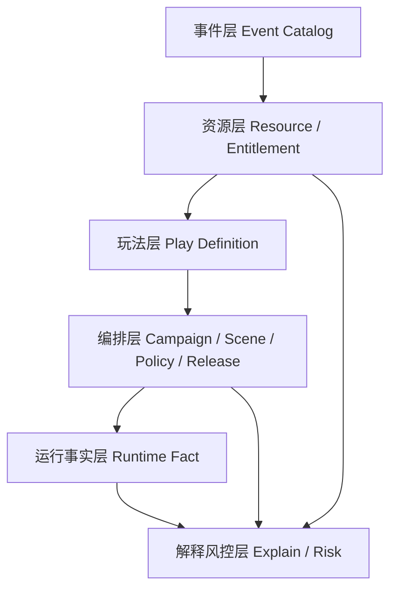
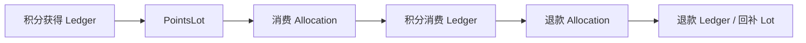

# 1. 文档目的

本文用于冻结营销模块下一阶段的架构演进方向，避免在“局部补丁”和“完整活动中台”之间来回漂移。

本方案采用：

```text
C 的领域模型作为目标架构
B 的阶段深度作为实施策略
```

换句话说：

- 不重建一套平行活动中台。
- 不一次性把所有优惠券、积分、拼课、秒杀、抽奖都塞进统一大引擎。
- 但从现在开始，事件、资源、玩法、场景、账务、履约、解释这些领域边界必须按完整模型设计。

适用阶段：

- 当前仍处于本地开发和架构塑形阶段。
- 历史生产数据包袱较小，适合先修地基。
- 后续若进入正式上线阶段，应按本文拆分出 ADR、process-spec 或交付实施文档。

# 2. 核心结论

营销模块后续不应被理解为“活动配置系统”，而应被理解为：

```text
场景出数 + 权益资产 + 玩法履约 + 可解释风控
```

当前项目已经具备较多能力：

- `PlayTemplate / StorePlayConfig / PlayInstance` 已具备玩法模板、配置和运行实例雏形。
- 优惠券已有模板、库存、用户券、锁定、核销、退还链路。
- 积分已有账户、流水、冻结、扣减、过期任务和失败重试。
- 场景链路已经以 `MktSceneRelease` 发布快照作为 C 端主入口。
- 拼课已经进入复杂玩法阶段，覆盖成团、虚拟补位、排课、考勤、分佣和课程权益。

主要缺口不是“功能少”，而是：

- 场景出数差异不可充分解释。
- 事件还不是技术白名单。
- 积分还不是完整资产账。
- 营销模板概念承担了过多语义。
- 服务容量、实物库存、积分预算、虚拟补位没有统一分类模型。

# 3. 目标模型

目标模型分为六层。



## 3.1 事件层

事件层回答：

```text
系统能稳定感知哪些业务行为？
```

事件是技术白名单，不是运营随意新增的配置项。

典型事件：

- 用户注册完成
- 用户绑定手机号
- 用户签到
- 订单创建
- 订单支付成功
- 订单取消
- 订单退款
- 优惠券领取
- 优惠券核销
- 积分获得
- 积分使用
- 拼课成团
- 拼课失败

事件目录必须说明：

- 事件编码
- 触发时机
- payload schema
- 幂等键
- owner
- 可用范围：积分、任务、触点、风控、统计
- 状态：草稿、可用、废弃

## 3.2 资源层

资源层回答：

```text
系统能发什么、能用什么、能履约什么？
```

资源包括：

- 优惠券模板
- 用户优惠券
- 积分账户
- 积分批次 / 明细
- 商品权益
- 课程课时
- 次卡
- 权益池
- 活动预算
- 库存 / 容量

资源层不决定“怎么玩”，只定义可被玩法引用的权益和资产。

## 3.3 玩法层

玩法层回答：

```text
用户怎么参与，怎样算成功，怎样算失败？
```

玩法按成熟度分级：

| 等级 | 类型   | 示例                       | 是否需要实例 | 是否需要履约 |
| ---- | ------ | -------------------------- | ------------ | ------------ |
| L0   | 展示型 | 首页活动卡片、商品角标     | 否           | 否           |
| L1   | 权益型 | 领券、新人礼包、签到送积分 | 可选         | 否           |
| L2   | 实例型 | 秒杀、会员升级、抽奖       | 是           | 可选         |
| L3   | 履约型 | 次卡、服务预约、课程核销   | 是           | 是           |
| L4   | 复合型 | 拼课、分销成长、佣金活动   | 是           | 是           |

拼课应作为 L4 复杂玩法样板，不应反向拖重简单玩法。

## 3.4 编排层

编排层回答：

```text
给谁看，在哪里看，什么时候生效，按什么策略展示？
```

核心对象：

- Campaign Draft / Release
- Activity
- Scene
- Scene Module
- Policy
- Release Snapshot

C 端主链路应继续以场景发布快照为主，不回退到每次请求现场拼配置。

## 3.5 运行事实层

运行事实层回答：

```text
真实发生了什么？
```

事实数据包括：

- PlayInstance
- MktUserCoupon
- MktCouponUsage
- MktPointsTransaction
- 未来的 MktPointsLot
- 未来的 MktPointsConsumeAllocation
- OmsOrderItemAttribution
- CourseSchedule
- CourseAttendance
- CourseGroup virtual fill audit

事实数据要长期可审计，不应被配置修改覆盖。

## 3.6 解释风控层

解释风控层回答：

```text
为什么展示、为什么发放、为什么扣减、为什么失败、哪里异常？
```

核心能力：

- 场景出数解释
- 积分风险视图
- 高风险规则派生视图
- 优惠券库存风险
- 积分预算风险
- 虚拟补位审计
- 人工操作审计
- 失败重试台账

风险结论默认是派生视图，不是稳定主数据。只有处理结果和确认快照才需要落表。

# 4. 当前问题

## 4.1 模板概念过载

当前 `PlayTemplate` 具备动态表单、前端组件映射和模板编码能力，但它本身不等于完整玩法。

真正可执行的玩法还依赖：

- `PLAY_REGISTRY`
- 玩法策略 Service
- DTO 校验
- 库存模式
- PlayInstance 状态机
- C 端展示组件
- 履约规则

因此后续需要区分：

| 类型     | 职责                                             |
| -------- | ------------------------------------------------ |
| 玩法模板 | 描述怎么玩，绑定策略、规则 schema、库存/履约语义 |
| 权益模板 | 描述发什么，如优惠券、积分、课时、商品权益       |
| 展示模板 | 描述怎么展示，如卡片、弹窗、详情组件             |
| 场景模板 | 描述在哪展示，如首页模块、详情页推荐位           |

## 4.2 场景出数差异缺少解释协议

不同账户、不同端、不同版本看到不同商品可以是正常结果，但必须可解释。

差异来源至少包括：

- tenantId
- memberId
- channel
- clientVersion
- sceneCode
- releaseNo
- 用户身份
- 新客状态
- 会员等级
- 地理位置
- 库存 / 容量
- 可用权益
- 灰度桶
- 缓存命中
- fallback 降级

如果同一账号、同一场景、同一 release，只是换手机就出现差异，默认应先怀疑：

- 缓存 key 不完整
- 渠道参数不一致
- 客户端版本策略不同
- fallback 数据来源不同
- releaseNo 缓存污染

## 4.3 积分账务不够细

当前积分已有账户和交易流水，但缺少资产明细层。

已有能力：

- 账户余额
- 冻结 / 解冻
- 扣减
- 增加
- 过期任务
- 失败重试
- 订单退款返还

缺口：

- 不知道本次消费扣了哪几批积分。
- 无法严格 FIFO。
- 退款无法原路回到来源明细。
- 过期处理基于正向交易，不是基于剩余 lot。
- 积分倍率和预算风险还缺统一解释。

## 4.4 库存与容量语义还需分层

当前已有 `STRONG_LOCK` 与 `LAZY_CHECK`，但服务类玩法还需要更细的容量模型。

| 资源       | 推荐语义                                 |
| ---------- | ---------------------------------------- |
| 实物库存   | 强锁、预占、取消释放、发货后不可简单回滚 |
| 优惠券库存 | 模板库存强扣、用户券状态机               |
| 积分       | 预算和风控，不是简单库存                 |
| 服务容量   | 时间、老师、门店、名额组合               |
| 排课资源   | 日历资源，涉及调课、停课、考勤           |
| 虚拟补位   | 运营策略，不参与订单、考勤、分佣         |

# 5. 推荐方案：C-compatible B

## 5.1 不选纯 B

纯 B 如果只是“边做边补”，会留下三个隐患：

- 模板继续混用，后续玩法越来越难解释。
- 积分继续缺明细，上线后再补迁移成本更高。
- 场景出数继续黑盒，客服、测试、运营无法复现差异。

## 5.2 不选完整 C

完整 C 如果一次性落地，会拖重简单能力：

- 简单领券也要接活动实例。
- 签到也要走完整发布版本。
- 所有奖励都被迫抽成统一 Reward。
- 所有规则都进入通用规则引擎。
- 拼课复杂度会反向污染其他玩法。

## 5.3 推荐策略

采用：

```text
先定 C 的边界
只做 B 的深度
优先处理未来最难补的地基
```

优先地基：

1. 场景出数解释协议
2. 事件目录
3. 积分 lot / allocation
4. 模板分类
5. 库存 / 容量 / 履约分类
6. 拼课复杂玩法样板

# 6. 阶段路线

## P0：概念冻结

目标：

- 冻结本文的六层模型。
- 统一“模板、玩法、权益、场景、事件、事实、解释”的语言。

改哪些模块：

- 仅文档、术语表、必要的类型说明。

不改哪些模块：

- 不改业务代码。
- 不改数据库。
- 不改前端页面。

数据表影响：

- 无。

前后台影响：

- 无运行时影响。

风险：

- 方案认知不统一，后续实施再次漂移。

验证方式：

- 架构评审。
- 对照现有 `coupon / points / template / scene / course-group` 是否都能映射进六层模型。

是否迁移历史数据：

- 否。

## P1：场景出数解释协议

目标：

- 让首页、活动页、商品详情等场景出数具备可解释能力。
- 支持回答：为什么 A 用户看到商品 X，B 用户看不到。

改哪些模块：

- `marketing/resolution`
- `marketing/scene`
- `marketing-runtime-ledger`
- C 端 scene controller / service
- admin-web 场景模拟器和运行台账

不改哪些模块：

- 不改订单支付主链路。
- 不重做推荐算法。
- 不改优惠券和积分账务。

数据表影响：

- 可新增 `mkt_scene_resolve_trace`。
- 或先扩展现有 runtime ledger，记录解释快照。

建议记录字段：

```text
traceId
tenantId
memberId
sceneCode
releaseNo
channel
clientVersion
abBucket
cacheSource
fallbackSource
candidateSnapshot
filterReasonSnapshot
selectedSnapshot
createdAt
```

前后台影响：

- miniapp 请求透传或接收 `traceId`。
- admin 增加“按 traceId 查询出数解释”。
- admin 场景模拟器支持输入 memberId、channel、clientVersion。

风险：

- 日志量变大。
- filter reason 可能包含敏感业务信息，需要脱敏。
- 缓存命中时也要能解释数据来源。

验证方式：

- 同用户同场景同 release 多次请求结果稳定。
- 不同用户出数差异能说明原因。
- 不同 channel 出数差异能说明策略来源。
- fallback 场景能说明 fallback source。

是否迁移历史数据：

- 否。

## P2：事件目录

目标：

- 把事件从代码枚举升级为技术白名单。
- 后续积分规则、任务、触点、风控都从同一事件目录选择。

改哪些模块：

- `marketing/events`
- 积分任务
- 积分发放入口
- 优惠券事件入口
- 订单集成事件入口
- admin 事件只读页面

不改哪些模块：

- 不马上重做所有积分规则。
- 不允许运营自由新增事件。

数据表影响：

可新增 `mkt_event_catalog`：

```text
id
eventCode
eventName
eventDesc
payloadSchema
idempotencyKeyPattern
owner
usableScopes
status
createTime
updateTime
```

前后台影响：

- admin 展示事件目录。
- 规则配置、任务配置后续只能引用 ONLINE 事件。

风险：

- 事件粒度过细会导致规则膨胀。
- 事件粒度过粗会导致规则无法表达。

验证方式：

- 事件 schema 测试。
- 事件触发时机测试。
- 幂等键重复上报测试。

是否迁移历史数据：

- 否，可先从代码枚举初始化。

## P3：积分资产账

目标：

- 从账户余额系统升级为资产账务系统。
- 支持 FIFO、过期、消费分摊、退款追溯。

改哪些模块：

- `marketing/points/account`
- `marketing/points/scheduler`
- `marketing/integration`
- admin-web 积分账户、流水、明细页面

不改哪些模块：

- 不重做优惠券。
- 不改变订单金额计算口径。
- 不引入完整规则引擎。

数据表影响：

新增 `mkt_points_lot`：

```text
id
tenantId
memberId
sourceTransactionId
sourceType
sourceId
amount
remainAmount
expireTime
status
createTime
updateTime
```

新增 `mkt_points_consume_allocation`：

```text
id
tenantId
memberId
spendTransactionId
lotId
amount
createTime
```

新增 `mkt_points_refund_allocation`：

```text
id
tenantId
memberId
refundTransactionId
sourceSpendTransactionId
sourceLotId
amount
strategy
createTime
```

前后台影响：

- 用户积分详情增加“积分明细”。
- 积分消费记录可展开查看扣了哪些 lot。
- 退款记录可展开查看退回策略。

风险：

- 双写账户、流水、lot 一致性风险。
- 历史交易转 lot 的迁移口径需要明确。
- 并发扣减必须严格测试。

验证方式：

- 发放积分生成 lot。
- 消费积分按 FIFO 生成 allocation。
- 已过期 lot 不可消费。
- 定时过期只处理 remainAmount 大于 0 的 lot。
- 退款时按 allocation 回补。
- 并发消费不会超扣。

是否迁移历史数据：

- 需要。
- 可将历史正向未过期积分按交易生成初始 lot。
- 无法精确还原历史消费分摊的，只标记为 legacy lot。

## P4：模板分类

对应文档：

- [20-P4-营销模板分类与边界方案](./20-P4-营销模板分类与边界方案.md)

目标：

- 解决“营销模板到底是什么”的长期歧义。
- 区分玩法能力、玩法配置模板、门店玩法配置、权益模板、展示模板、场景编排模板。
- 明确 `PlayTemplate` 不等于完整可执行玩法。

改哪些模块：

- `marketing/template`
- `marketing/play`
- `marketing/config`
- `marketing/policy`
- admin-web 营销模板页面

不改哪些模块：

- 不拆 `StorePlayConfig` 主链路。
- 不强制迁移所有历史配置。

数据表影响：

- 可在 `PlayTemplate` 补 `templateCategory`。
- 或先在 VO / admin 分组层做分类，不动表。
- 不把优惠券、积分、场景策略合并进 `PlayTemplate`。

前后台影响：

- 页面命名从“营销模板”拆为“玩法模板 / 展示模板 / 权益模板”。
- 门店玩法配置只展示可执行玩法模板。

风险：

- 旧菜单和旧文案认知冲突。
- 运营新增 `PT_xxx` 模板后误认为已经新增可执行玩法。

验证方式：

- 现有模板能无损归类。
- 现有玩法策略仍能识别 templateCode。
- `StorePlayConfig` 不能选择没有策略的模板。
- `cardTemplateCode` 继续只引用 `CARD_TEMPLATE` 策略。

是否迁移历史数据：

- 第一阶段不迁移；如后续补字段，再单独确认迁移口径。

## P5：拼课复杂玩法样板

目标：

- 把拼课沉淀成 L4 复杂玩法样板。
- 为未来服务类玩法、排课类玩法提供参考。

改哪些模块：

- `marketing/course-group`
- `marketing/play/course-group-buy`
- `marketing/stock`
- `marketing/asset`
- `finance/commission`

不改哪些模块：

- 不让其他玩法继承拼课复杂度。

数据表影响：

- 视排课资源建模深度决定。
- 可能补容量 / 排课资源 / 履约计划表。

前后台影响：

- 拼课详情增加履约解释。
- 虚拟补位、排课、考勤、分佣边界更清楚。

风险：

- 涉及资金、履约和服务交付，高风险。

验证方式：

- 开团、参团、成团、失败、退款、虚拟补位、排课、考勤、分佣全链路。

是否迁移历史数据：

- 视现有拼课数据量决定。

## P6：新玩法渐进

目标：

- 任务、签到、抽奖、倍率、预算按成熟度接入。

改哪些模块：

- 按单玩法立项。

不改哪些模块：

- 不一次性实现所有玩法。

数据表影响：

- 按玩法单独评估。

前后台影响：

- 按玩法组件挂载。

风险：

- 过度抽象。

验证方式：

- 单玩法行为测试 + 场景出数回归。

是否迁移历史数据：

- 按玩法判断。

# 7. 深挖问题

## 7.1 积分退款原路回退

当前订单退款时可以新增一笔 `REFUND` 积分，这能解决余额问题，但不能回答：

```text
这笔退回积分来自哪一次消费？
原来消费扣的是哪几批积分？
原批次是否已经过期？
部分退款怎么分摊？
```

推荐设计：



退款策略：

| 场景           | 策略                                   |
| -------------- | -------------------------------------- |
| 原 lot 未过期  | 回补原 lot remainAmount                |
| 原 lot 已过期  | 生成退款补偿 lot                       |
| 部分退款       | 按消费 allocation 比例回补             |
| 原消费分摊缺失 | 生成 legacy refund lot，并标记不可原路 |

## 7.2 是否需要积分 lot 和消费分摊表

如果积分只用于展示余额，可以不需要。

但当前系统已有：

- 积分抵扣订单
- 订单退款
- 积分过期
- 消费返积分
- 失败重试

因此建议补 lot 和 allocation。

否则后续会持续遇到：

- 过期不精确
- FIFO 不成立
- 退款无法解释
- 风控只能看总流水

## 7.3 优惠券库存与积分预算

优惠券是离散权益，库存是核心。

积分是可拆分资产，预算和风控是核心。

| 能力     | 优惠券           | 积分                   |
| -------- | ---------------- | ---------------------- |
| 基本单位 | 一张用户券       | 可拆分分值             |
| 核心风险 | 超发券、重复领取 | 超发分、刷分、倍率放大 |
| 库存模型 | 模板库存         | 预算池 / 发放上限      |
| 使用模型 | 锁定、核销、退还 | 冻结、扣减、分摊、回补 |
| 过期模型 | 用户券过期       | lot 过期               |

## 7.4 实物库存、服务容量、排课资源、虚拟补位

这四类不能混用一个 `stock` 字段解释。

| 类型     | 本质             | 失败后果       | 推荐模型               |
| -------- | ---------------- | -------------- | ---------------------- |
| 实物库存 | 可发货数量       | 超卖无法发货   | 强锁预占               |
| 服务容量 | 可服务名额       | 需调度或补偿   | 容量校验               |
| 排课资源 | 老师/教室/时间段 | 履约冲突       | 日历资源               |
| 虚拟补位 | 展示/成团策略    | 信任和财务风险 | 审计事实，不进真实履约 |

## 7.5 拼课作为复杂玩法样板

拼课不是“团购 + 库存”。

它是：

```text
招募 -> 成团 -> 排课 -> 考勤 -> 核销 -> 分佣 -> 退款/补偿
```

拼课样板应沉淀：

- 团状态投影
- 真实成员和虚拟成员分离
- 虚拟补位审计
- 排课履约计划
- 考勤事实
- 课时资产
- 分佣证据
- 失败补偿

## 7.6 其他玩法渐进

其他玩法不应直接复制拼课模型。

建议：

- 签到：先做 L1，事件驱动 + 积分 lot。
- 任务：做 L2，事件推进进度。
- 抽奖：做 L2/L3，奖池、概率快照、保底、发奖幂等。
- 秒杀：做 L2，强库存、订单锁定、支付超时释放。
- 会员升级：做 L2/L3，支付成功后权益状态变更。

# 8. 后续实施顺序

推荐下一步先做 P1 和 P2 的详细设计。

理由：

- 不涉及资金真实变更。
- 不需要迁移历史数据。
- 能直接解决“不同用户 / 不同端首页看到不同商品”的解释问题。
- 能为后续积分任务、触点、风控打基础。

后续设计拆分：

1. `15-P1-营销场景出数解释协议.md`
2. `16-P2-营销事件目录与规则触发边界.md`
3. `17-P3-积分资产账与退款原路回退方案.md`
4. `18-P5-拼课复杂玩法样板化方案.md`

## 8.1 2026-04-29 实施核验补充

本轮按 C-compatible B 的阶段边界继续收口，不新增通用活动中台，也不新增未确认的抽奖、倍率、预算类 P6 能力。

已补齐的架构证据：

- P1 场景出数解释从“只知道 trace 命中”推进到“可回看候选、受众过滤、主推选择和选中商品快照”。
- P3 积分退款入口从“部分退款触发全量积分处理”修正为“按本次退款单幂等、按退款比例返还已抵扣积分并扣回消费赠送积分”。
- C 端积分资产从“我的页占位数字”推进到“余额、批次、消费分摊、退款回流可查询”。
- P5 拼课样板继续沿用四轴边界，复核并执行虚拟补位、投影、排课资源、考勤排除虚拟成员等测试；本轮没有把拼课履约模型抽成通用玩法状态。

仍需保持单独确认的高风险项：

- 不执行真实数据库 migration / deploy。
- 不对历史积分、历史拼课、历史订单做批量回填。
- 不新增 P6 玩法能力或运营可配置技术事件。

# 9. 逻辑矫正

本方案修正此前两个容易误导的判断：

1. 不是“选 B 不选 C”。

   - 正确表述是：用 C 的领域骨架，按 B 的深度实施。

2. 不是“营销活动系统”。
   - 正确表述是：场景出数、权益资产、玩法履约、解释风控共同构成营销域。

# 10. 注释审查与注释方案

后续进入实施时，注释重点应放在非显然边界：

- 事件只描述发生了什么，不承诺一定发奖。
- 场景出数差异必须由上下文、策略、库存、缓存或降级解释。
- 积分 lot 是资产层，不等同于流水。
- 消费 allocation 是退款和 FIFO 的证据。
- 虚拟补位不参与真实订单、考勤和分佣。
- `STRONG_LOCK` 适用于实物或强库存，服务容量和排课资源不能直接套用。

禁止把这些边界散落在页面文案或临时代码注释中，应沉淀到对应 service、DTO、process-spec 或 ADR。
