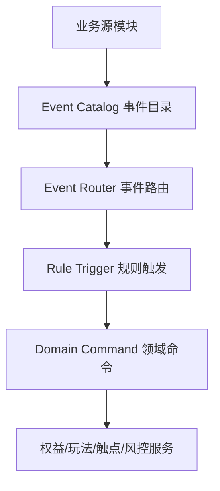

# 1. 文档目的

本文承接：

- [14-C-compatible-B-营销架构演进方案](./14-C-compatible-B-营销架构演进方案.md)
- [15-P1-营销场景出数解释协议](./15-P1-营销场景出数解释协议.md)

P2 要解决的问题是：

```text
哪些业务行为可以稳定触发营销规则？
哪些动作不能因为“事件驱动”就异步化？
积分、优惠券、玩法模板、触点通知应该如何共用事件，但不互相拖重？
```

本文不是要把项目改成完整事件溯源系统，也不是要做运营可随意新增事件的活动中台。P2 的目标是建立“事件目录 + 规则触发边界”，让后续积分、优惠券、任务、触点、拼课和更多玩法有稳定的触发基础。

# 2. 核心结论

营销事件要被理解为：

```text
系统已经确认发生的业务事实。
```

事件不是：

- 运营配置项。
- 前端埋点名称。
- 要执行的命令。
- 规则本身。
- 可替代事务一致性的异步补丁。

P2 推荐采用：

```text
事件事实目录作为技术白名单
规则订阅事件后产生命令
命令再调用积分、优惠券、玩法、触点等领域服务
```

但必须保留一个底线：

```text
支付、退款、券锁定、积分抵扣、库存占用、排课履约这类强一致动作，不应只靠异步事件完成。
```

事件驱动适合：

- 可补偿的积分发放。
- 发券任务。
- 签到 / 任务完成。
- 触点通知。
- 统计分析。
- 风控视图。
- 缓存失效。
- 玩法状态后的衍生动作。

事件驱动不适合直接替代：

- 下单时锁券。
- 下单时冻结积分。
- 支付时核销优惠券。
- 支付时扣减冻结积分。
- 退款时回滚用户资产。
- 拼课成团时的核心状态流转。
- 排课资源的最终占用。

# 3. 当前事实

## 3.1 已有事件基础

当前后端已经有营销事件基础：

- 事件类型：`apps/backend/src/module/marketing/events/marketing-event.types.ts`
- 事件发射器：`apps/backend/src/module/marketing/events/marketing-event.emitter.ts`
- 事件监听器：`apps/backend/src/module/marketing/events/marketing-event.listener.ts`
- 触点编排：`apps/backend/src/module/marketing/events/touchpoint-orchestrator.service.ts`
- 模拟事件样例：`apps/backend/src/module/marketing/resolution/sample-event.catalog.ts`
- 缓存失效监听：`apps/backend/src/module/marketing/resolution/resolution-cache.listener.ts`

当前 `MarketingEventType` 已覆盖：

- 玩法实例生命周期：`instance.created / paid / success / failed / timeout / refunded`
- 优惠券：`coupon.claimed / used / expired`
- 积分：`points.earned / used / expired`
- 订单集成：`integration.order.created / paid / cancelled / refunded`
- 拼团 / 秒杀 / 课程：`group.full / group.failed / flash_sale.sold_out / course.open`
- 配置与缓存失效：`scene.release.published / policy.config.changed / resolution.priorityRule.changed`

## 3.2 当前事件的真实作用

当前事件更多承担：

- 记录 Redis 最近事件和日级计数。
- 触发消息触点。
- 触发缓存失效。
- 做模拟器样例。
- 作为部分服务处理完成后的审计信号。

从代码看，关键业务仍是服务直接调用：

- 订单创建直接锁券、冻结积分。
- 订单支付直接核销券、扣减积分、计算并发放消费积分。
- 订单退款直接退券、补积分、扣回消费赠送积分。
- 优惠券领取直接创建用户券并扣库存。
- 积分账户直接创建流水并更新账户。

这说明项目已经做对了一半：

```text
强一致链路没有被异步事件掏空。
```

但还缺另一半：

```text
哪些事件能触发哪些规则，缺少稳定目录和边界声明。
```

## 3.3 当前风险

如果不先定义事件目录，后续会出现几类问题：

- 监听器越来越多，谁都可以订阅同一个事件。
- 同一个事件 payload 被不同消费者按不同假设解析。
- 积分、优惠券、触点、任务各自造一套触发规则。
- 事件失败不影响主流程，但用户权益可能悄悄漏发。
- 配置变更事件和用户行为事件混用，导致规则误触发。
- 模拟事件、缓存事件、真实业务事件边界不清。

# 4. 目标模型

P2 建议把事件链路拆成五层：



## 4.1 业务源模块

业务源模块只负责在事实成立后发出事件。

例如：

- 订单支付成功后发出 `order.paid`。
- 优惠券领取成功后发出 `coupon.claimed`。
- 积分入账成功后发出 `points.earned`。
- 拼课成团成功后发出 `course_group.team_formed`。

业务源模块不应该知道所有营销规则。

## 4.2 Event Catalog

事件目录回答：

```text
系统承认哪些事件是稳定事实？
```

事件目录不是 `enum` 本身，而是 `enum + schema + 触发时机 + 幂等语义 + 消费边界`。

每个事件必须定义：

| 字段            | 说明                                                   |
| --------------- | ------------------------------------------------------ |
| eventType       | 稳定事件编码                                           |
| displayName     | 人读名称                                               |
| category        | USER / ORDER / COUPON / POINTS / PLAY / SCENE / CONFIG |
| owner           | 事件来源模块负责人                                     |
| sourceModule    | 发出事件的模块                                         |
| triggerTiming   | 触发时机，必须说明事务前后                             |
| payloadSchema   | payload 结构                                           |
| idempotencyKey  | 幂等键规则                                             |
| orderingKey     | 顺序键，一般是订单、实例、用户或队伍                   |
| tenantScoped    | 是否租户隔离                                           |
| replayable      | 是否允许重放                                           |
| ruleTriggerable | 是否允许营销规则订阅                                   |
| consumers       | 已知消费者                                             |
| privacyLevel    | 是否包含敏感数据                                       |
| status          | DRAFT / ACTIVE / DEPRECATED                            |

## 4.3 Event Router

事件路由回答：

```text
这个事件可以给谁消费？
```

它不执行业务规则，只做分发和治理：

- 校验事件是否在目录中。
- 校验 payload 基础字段。
- 生成或透传 `traceId`。
- 生成 `eventId` 和 `idempotencyKey`。
- 标记事件分类。
- 决定是否进入规则触发、触点、统计、缓存失效。

## 4.4 Rule Trigger

规则触发回答：

```text
这个事件命中了哪些运营或系统规则？
```

规则触发只能输出命令，不直接改资产。

例如：

```text
order.paid
  -> 命中消费送积分规则
  -> 产出 GrantPointsCommand
  -> PointsAccountService.addPoints
```

再如：

```text
member.registered
  -> 命中新人礼包规则
  -> 产出 GrantCouponCommand
  -> CouponDistributionService.grant
```

## 4.5 Domain Command

领域命令回答：

```text
真正要执行什么资产或玩法动作？
```

命令必须具备：

- 幂等键。
- 目标资源。
- 来源事件。
- 失败处理。
- 审计记录。

典型命令：

- `GrantPointsCommand`
- `DeductPointsCommand`
- `GrantCouponCommand`
- `CompleteTaskCommand`
- `SendTouchpointCommand`
- `OpenPlayInstanceCommand`
- `InvalidateSceneCacheCommand`

# 5. 事件分类

P2 建议将事件分为四类，不同类别使用不同边界。

## 5.1 业务事实事件

业务事实事件来自用户、订单、权益、玩法的真实状态变化。

示例：

- `member.registered`
- `member.phone_bound`
- `signin.completed`
- `order.created`
- `order.paid`
- `order.cancelled`
- `order.refunded`
- `coupon.claimed`
- `coupon.used`
- `coupon.expired`
- `points.earned`
- `points.used`
- `points.expired`
- `play.instance.created`
- `play.instance.success`
- `course_group.team_formed`

这类事件可以触发营销规则。

## 5.2 资产流水事件

资产流水事件描述资产账已经发生变化。

示例：

- `points.earned`
- `points.used`
- `points.expired`
- `coupon.claimed`
- `coupon.used`
- `coupon.refunded`

这类事件不应该再反向触发同类资产变更，避免循环。

例如：

```text
points.earned 不能再触发“再送积分”规则。
```

但它可以触发：

- 触点通知。
- 统计分析。
- 风险识别。
- 任务完成。

## 5.3 配置与缓存事件

配置与缓存事件是技术事件。

示例：

- `scene.release.published`
- `policy.config.changed`
- `resolution.priorityRule.changed`
- `storePlayConfig.statusChanged`
- `activity.stockDepleted`

这类事件默认不允许触发用户权益规则。

它们适合：

- 清缓存。
- 刷新发布快照。
- 记录配置审计。
- 通知后台监控。

## 5.4 模拟与测试事件

`sample-event.catalog.ts` 当前用于试跑或模拟场景。

这类事件必须和生产事件隔离：

- 不能进入真实积分账户。
- 不能真实发券。
- 不能触发真实通知。
- 可以进入模拟器解释和规则试算。

# 6. 推荐事件目录

以下是 P2 推荐事件目录草案。当前不要求一次性全部实现，但新增事件应按这个目录归类。

## 6.1 用户事件

| eventType                  | 触发时机         | 可触发规则               | 备注                |
| -------------------------- | ---------------- | ------------------------ | ------------------- |
| `member.registered`        | 用户注册完成后   | 新人礼包、首登任务、触点 | 需要账户创建成功    |
| `member.phone_bound`       | 手机号绑定成功后 | 绑手机送券 / 送积分      | 需要防重复          |
| `member.profile_completed` | 资料完善完成后   | 成长任务                 | 不建议影响强权益    |
| `signin.completed`         | 签到成功后       | 签到积分、连续签到奖励   | 幂等键按会员 + 日期 |

## 6.2 订单事件

| eventType         | 触发时机                     | 可触发规则                         | 不应做什么                |
| ----------------- | ---------------------------- | ---------------------------------- | ------------------------- |
| `order.created`   | 订单创建成功后               | 下单任务、触点                     | 不异步锁券 / 冻结积分     |
| `order.paid`      | 支付成功且营销支付处理完成后 | 消费送积分、支付后发券、会员成长值 | 不异步核销券 / 扣抵扣积分 |
| `order.cancelled` | 订单取消回滚完成后           | 取消触点、风险统计                 | 不异步退券 / 解冻积分     |
| `order.refunded`  | 退款和营销回滚完成后         | 退款触点、扣回奖励积分、风险统计   | 不只靠事件做原路退回      |

当前项目已有 `integration.order.*`。推荐后续把它们定位为：

```text
订单营销集成处理完成事件
```

也就是它们不是“订单系统原始事件”，而是“营销侧已经处理过订单联动后的事实”。

## 6.3 优惠券事件

| eventType         | 触发时机         | 可触发规则         | 边界                         |
| ----------------- | ---------------- | ------------------ | ---------------------------- |
| `coupon.claimed`  | 用户券创建成功后 | 触点、任务、统计   | 不再触发二次发券，避免循环   |
| `coupon.used`     | 优惠券核销成功后 | 核销任务、复购触点 | 不反向改订单                 |
| `coupon.expired`  | 过期任务处理后   | 召回触点、损耗统计 | 不自动补券，除非独立补偿规则 |
| `coupon.refunded` | 退款退券成功后   | 退款触点、风控     | 需要和订单退款 trace 关联    |

当前缺口：

- `coupon.refunded` 可以考虑补充。
- `coupon.claimed` 的来源应区分手动发放、用户领取、订单后发放、任务奖励。

## 6.4 积分事件

| eventType         | 触发时机           | 可触发规则       | 边界                          |
| ----------------- | ------------------ | ---------------- | ----------------------------- |
| `points.earned`   | 积分增加成功后     | 通知、任务、统计 | 不再触发积分奖励              |
| `points.used`     | 积分扣减成功后     | 消耗分析、风控   | 不反向影响订单支付            |
| `points.expired`  | 积分过期处理成功后 | 召回、损耗统计   | 不自动恢复                    |
| `points.refunded` | 积分退款回退成功后 | 退款通知、审计   | 依赖 P3 lot / allocation 方案 |
| `points.adjusted` | 后台人工调整成功后 | 审计、风控       | 必须记录操作人                |

当前缺口：

- 积分事件已有获得、使用、过期。
- 退款、调整、lot 来源和消费分摊不完整，放到 P3 深挖。

## 6.5 玩法事件

| eventType                | 触发时机       | 可触发规则           | 边界                    |
| ------------------------ | -------------- | -------------------- | ----------------------- |
| `play.instance.created`  | 玩法实例创建后 | 参与统计、触点       | 不直接发放最终权益      |
| `play.instance.paid`     | 实例支付后     | 触点、任务           | 不替代订单支付处理      |
| `play.instance.success`  | 玩法成功后     | 权益发放、触点、统计 | 发放必须有幂等命令      |
| `play.instance.failed`   | 玩法失败后     | 退款提醒、触点       | 退款仍走订单 / 财务链路 |
| `play.instance.timeout`  | 玩法超时后     | 关闭、提醒           | 状态机内完成核心流转    |
| `play.instance.refunded` | 实例退款完成后 | 触点、审计           | 不直接改资金账          |

当前 `instance.*` 已基本覆盖，可继续使用。

## 6.6 拼课事件

拼课是复杂玩法样板，建议不要只用通用 `group.full` 表达全部语义。

推荐补充更明确的拼课事件：

| eventType                           | 触发时机           | 可触发规则             | 说明             |
| ----------------------------------- | ------------------ | ---------------------- | ---------------- |
| `course_group.team_created`         | 开团成功后         | 开团触点               | 队伍事实         |
| `course_group.member_joined`        | 真实用户参团成功后 | 参团触点、任务         | 真实成员         |
| `course_group.virtual_filled`       | 虚拟补位后         | 审计、风控             | 不是库存         |
| `course_group.team_formed`          | 成团成功后         | 发课时、通知、排课准备 | 核心事实         |
| `course_group.team_failed`          | 拼课失败后         | 退款提醒、触点         | 失败原因要结构化 |
| `course_group.schedule_bound`       | 队伍绑定课次后     | 上课通知               | 涉及排课资源     |
| `course_group.attendance_confirmed` | 考勤确认后         | 完课奖励、分佣结算     | 履约完成事实     |

其中：

- `team_formed` 不能等同于“已履约”。
- `schedule_bound` 说明已有排课安排。
- `attendance_confirmed` 才接近服务真实消耗。

这对服务和实物库存差异很关键。

## 6.7 场景与配置事件

| eventType                         | 触发时机         | 用途             | 是否可触发权益 |
| --------------------------------- | ---------------- | ---------------- | -------------- |
| `scene.release.published`         | 场景发布成功后   | 清缓存、审计     | 否             |
| `policy.config.changed`           | 策略保存后       | 清缓存、审计     | 否             |
| `resolution.priorityRule.changed` | 优先级规则变更后 | 清缓存、审计     | 否             |
| `storePlayConfig.statusChanged`   | 门店玩法上下架后 | 清缓存、审计     | 否             |
| `activity.stockDepleted`          | 活动库存耗尽后   | 清缓存、下架提醒 | 否             |

这些事件是技术治理事件，不应进入用户奖励规则。

# 7. 规则触发边界

## 7.1 允许的触发

规则可以订阅：

- 用户行为事实。
- 订单营销处理完成事实。
- 玩法状态事实。
- 履约完成事实。

规则可以产出：

- 发积分命令。
- 发券命令。
- 完成任务命令。
- 发送触点命令。
- 写风险视图命令。
- 刷新缓存命令。

## 7.2 禁止的触发

规则默认禁止：

- 资产流水事件触发同类资产变更。
- 配置事件触发用户权益。
- 模拟事件触发真实权益。
- 纯前端埋点直接发放权益。
- 无幂等键事件触发资产变更。

示例：

```text
points.earned -> 再送积分
```

应禁止，避免积分循环。

```text
scene.release.published -> 给所有用户发券
```

应禁止。发布场景不是用户行为事实。

```text
front.click.banner -> 直接发积分
```

应禁止。点击埋点不能作为强权益依据，除非后端确认并生成稳定业务事件。

## 7.3 强一致链路保留直调

这些动作应继续由当前业务服务直接处理：

| 场景              | 推荐方式                 | 原因                 |
| ----------------- | ------------------------ | -------------------- |
| 下单锁券          | 订单集成服务直调券服务   | 下单失败必须同步感知 |
| 下单冻结积分      | 订单集成服务直调积分服务 | 防止超用             |
| 支付核销券        | 支付营销处理内完成       | 订单支付结果依赖     |
| 支付扣抵扣积分    | 支付营销处理内完成       | 资产账必须同步一致   |
| 退款退券 / 退积分 | 退款营销处理内完成       | 用户资产必须可追溯   |
| 拼课成团状态变更  | 拼课服务状态机内完成     | 并发和容量约束复杂   |
| 排课资源占用      | 排课服务内完成           | 涉及老师、教室、时间 |

这些动作完成后可以发事件，用于衍生动作和审计。

## 7.4 可补偿链路可事件化

这些动作可以由事件规则触发，但必须可补偿：

| 场景       | 推荐方式                                                    | 失败处理          |
| ---------- | ----------------------------------------------------------- | ----------------- |
| 消费送积分 | `order.paid` -> `GrantPointsCommand`                        | 失败进入重试台账  |
| 支付后发券 | `order.paid` -> `GrantCouponCommand`                        | 失败可重试或补发  |
| 新人礼包   | `member.registered` -> `GrantCouponCommand`                 | 幂等避免重复      |
| 签到送积分 | `signin.completed` -> `GrantPointsCommand`                  | 按会员 + 日期幂等 |
| 完课奖励   | `course_group.attendance_confirmed` -> `GrantPointsCommand` | 以考勤记录幂等    |
| 触点通知   | 任意允许事件 -> `SendTouchpointCommand`                     | 失败记录通知重试  |

# 8. 与积分、优惠券、玩法模板的关系

## 8.1 积分

积分应消费事件，但不应被事件随意驱动。

推荐：

- `order.paid` 可以触发消费送积分。
- `signin.completed` 可以触发签到积分。
- `course_group.attendance_confirmed` 可以触发完课积分。
- `points.earned` 只用于通知、统计、风险，不再触发积分规则。

P3 会继续处理：

- 积分 lot。
- 消费分摊。
- 退款原路回退。
- 过期和退款的相互影响。

## 8.2 优惠券

优惠券有两类动作：

```text
领取 / 发放
使用 / 退还
```

推荐：

- 用户主动领券仍走优惠券服务同步扣库存。
- 事件触发发券可以用于新人礼包、支付后返券、任务奖励。
- 订单使用优惠券必须在订单营销处理内同步完成。
- 退款退券必须由退款链路驱动，不只靠事件补偿。

## 8.3 玩法模板

营销模板可以理解为文章里的“玩法模板”，但要补一句：

```text
模板只是玩法定义的一部分，不是事件规则本身。
```

模板定义：

- 可配置字段。
- 前端表单。
- 卡片展示。
- 玩法类型。

事件规则定义：

- 什么事实发生。
- 命中什么条件。
- 产出什么命令。
- 如何幂等和补偿。

因此不建议把所有事件规则塞进 `PlayTemplate`。更合理的是：

```text
PlayTemplate 定义玩法结构
EventRule 定义触发关系
DomainCommand 执行权益或履约动作
```

# 9. 数据模型建议

P2 仍推荐先文档和代码结构冻结，不急着改 Prisma。

## 9.1 代码目录档

不新增表。

做法：

- 先用 TypeScript 常量维护 `MarketingEventCatalog`。
- 让 `MarketingEventType` 和 catalog 一一对应。
- 在单测中校验每个事件都有目录定义。
- 规则触发先保持代码内白名单。

优点：

- 不触发 schema 变更。
- 适合本地开发阶段快速收敛边界。

缺点：

- 后台无法动态查看目录。
- 运营侧看不到完整事件说明。

## 9.2 完整档

未来可新增：

```text
mkt_event_catalog
mkt_event_rule
mkt_event_command_log
```

建议字段：

### mkt_event_catalog

| 字段                 | 说明             |
| -------------------- | ---------------- |
| event_type           | 事件编码         |
| category             | 分类             |
| display_name         | 名称             |
| source_module        | 来源模块         |
| payload_schema       | payload schema   |
| idempotency_key_expr | 幂等键表达式     |
| rule_triggerable     | 是否允许触发规则 |
| replayable           | 是否可重放       |
| status               | 状态             |

### mkt_event_rule

| 字段             | 说明     |
| ---------------- | -------- |
| rule_code        | 规则编码 |
| event_type       | 订阅事件 |
| condition_config | 条件     |
| command_type     | 输出命令 |
| command_config   | 命令参数 |
| priority         | 优先级   |
| status           | 状态     |

### mkt_event_command_log

| 字段            | 说明                                  |
| --------------- | ------------------------------------- |
| event_id        | 来源事件                              |
| idempotency_key | 命令幂等键                            |
| command_type    | 命令类型                              |
| target_id       | 目标资源                              |
| status          | PENDING / SUCCESS / FAILED / RETRYING |
| error_message   | 失败原因                              |
| trace_id        | 链路                                  |

推荐：

```text
P2 不直接新增表。
先定义 catalog 常量和规则触发边界；
等 P3 积分资产账、P5 拼课样板落地后，再判断是否需要表驱动规则。
```

# 10. 实施分析

P2 不是新增几个事件枚举，而是把现有事件系统升级为可治理的技术白名单。实施上先代码目录化，后续再决定是否表驱动。

## 10.1 当前代码切入点

核心文件：

- `apps/backend/src/module/marketing/events/marketing-event.types.ts`
- `apps/backend/src/module/marketing/events/marketing-event.emitter.ts`
- `apps/backend/src/module/marketing/events/marketing-event.listener.ts`
- `apps/backend/src/module/marketing/events/touchpoint-orchestrator.service.ts`
- `apps/backend/src/module/marketing/events/events.module.ts`
- `apps/backend/src/module/marketing/resolution/sample-event.catalog.ts`

事件生产方：

- `apps/backend/src/module/marketing/integration/integration.service.ts`
- `apps/backend/src/module/marketing/points/account/account.service.ts`
- `apps/backend/src/module/marketing/points/scheduler/scheduler.service.ts`
- `apps/backend/src/module/marketing/coupon/distribution/distribution.service.ts`
- `apps/backend/src/module/marketing/coupon/usage/usage.service.ts`
- `apps/backend/src/module/marketing/coupon/scheduler/scheduler.service.ts`
- `apps/backend/src/module/marketing/scene/scene.service.ts`
- `apps/backend/src/module/marketing/policy/policy.service.ts`
- `apps/backend/src/module/marketing/resolution/priority-rule.service.ts`

当前特点：

- `MarketingEventType` 已覆盖较多事件。
- `MarketingEvent` payload 仍是 `Record<string, unknown>`。
- `MarketingEventEmitter.emitAsync` 使用 `setImmediate`，不阻塞主流程。
- `MarketingEventListener` 主要做 Redis 计数、最近事件、触点派发和日志。
- `TouchpointOrchestratorService` 自己维护消息事件白名单。
- 模拟事件目录与真实事件共用 `MarketingEventType`，需要隔离真实资产执行。

## 10.2 实施目标

P2 实施目标：

```text
事件可登记
payload 可校验
消费者可治理
规则触发有白名单
强一致链路不被异步事件替代
```

第一阶段产物：

- `MarketingEventCatalog` 代码常量。
- `MarketingEventCategory` 分类。
- `MarketingEventUsableScope` 可用范围。
- `ruleTriggerable` 标记。
- `replayable` 标记。
- `payloadSchema` 或 payload guard。
- catalog 单测。

## 10.3 事件目录落点

建议新增文件：

```text
apps/backend/src/module/marketing/events/marketing-event.catalog.ts
```

目录结构建议：

```ts
type MarketingEventCatalogItem = {
  eventType: MarketingEventType;
  category: 'USER' | 'ORDER' | 'COUPON' | 'POINTS' | 'PLAY' | 'SCENE' | 'CONFIG' | 'SIMULATION';
  displayName: string;
  sourceModule: string;
  ruleTriggerable: boolean;
  replayable: boolean;
  usableScopes: Array<'POINTS' | 'COUPON' | 'TASK' | 'TOUCHPOINT' | 'RISK' | 'CACHE' | 'STAT'>;
  idempotencyKey: string;
  payloadSchemaVersion: number;
  status: 'ACTIVE' | 'DRAFT' | 'DEPRECATED';
};
```

要求：

- 每个 `MarketingEventType` 必须有 catalog。
- 配置和缓存事件 `ruleTriggerable = false`。
- 资产流水事件不得触发同类资产变更。
- 模拟事件必须标记 `SIMULATION` 或携带 simulation context。

## 10.4 emitter 改造分析

`MarketingEventEmitter` 应在发送前做基础治理：

- 校验 eventType 是否在 catalog。
- 补齐 `tenantId`。
- 补齐或透传 `traceId`。
- 生成 `eventId`。
- 生成 `idempotencyKey`。
- 对未知事件拒绝发送或记录治理错误。

注意：

```text
emitAsync 不应被用于强一致资产处理。
```

所以注释和代码结构都要提醒：订单锁券、积分冻结、核销、退款不应依赖事件监听器异步完成。

## 10.5 listener 改造分析

`MarketingEventListener` 当前有大量事件 handler。P2 不建议继续在一个 listener 里堆所有业务。

推荐拆分责任：

- `MarketingEventAuditListener`：Redis 计数、最近事件。
- `MarketingTouchpointListener`：触点派发。
- `MarketingRuleTriggerListener`：只接收 `ruleTriggerable = true` 的事件。
- `MarketingCacheEventListener`：配置 / 场景缓存失效仍留在 resolution cache listener。

阶段化实施可以先不拆文件，但要把白名单判断统一改为 catalog，而不是各服务各写一套 `Set<MarketingEventType>`。

## 10.6 规则触发分析

如果新增 `RuleTriggerService`，它只能做：

```text
event -> matched rules -> domain commands
```

不能直接改积分、券、订单、拼课状态。

命令示例：

- `GrantPointsCommand`
- `GrantCouponCommand`
- `CompleteTaskCommand`
- `SendTouchpointCommand`
- `InvalidateSceneCacheCommand`

命令必须有幂等键：

```text
eventId + ruleCode + commandType + targetId
```

## 10.7 模拟事件隔离

`sample-event.catalog.ts` 当前复用真实事件类型。后续需要加隔离字段：

- `simulation: true`
- `scenarioCode`
- `sampleEventId`
- `dryRunOnly`

模拟事件允许：

- 规则试算。
- trace 展示。
- 触发解释。

模拟事件禁止：

- 真实发券。
- 真实发积分。
- 真实发通知。
- 真实修改订单或玩法实例。

## 10.8 验证分析

必须验证：

- `MarketingEventType` 与 `MarketingEventCatalog` 一一对应。
- 配置事件不能进入规则触发。
- `points.earned` 不能触发再次发积分。
- 模拟事件不能执行真实资产命令。
- 触点事件白名单来自 catalog。
- 订单支付 / 退款仍由 `OrderIntegrationService` 直调资产服务。
- emitAsync 失败不影响主流程，但可被最近事件或失败日志观察。

## 10.9 文件级执行顺序

建议顺序：

1. 新增 `marketing-event.catalog.ts`。
2. 给 `MarketingEventType` 建 catalog 覆盖测试。
3. 在 `MarketingEventEmitter` 中读取 catalog 做基础校验和补充 metadata。
4. 把 `TouchpointOrchestratorService.MESSAGE_EVENT_SET` 改为从 catalog 派生。
5. 给 sample event 加 simulation / dry-run 语义。
6. 后续再引入 `RuleTriggerService` 和 command log。

本阶段不新增表，不开放运营动态新增事件。

# 11. 阶段路线

## P2.1 事件目录冻结

目标：

- 固定事件分类、目录字段、触发边界。
- 明确哪些事件可触发规则，哪些只是技术事件。

改哪些模块：

- 文档。
- 后续可新增 `MarketingEventCatalog` 常量。

不改哪些模块：

- 不改积分账户。
- 不改优惠券库存。
- 不改订单支付退款。
- 不改拼课状态机。

数据表影响：

- 无。

前后台影响：

- 暂无页面变化。

风险：

- 目录过细会增加维护成本。
- 目录过粗会无法支撑规则复用。

验证方式：

- 用现有 `MarketingEventType` 逐项映射目录。
- 找出不能触发权益的技术事件。

是否迁移历史数据：

- 否。

## P2.2 事件 payload 规范

目标：

- 每个事件明确必填字段、幂等键、traceId、sourceStep。

改哪些模块：

- `apps/backend/src/module/marketing/events/marketing-event.types.ts`
- `apps/backend/src/module/marketing/events/marketing-event.emitter.ts`

不改哪些模块：

- 不改具体业务服务。

数据表影响：

- 无。

风险：

- 一次性强类型化所有 payload 成本较高。

验证方式：

- 单测校验发出的事件包含必要字段。

是否迁移历史数据：

- 否。

## P2.3 规则触发白名单

目标：

- 只允许 `ruleTriggerable = true` 的事件进入规则触发。

改哪些模块：

- 后端事件路由 / 规则触发服务。
- 触点编排可复用同一目录判断。

不改哪些模块：

- 不改资产服务执行逻辑。

数据表影响：

- 无。

风险：

- 白名单遗漏会导致规则不触发。

验证方式：

- 配置事件不触发权益。
- 业务事实事件可触发命令。
- 模拟事件不触发真实权益。

是否迁移历史数据：

- 否。

## P2.4 命令日志与补偿

目标：

- 对事件触发的发积分、发券、触点通知建立命令级幂等和失败记录。

改哪些模块：

- 积分发放包装命令。
- 优惠券发放包装命令。
- 触点发送包装命令。

不改哪些模块：

- 不改支付强一致链路。
- 不改退款强一致链路。

数据表影响：

- 可能需要 `mkt_event_command_log`，属于后续高风险 schema 变更，需单独确认。

风险：

- 没有命令日志时，事件规则失败不易补偿。

验证方式：

- 同一事件重复投递不会重复发券 / 发积分。
- 命令失败可重试。

是否迁移历史数据：

- 否。

## P2.5 后台事件目录视图

目标：

- 后台可查看事件目录、消费者、触发规则、最近失败。

改哪些模块：

- backend admin 查询接口。
- admin-web 事件目录页面。

不改哪些模块：

- 不开放运营随意新增事件。

数据表影响：

- 如果目录仍是代码常量，则页面只读。

风险：

- 运营可能误以为可以任意配置所有事件。

验证方式：

- 页面能区分业务事实事件、技术事件、模拟事件。

是否迁移历史数据：

- 否。

# 12. 与文章设计的取舍

文章里的事件驱动活动系统强调：

- 玩法模板。
- 事件触发。
- 规则匹配。
- 任务和奖励。
- 风控和审计。

这些思路值得吸收，但本项目不适合照搬成完整活动中台。

原因：

- 项目已经有优惠券、积分、玩法实例、场景发布和拼课履约，不是空白系统。
- 拼课涉及排课、考勤、课程权益、虚拟补位，比普通“活动奖励”更重。
- 订单支付和退款已经有强一致营销处理，不能被异步事件弱化。
- 当前还在本地开发，应该先冻结边界，而不是上来做运营全动态引擎。

因此推荐：

```text
吸收文章的事件目录、规则白名单、幂等、审计思想；
不照搬它的全量活动引擎。
```

# 13. 逻辑矫正

需要先纠正几个容易误判的点：

1. “事件驱动就是所有动作都异步”：不准确。强一致资产和订单链路不能被异步事件替代。
2. “有 MarketingEventType 就等于有事件目录”：不准确。事件目录还要定义 payload、幂等、消费者、可触发范围和状态。
3. “运营可以自由新增事件”：不准确。事件是技术白名单，运营只能配置基于事件的规则。
4. “优惠券、积分、营销模板都能放进一个玩法模板”：不准确。模板定义玩法结构，事件规则定义触发关系，资产服务负责执行。
5. “积分获得事件可以继续触发积分奖励”：不准确。这会导致循环奖励，应禁止同类资产反向触发。
6. “模拟器事件和真实事件一样”：不准确。模拟事件不能触发真实权益。

# 14. 注释审查与注释方案

如果后续进入代码实现，注释应集中在以下位置：

- `MarketingEventCatalog`：说明事件目录是技术白名单，不是运营动态配置。
- `MarketingEventEmitter`：说明事件发送失败是否影响主流程，以及哪些场景不能依赖异步事件保证权益。
- `RuleTriggerService`：说明只处理 `ruleTriggerable = true` 的事件。
- `DomainCommand` 执行器：说明幂等键、来源事件和失败补偿策略。
- `sample-event.catalog.ts`：说明模拟事件不能触发真实资产变更。

不建议增加的注释：

- 不在每个监听器里堆“未来可扩展”的 TODO。
- 不用注释替代事件目录。
- 不在业务服务里解释所有消费者逻辑，消费者关系应由目录或后台视图展示。

# 15. 下一步建议

P2 之后建议继续写：

```text
17-P3-积分资产账与退款原路回退方案.md
```

P3 要回答：

- 当前积分账户和流水是否足够。
- 是否需要 lot。
- 是否需要消费分摊表。
- 积分抵扣订单退款时如何原路回退。
- 过期、退款、人工调整、冻结、扣减如何互相影响。

P2 只定义事件触发边界，不能替代积分资产账设计。

# 16. 2026-04-28 低风险实施回写

本次已完成 P2.1 / P2.3 的代码级落地，不涉及 Prisma schema、migration、seed，也不开放运营动态新增事件。

已落地代码：

- `apps/backend/src/module/marketing/events/marketing-event.catalog.ts`
  - 新增 `MARKETING_EVENT_CATALOG` 技术白名单。
  - 为每个 `MarketingEventType` 定义分类、触发时机、消费者、可用范围和是否可规则触发。
  - 配置 / 缓存事件保持 `ruleTriggerable = false`，不进入积分、优惠券等用户权益范围。
- `apps/backend/src/module/marketing/events/marketing-event.emitter.ts`
  - 发送前校验事件是否已登记。
  - 未登记事件拒绝发送并记录错误。
- `apps/backend/src/module/marketing/events/marketing-event.listener.ts`
  - 触点派发白名单从 catalog 的 `TOUCHPOINT` scope 派生。
- `apps/backend/src/module/marketing/events/touchpoint-orchestrator.service.ts`
  - 触点白名单从 catalog 派生。
  - `simulation / dryRunOnly` 事件不进入真实通知派发。
- `apps/backend/src/module/marketing/resolution/sample-event.catalog.ts`
  - 模拟事件补充 `simulation` 和 `dryRunOnly` 语义。
- `apps/backend/src/module/marketing/resolution/simulator.service.ts`
  - 提交模拟事件时强制写入 dry-run 上下文。

验证已执行：

```text
pnpm --filter @apps/backend test -- marketing-event.catalog.spec.ts marketing-event.emitter.spec.ts touchpoint-orchestrator.service.spec.ts simulator.service.spec.ts
pnpm typecheck:backend
```

边界仍保持：

- 没有新增数据库事件目录表。
- 没有实现运营可配置事件规则。
- 没有把支付、退款、券锁定、积分抵扣改成异步事件驱动。
- 没有让模拟事件触发真实积分、优惠券或通知。

# 17. 2026-04-28 事件目录只读视图回写

本次继续完成 P2.5 的低风险版本：后台可查看事件目录，但不开放新增、编辑、删除事件。

已落地代码：

- `apps/backend/src/module/marketing/events/event-catalog.controller.ts`
  - 新增 `GET /admin/marketing/events/catalog`。
  - 新增 `GET /admin/marketing/events/catalog/summary`。
  - 权限复用 `marketing:policy:list`，避免在本阶段新增菜单权限、seed 或动态路由治理。
- `apps/backend/src/module/marketing/events/event-catalog.service.ts`
  - 从 `MARKETING_EVENT_CATALOG` 读取目录。
  - 支持按分类、可用范围、状态、隐私级别、规则触发和关键词筛选。
  - 输出汇总分桶，供后台筛选项和指标区使用。
- `apps/backend/src/module/marketing/events/dto/event-catalog-query.dto.ts`
  - 查询参数只表达只读筛选，不承载运营配置。
- `apps/backend/src/module/marketing/events/vo/event-catalog.vo.ts`
  - 用显式 VO 修正 OpenAPI schema，避免前端手写同义类型。
- `apps/admin-web/src/service/api/marketing/event-catalog.ts`
  - 类型来自 `@libs/common-types` 的 `EventCatalogItemVo / EventCatalogSummaryVo / EventCatalogController_list`。
- `apps/admin-web/src/views/marketing/policy/index.vue`
  - 在现有策略中心中新增“事件目录”Tab。
  - 不新增菜单、不新增路由、不新增权限 seed。
- `apps/admin-web/src/views/marketing/policy/modules/event-catalog-panel.vue`
  - 只读展示事件目录、汇总指标、筛选和详情弹窗。
  - 状态、分类、隐私级别、可用范围统一映射为中文，不直接展示原始枚举。

本次明确不做：

- 不新增 `mkt_event_catalog` 表。
- 不新增事件规则配置表。
- 不开放运营新增技术事件。
- 不新增后台菜单或动态路由。
- 不把事件目录视图变成规则编辑器。

验证已执行：

```text
pnpm --filter @apps/backend test -- event-catalog.service.spec.ts event-catalog.controller.spec.ts marketing-event.catalog.spec.ts marketing-controller.decorator.spec.ts
pnpm typecheck:backend
pnpm dev:backend
pnpm generate-types
pnpm --filter @apps/admin-web test -- src/service/api/marketing/event-catalog.spec.ts
pnpm --filter @apps/admin-web typecheck
pnpm verify:admin-view-types
pnpm --filter @apps/admin-web lint
```

补充记录：

- OpenAPI 刷新仍然以 `pnpm dev:backend` 运行程序产出的 `apps/backend/public/openApi.json` 为准。
- `pnpm generate-types` 的 Turbo 链路会执行 `@apps/backend:build` 依赖任务，但这不是 OpenAPI 刷新机制。
- Windows 自动化中 `Start-Process -FilePath pnpm` 会命中 shim 并报“不是有效的 Win32 应用程序”；脚本场景应使用 `pnpm.cmd`，人工终端仍直接执行 `pnpm dev:backend`。

逻辑矫正：

- “事件目录页面”等于“事件规则配置后台”是不准确的。本阶段只读查看技术白名单，规则配置和命令日志仍属于后续能力。
- “为了事件目录页面新增菜单权限”不是当前最优解。新增菜单 / 权限 seed 会扩大治理面，本阶段复用策略中心权限更符合低风险边界。

注释审查与注释方案：

- 后端目录服务代码保持自解释，不额外堆逐行注释。
- 前端面板在汇总、筛选、列表、详情四个逻辑区补充结构注释，说明只读边界、空值筛选映射和枚举中文化职责。
