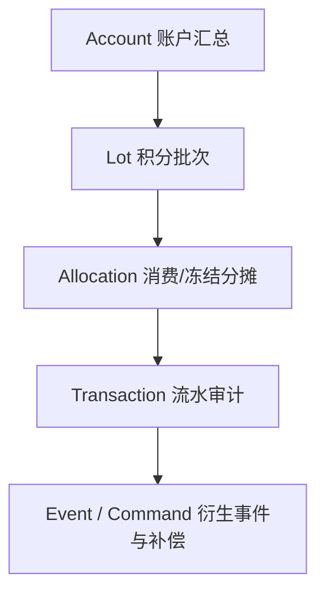

# 1. 文档目的

本文承接：

- [14-C-compatible-B-营销架构演进方案](./14-C-compatible-B-营销架构演进方案.md)
- [16-P2-营销事件目录与规则触发边界](./16-P2-营销事件目录与规则触发边界.md)

P3 要回答的问题是：

```text
当前积分系统是“余额流水系统”，还是“可追溯资产账”？
如果订单使用积分后退款，积分应该退回哪里？
是否需要 lot 和消费分摊表？
积分过期、冻结、退款、扣回消费赠送积分之间如何互相影响？
```

本文最初不直接修改 Prisma schema。2026-04-28 用户已明确确认执行 `S11/P3`，因此本文件末尾补充第一版 lot / allocation 实施回写；涉及真实数据库应用时仍需按迁移发布流程执行新增 migration。

# 2. 核心结论

当前项目的积分系统已经能满足基础场景：

- 账户余额。
- 积分增加。
- 积分扣减。
- 冻结 / 解冻。
- 订单抵扣。
- 订单退款返还。
- 积分过期任务。
- 发放失败重试。

但当前设计更接近：

```text
账户余额 + 交易流水
```

还不是完整的：

```text
积分资产账
```

关键差异在于：

| 能力                       | S11 后是否具备              | 说明                                                                                  |
| -------------------------- | --------------------------- | ------------------------------------------------------------------------------------- |
| 知道账户当前可用积分       | 具备                        | `MktPointsAccount.availablePoints`                                                    |
| 知道每次加减流水           | 具备                        | `MktPointsTransaction`                                                                |
| 知道某笔消费用了哪几批积分 | 新订单具备                  | `MktPointsConsumeAllocation` 记录消费分摊                                             |
| 知道某批积分还剩多少       | 具备                        | `MktPointsLot.availableAmount / frozenAmount / consumedAmount / expiredAmount`        |
| 退款时退回原来源批次       | 新订单具备，历史降级        | 有消费分摊时原 lot 恢复；历史订单缺分摊时创建补偿 lot                                 |
| 部分退款按原消费比例退     | ledger 支持，订单入口待扩展 | `refundSpentLots(amount)` 支持小于原消费总额，但当前订单退款入口仍按整单 `pointsUsed` |
| 已过期来源在退款时如何处理 | 具备补偿策略                | 原 lot 已过期时创建 `EXPIRED_LOT_COMPENSATION` 补偿 lot                               |
| 冻结积分锁定具体来源       | 具备                        | `MktPointsFreezeAllocation` 在下单冻结时绑定 lot                                      |

因此 P3 的建议是：

```text
如果项目只做基础积分抵扣，当前方案可继续。
如果要把积分当资产、要解释退款和过期，就应引入 lot + allocation。
```

由于当前仍处于本地开发阶段，S11 已先落地第一版资产账地基：

```text
第一步：新增 lot / freeze_allocation / consume_allocation / refund_allocation。
第二步：把下单冻结、支付结算、订单退款和过期任务切到 lot 语义。
第三步：后台 lot 查询、部分退款比例、消费赠送积分欠账仍可后续扩展。
```

# 3. 当前事实

## 3.1 数据模型

当前 Prisma 已有：

- `MktPointsRule`
- `MktPointsAccount`
- `MktPointsTransaction`
- `MktPointsTask`
- `MktUserTaskCompletion`
- `MktPointsGrantFailure`

`MktPointsAccount` 是账户汇总：

- `totalPoints`
- `availablePoints`
- `frozenPoints`
- `usedPoints`
- `expiredPoints`
- `version`

`MktPointsTransaction` 是流水：

- `type`
- `amount`
- `balanceBefore`
- `balanceAfter`
- `relatedId`
- `relatedType`
- `expireTime`
- `status`

当前交易类型：

- `EARN_ORDER`
- `EARN_SIGNIN`
- `EARN_TASK`
- `EARN_ADMIN`
- `USE_ORDER`
- `USE_COUPON`
- `USE_PRODUCT`
- `FREEZE`
- `UNFREEZE`
- `EXPIRE`
- `REFUND`
- `DEDUCT_ADMIN`

## 3.2 当前订单链路

当前订单营销集成逻辑大致是：

```text
订单创建
  -> 锁定优惠券
  -> 冻结积分

订单支付
  -> 核销优惠券
  -> 解冻积分
  -> 扣减积分
  -> 发放消费积分
  -> 处理玩法支付成功

订单取消
  -> 解锁优惠券
  -> 解冻积分

订单退款
  -> 退还优惠券
  -> addPoints(type = REFUND)
  -> 扣减消费赠送积分
```

这条链路的优点是强一致动作没有交给纯异步事件处理，符合 P2 的边界。

但它的不足也很明确：

```text
退款返还是“新增一笔退款积分”，不是“退回原消费来源”。
```

## 3.3 当前过期链路

当前过期任务按正向交易处理：

```text
查找 amount > 0 且 expireTime <= now 且 status = COMPLETED 的交易
如果账户可用积分足够
  -> 账户 available 扣减
  -> expiredPoints 增加
  -> 创建 EXPIRE 负流水
  -> 原正向交易标记 CANCELLED
```

这个方案能跑，但有几个问题：

- 正向交易没有 `remainingAmount`，无法知道这批积分是否已部分消费。
- 如果账户可用积分不足，会跳过过期，但不知道是哪批被消费了。
- 标记原交易 `CANCELLED` 容易混淆“业务取消”和“已过期结清”。
- 退款返还的新 `REFUND` 积分如何继承原有效期没有来源依据。

# 4. 目标模型

P3 建议把积分拆成四层：



## 4.1 Account

账户是汇总视图，用于快速读取余额：

- 可用积分。
- 冻结积分。
- 已使用积分。
- 已过期积分。
- 乐观锁版本。

账户不是追溯来源的唯一依据。

## 4.2 Lot

Lot 是积分资产批次，回答：

```text
这一批积分从哪里来、什么时候过期、还剩多少？
```

例如：

```text
用户 1001 因订单 O001 获得 100 积分，2026-12-31 过期。
```

这应该是一条 lot。

## 4.3 Allocation

Allocation 是分摊表，回答：

```text
某次冻结 / 消费 / 退款涉及哪些 lot，各用了多少？
```

例如：

```text
订单 O100 使用 120 积分：
  lot A 使用 80
  lot B 使用 40
```

没有 allocation，就无法原路回退。

## 4.4 Transaction

Transaction 是流水审计，回答：

```text
账户余额发生了什么变化？
```

流水应保留，不应承担所有来源追踪职责。

# 5. 为什么需要 lot

积分不是单纯数字。不同来源的积分可能有不同约束：

| 来源     | 有效期               | 是否可退           | 是否可转赠 | 退款策略         |
| -------- | -------------------- | ------------------ | ---------- | ---------------- |
| 消费获得 | 可配置               | 可扣回             | 否         | 订单退款时扣回   |
| 签到获得 | 通常短期             | 通常不可反向扣订单 | 否         | 过期为主         |
| 任务获得 | 按任务规则           | 可按任务撤销       | 否         | 任务撤销时扣回   |
| 后台发放 | 人工指定             | 视原因             | 否         | 人工处理         |
| 退款返还 | 继承原来源或给宽限期 | 可再次使用         | 否         | 取决于原消费 lot |

如果没有 lot，系统只能知道：

```text
用户有 1000 积分。
```

但不能知道：

```text
这 1000 积分中，哪些 3 天后过期，哪些来自退款，哪些来自消费奖励，哪些已经被订单冻结。
```

# 6. 为什么需要 allocation

Lot 只能说明积分来源，allocation 才能说明消费去向。

退款原路回退必须回答：

```text
订单 O100 抵扣的 120 积分，来自哪些 lot？
退款时应该退回哪些 lot？
```

没有 allocation，退款时只有两个粗糙选择：

1. 新增一笔 `REFUND` 积分。
2. 按当前剩余积分和过期时间猜测。

第 2 种不能接受，因为账务不能靠猜。

所以如果业务要求原路退回，应引入：

- 冻结分摊。
- 消费分摊。
- 退款分摊。

# 7. 推荐数据模型

## 7.1 MktPointsLot

建议新增：

```text
mkt_points_lot
```

字段建议：

| 字段                  | 说明                                                       |
| --------------------- | ---------------------------------------------------------- |
| id                    | 主键                                                       |
| tenant_id             | 租户                                                       |
| account_id            | 积分账户                                                   |
| member_id             | 用户                                                       |
| source_transaction_id | 来源流水                                                   |
| source_type           | EARN_ORDER / EARN_SIGNIN / EARN_TASK / EARN_ADMIN / REFUND |
| source_id             | 订单 ID / 任务 ID / 人工单号                               |
| original_amount       | 初始积分                                                   |
| available_amount      | 可用积分                                                   |
| frozen_amount         | 冻结积分                                                   |
| used_amount           | 已使用积分                                                 |
| expired_amount        | 已过期积分                                                 |
| refunded_amount       | 从消费中退回的积分                                         |
| expire_time           | 过期时间                                                   |
| status                | ACTIVE / EXHAUSTED / EXPIRED / CANCELLED                   |
| create_time           | 创建时间                                                   |
| update_time           | 更新时间                                                   |

索引建议：

- `(tenant_id, member_id, status, expire_time)`
- `(tenant_id, source_type, source_id)`
- `(tenant_id, account_id, status)`

关键约束：

```text
original_amount
= available_amount + frozen_amount + used_amount + expired_amount
  - refunded_amount_adjustment
```

这里不建议强行用一个公式覆盖所有场景，实际实现中应通过服务层校验 lot 守恒。

更容易维护的口径是：

```text
lot.current_total = available + frozen + used + expired
```

退款回退时，如果恢复已使用积分，则：

- `used_amount` 减少。
- `available_amount` 或 `expired_amount` 增加。

## 7.2 MktPointsFreezeAllocation

建议新增：

```text
mkt_points_freeze_allocation
```

字段建议：

| 字段                  | 说明                         |
| --------------------- | ---------------------------- |
| id                    | 主键                         |
| tenant_id             | 租户                         |
| account_id            | 账户                         |
| member_id             | 用户                         |
| order_id              | 订单                         |
| freeze_transaction_id | 冻结流水                     |
| lot_id                | 来源 lot                     |
| amount                | 冻结数量                     |
| status                | FROZEN / RELEASED / CONSUMED |
| create_time           | 创建时间                     |
| update_time           | 更新时间                     |

用途：

- 下单时按 FIFO 锁定具体 lot。
- 取消订单时释放原 lot。
- 支付时把冻结分摊转为消费分摊。

## 7.3 MktPointsConsumeAllocation

建议新增：

```text
mkt_points_consume_allocation
```

字段建议：

| 字段                   | 说明                                   |
| ---------------------- | -------------------------------------- |
| id                     | 主键                                   |
| tenant_id              | 租户                                   |
| account_id             | 账户                                   |
| member_id              | 用户                                   |
| order_id               | 订单                                   |
| consume_transaction_id | 消费流水                               |
| lot_id                 | 来源 lot                               |
| amount                 | 消费数量                               |
| refunded_amount        | 已退回数量                             |
| expire_time_at_consume | 消费时 lot 过期时间快照                |
| status                 | CONSUMED / PARTIAL_REFUNDED / REFUNDED |
| create_time            | 创建时间                               |
| update_time            | 更新时间                               |

用途：

- 退款原路回退。
- 部分退款按抵扣比例回退。
- 查询某笔订单用了哪些来源积分。

## 7.4 MktPointsRefundAllocation

退款分摊可以单独建表，也可以落在消费分摊的 `refunded_amount` 上。

如果需要审计每次退款，建议新增：

```text
mkt_points_refund_allocation
```

字段建议：

| 字段                  | 说明                                                                 |
| --------------------- | -------------------------------------------------------------------- |
| id                    | 主键                                                                 |
| tenant_id             | 租户                                                                 |
| refund_id             | 退款单 ID                                                            |
| order_id              | 订单 ID                                                              |
| member_id             | 用户                                                                 |
| consume_allocation_id | 原消费分摊                                                           |
| lot_id                | 原 lot                                                               |
| amount                | 本次退回积分                                                         |
| return_policy         | ORIGINAL_EXPIRE / GRACE_PERIOD / EXPIRE_IMMEDIATELY / NEW_REFUND_LOT |
| target_lot_id         | 退回到哪个 lot                                                       |
| refund_transaction_id | 退款流水                                                             |
| create_time           | 创建时间                                                             |

如果当前没有独立退款单，可先用 `orderId + refundSequence`，但不建议长期只用 orderId，因为部分退款会需要多次记录。

# 8. 核心流程

## 8.1 发放积分

发放积分应同时做：

```text
更新 account.available
创建 transaction
创建 lot
发送 points.earned 事件
```

示例：

```text
EARN_ORDER 100
  -> transaction +100
  -> lot original=100 available=100 expire=2026-12-31
```

## 8.2 下单冻结积分

冻结积分应按可用 lot 分摊。

推荐顺序：

```text
先过期先用 FIFO
同过期时间按创建时间
无过期时间排最后
```

流程：

```text
订单 O100 使用 120 积分
  -> 查询 ACTIVE lot
  -> lot A 冻结 80
  -> lot B 冻结 40
  -> account.available -120
  -> account.frozen +120
  -> transaction FREEZE -120
  -> freeze_allocation 两条
```

注意：

```text
冻结时就应该绑定 lot。
```

如果冻结不绑定 lot，支付时再绑定，会出现支付前某些 lot 过期或被其他订单占用的解释问题。

## 8.3 订单取消解冻

取消订单时释放冻结分摊：

```text
查 freeze_allocation
  -> lot.frozen - amount
  -> lot.available + amount
  -> account.frozen - total
  -> account.available + total
  -> transaction UNFREEZE +total
  -> freeze_allocation.status = RELEASED
```

如果冻结期间 lot 到期，需要一个业务政策：

| 政策         | 说明                             |
| ------------ | -------------------------------- |
| 原到期日有效 | 解冻后如果已经过期，立即进入过期 |
| 订单占用宽限 | 按冻结时长顺延                   |
| 固定宽限期   | 解冻后给 1 到 7 天               |

推荐默认：

```text
原到期日有效 + 可配置宽限期。
```

因为积分原本不是因为用户取消而自然延长，但订单占用可能造成用户不可使用，需要业务留一点空间。

## 8.4 订单支付扣减

支付时不应重新选择 lot，而应消费冻结分摊：

```text
查 freeze_allocation(status=FROZEN)
  -> lot.frozen - amount
  -> lot.used + amount
  -> account.frozen - total
  -> account.used + total
  -> transaction USE_ORDER -total
  -> consume_allocation
  -> freeze_allocation.status = CONSUMED
```

这样退款时就能知道原路。

## 8.5 订单退款返还抵扣积分

退款时根据消费分摊退回。

全额退款：

```text
查 orderId 下 consume_allocation
按 allocation.amount - refunded_amount 退回
```

部分退款：

```text
refundPoints = 原订单使用积分 * 退款金额 / 可退金额
按 consume_allocation 原使用比例分摊
最后一条处理舍入差
```

退回到哪里由政策决定：

| 政策               | 行为                       | 优点           | 缺点                         |
| ------------------ | -------------------------- | -------------- | ---------------------------- |
| ORIGINAL_EXPIRE    | 回到原 lot，保留原过期时间 | 最符合原路回退 | 如果已过期，用户可能马上失效 |
| GRACE_PERIOD       | 回到原 lot，但给退款宽限期 | 用户体验好     | 不完全原始有效期             |
| EXPIRE_IMMEDIATELY | 原 lot 已过期则直接过期    | 成本最低       | 用户感知差                   |
| NEW_REFUND_LOT     | 生成退款 lot               | 实现简单       | 不算严格原路                 |

推荐策略：

```text
默认 ORIGINAL_EXPIRE。
如果原 lot 已在订单占用期间过期，给 GRACE_PERIOD。
宽限期可配置，建议 3 到 7 天。
```

这比当前简单 `REFUND` 更清晰：

- 有原消费分摊。
- 有原 lot。
- 有回退政策。
- 有退款流水。
- 有过期处理。

## 8.6 订单退款扣回消费赠送积分

这和“返还抵扣积分”是两件事。

订单退款时会涉及：

```text
返还用户当初用于抵扣的积分
扣回用户因该订单获得的消费积分
```

当前项目已经尝试扣回 `EARN_ORDER`，但只查一笔正向流水，再看账户可用余额是否足够。

资产账方案应改为：

```text
找到该订单产生的 EARN_ORDER lot
按退款比例计算应扣回积分
优先扣该 lot 剩余 available
不足部分按政策处理
```

不足时有三种政策：

| 政策           | 说明                           |
| -------------- | ------------------------------ | -------------------------------- |
| ALLOW_NEGATIVE | 允许账户负积分                 | 风控强，但用户体验和系统复杂度高 |
| DEBT_LEDGER    | 记积分欠账，未来获得积分先冲抵 | 推荐用于资产账                   |
| SKIP_WITH_RISK | 跳过扣回，只记风险             | 当前项目接近这个                 |

推荐：

```text
本阶段不建议允许负积分。
推荐先设计 points_debt 或 risk ledger，至少不要悄悄跳过。
```

如果不做 debt ledger，也应记录：

- 应扣回多少。
- 已扣回多少。
- 未扣回多少。
- 原因。
- 是否需要人工处理。

## 8.7 积分过期

过期任务不应扫描正向 transaction，而应扫描 lot。

流程：

```text
查 ACTIVE lot where expire_time <= now and available_amount > 0
  -> account.available -= available_amount
  -> account.expired += available_amount
  -> lot.expired += available_amount
  -> lot.available = 0
  -> lot.status = EXPIRED or EXHAUSTED
  -> transaction EXPIRE
```

冻结中的 lot 到期怎么处理：

- 不直接扣 frozen。
- 标记 `expirePending = true` 或在冻结释放 / 消费时判断。
- 如果订单取消解冻，按政策立即过期或给宽限。
- 如果订单支付消费，则无需再过期，因为已使用。

# 9. 推荐政策

## 9.1 消费顺序

推荐：

```text
先过期先用 FIFO
同过期时间按创建时间
无过期时间最后使用
```

原因：

- 用户损耗最低。
- 和常见积分系统一致。
- 方便解释。

## 9.2 退款返还有效期

推荐：

```text
未过期：回原 lot，保留原 expireTime。
已过期但订单占用导致不可用：给退款宽限期。
已过期且非订单占用原因：按过期处理或给极短宽限。
```

当前项目可以先配置：

```text
refundGraceDays = 7
```

## 9.3 部分退款分摊

推荐按金额比例：

```text
refundPoints = floor(pointsUsed * refundAmount / refundableAmount)
```

最后一次退款处理剩余未退积分，避免舍入造成少退或多退。

## 9.4 消费赠送积分扣回

推荐按商品和退款金额分摊。

如果订单明细已有积分明细：

```text
按退款商品行对应 earnedPoints 扣回。
```

如果只有订单级积分：

```text
按退款金额比例扣回。
```

如果用户可用积分不足：

```text
记录欠账或风险，不静默跳过。
```

# 10. 数据表影响

## 10.1 余额系统延续档

不新增表。

改法：

- 保持 `MktPointsAccount` + `MktPointsTransaction`。
- 退款仍新增 `REFUND`。
- 在 transaction payload / relatedType 中补充更多来源说明。
- 过期逻辑继续按正向流水处理，但修正状态语义。

优点：

- 不触发 Prisma schema 变更。
- 对当前开发推进快。

缺点：

- 不能原路回退。
- 不能准确处理部分消费后过期。
- 不能准确处理部分退款。
- 不能解释积分来源剩余。

适用场景：

```text
积分只是营销余额工具，不作为严格资产。
```

## 10.2 中间档

新增 lot，不新增 allocation。

改法：

- 发放时创建 lot。
- 过期按 lot 扫描。
- 扣减时按 FIFO 消耗 lot，但只在 transaction payload 里记录分摊快照。

优点：

- 过期准确很多。
- 可以知道每批剩余。

缺点：

- 分摊快照不如表好查。
- 退款原路回退查询和并发控制较弱。

适用场景：

```text
需要控制过期，但退款原路回退不是强诉求。
```

## 10.3 完整档

新增：

- `MktPointsLot`
- `MktPointsFreezeAllocation`
- `MktPointsConsumeAllocation`
- 可选 `MktPointsRefundAllocation`
- 可选 `MktPointsDebt`

优点：

- 支持严格来源追溯。
- 支持退款原路回退。
- 支持部分退款。
- 支持冻结来源锁定。
- 支持过期与退款一致解释。

缺点：

- Prisma schema 变更。
- 现有发放 / 冻结 / 扣减 / 退款 / 过期链路都要改。
- 需要历史数据迁移策略。

推荐：

```text
如果确认积分要成为长期营销资产，选完整档。
当前本地开发阶段适合先定完整档模型，再分阶段实现。
```

# 11. 历史数据迁移

如果引入 lot，需要迁移历史正向积分。

## 11.1 无历史生产数据

本地开发阶段最简单：

```text
清空积分测试数据
重新 seed
```

但这仍是数据操作，执行前需要确认。

## 11.2 有少量测试数据

可以做迁移脚本：

```text
每条 amount > 0 的 COMPLETED transaction
  -> 创建对应 lot
  -> original_amount = transaction.amount
  -> available_amount = 根据账户余额和 FIFO 反推
```

反推存在不确定性，因为旧系统没有 allocation。

推荐策略：

- 若只是测试数据，直接重置。
- 若已有真实用户，不能声称精确原路，只能生成迁移 lot 并标记 `MIGRATED`。

## 11.3 有生产数据

生产迁移要更谨慎：

- 先冻结积分写入。
- 对账账户余额与流水总额。
- 生成迁移 lot。
- 建立差异表。
- 灰度读取 lot。
- 再切写入。

这超出当前 P3 文档范围，需要单独迁移方案。

# 12. 实施分析

本节基于当前代码扫描结果补充，不直接修改代码或 Prisma schema。

## 12.1 当前代码切入点

后端积分主链路集中在：

| 责任         | 当前文件                                                                     | 判断                                                                     |
| ------------ | ---------------------------------------------------------------------------- | ------------------------------------------------------------------------ |
| 积分账户读写 | `apps/backend/src/module/marketing/points/account/account.service.ts`        | 负责账户余额、冻结、解冻、扣减、交易流水                                 |
| 积分账户仓储 | `apps/backend/src/module/marketing/points/account/account.repository.ts`     | 通过 `updateWithOptimisticLock` 做账户级乐观锁                           |
| 积分流水仓储 | `apps/backend/src/module/marketing/points/account/transaction.repository.ts` | 查询交易明细和即将过期积分                                               |
| 订单营销集成 | `apps/backend/src/module/marketing/integration/integration.service.ts`       | 订单创建、支付、取消、退款时调用券和积分                                 |
| 过期任务     | `apps/backend/src/module/marketing/points/scheduler/scheduler.service.ts`    | 按正向交易扫描过期积分                                                   |
| 失败重试     | `apps/backend/src/module/marketing/points/degradation/**`                    | 消费赠送积分发放失败后的补偿                                             |
| Prisma 模型  | `apps/backend/prisma/models/80-marketing.prisma`                             | 已有 `MktPointsAccount`、`MktPointsTransaction`、`MktPointsGrantFailure` |

前后台影响主要来自：

- 后端积分 VO / DTO。
- 管理端积分账户和交易明细页面。
- 订单创建、支付、取消、退款调用方。
- 后续 OpenAPI 生成类型。

## 12.2 现有链路判断

当前 `PointsAccountService.addPoints` 的行为是：

```text
读取或创建账户
增加 totalPoints / availablePoints
创建正向 MktPointsTransaction
异步发送 POINTS_EARNED
```

当前 `deductPoints` 的行为是：

```text
读取账户
检查 availablePoints
账户 availablePoints 减少
账户 usedPoints 增加
创建负向 MktPointsTransaction
异步发送 POINTS_USED
```

当前 `freezePoints` / `unfreezePoints` 的行为是：

```text
冻结：availablePoints 减少，frozenPoints 增加，创建 FREEZE 流水
解冻：availablePoints 增加，frozenPoints 减少，创建 UNFREEZE 流水
```

这些行为能保证账户汇总正确，但没有回答三个资产账问题：

```text
冻结的是哪几批积分？
支付扣减的是哪几批积分？
退款返还应该恢复到哪几批积分？
```

当前 `OrderIntegrationService.handleOrderRefunded` 对积分抵扣退款的处理是：

```text
如果订单使用了积分
  -> addPoints(type = REFUND, amount = order.pointsUsed)
```

这是一笔新的退款积分，不是原路回到原消费 lot。

当前消费赠送积分扣回逻辑是：

```text
查询 relatedId = orderId 的一笔 EARN_ORDER
如果账户 availablePoints 足够
  -> deductPoints(type = DEDUCT_ADMIN)
否则跳过扣回
```

这个策略的好处是不会让退款流程因为赠送积分已被使用而失败；问题是扣回跳过后需要有异常处置，否则会形成积分套利空间。

## 12.3 数据模型落点

真正进入资产账后，建议在 `apps/backend/prisma/models/80-marketing.prisma` 中新增而不是改写旧流水语义：

```text
mkt_points_lot
  memberId
  sourceTransactionId
  sourceType
  sourceRelatedId
  amount
  remainingAmount
  frozenAmount
  expireTime
  status

mkt_points_allocation
  memberId
  actionType: FREEZE / UNFREEZE / CONSUME / REFUND / EXPIRE / COMPENSATE
  transactionId
  sourceTransactionId
  lotId
  relatedId
  amount
  strategy

mkt_points_refund_decision
  orderId
  memberId
  sourceSpendTransactionId
  refundTransactionId
  strategy
  requestedAmount
  restoredAmount
  compensatedAmount
  expiredAmount
  decisionSnapshot
```

这里有一个关键取舍：

```text
MktPointsTransaction 继续做审计流水；
mkt_points_lot 做资产余额；
mkt_points_allocation 做动作分摊；
mkt_points_refund_decision 做退款解释。
```

不要把所有字段都塞回 `MktPointsTransaction`，否则流水既要表示会计方向，又要表示资产余量，还要表示退款策略，后续会变成难以维护的混合表。

## 12.4 Service 改造分析

建议在积分模块内新增资产账服务，而不是让 `PointsAccountService` 直接膨胀：

```text
PointsLedgerService
  grant(dto)
  freeze(dto)
  unfreeze(dto)
  consume(dto)
  refund(dto)
  expire(dto)

PointsLotRepository
  createLot
  findConsumableLotsForUpdate
  incrementRemaining
  decrementRemaining
  incrementFrozen
  decrementFrozen

PointsAllocationRepository
  createFreezeAllocation
  createConsumeAllocation
  findByRelatedId
  findBySpendTransaction
```

`PointsAccountService` 后续更适合变成门面：

```text
addPoints       -> PointsLedgerService.grant
freezePoints    -> PointsLedgerService.freeze
unfreezePoints  -> PointsLedgerService.unfreeze
deductPoints    -> PointsLedgerService.consume
getBalance      -> account + lot summary
```

这样保留当前调用方 API，不要求订单、任务、签到、后台发放一次性全部改接口。

## 12.5 订单集成改造分析

订单链路建议演进为：

```text
订单创建
  -> lockCoupon
  -> points.freeze(orderId)
     记录 freeze transaction
     记录 freeze allocation

订单支付
  -> useCoupon
  -> points.consumeFromFreeze(orderId)
     把 freeze allocation 转成 consume allocation
     账户 frozenPoints 减少
     账户 usedPoints 增加
  -> grant order earn points

订单取消
  -> unlockCoupon
  -> points.unfreeze(orderId)
     按 freeze allocation 原路解冻

订单退款
  -> refundCoupon
  -> points.refundBySpend(orderId)
     找到 USE_ORDER 的 consume allocation
     按退款策略回写原 lot 或补偿 lot
  -> points.revokeOrderEarn(orderId)
     扣回消费赠送积分，扣不回时进入异常单
```

这里和优惠券不同：

| 能力     | 优惠券           | 积分                         |
| -------- | ---------------- | ---------------------------- |
| 锁定对象 | 一张用户券       | 多个积分 lot 的若干数量      |
| 消费对象 | 一张券状态变化   | 多个 lot 的扣减分摊          |
| 退款对象 | 原用户券或补偿券 | 原 lot / 补偿 lot / 过期处理 |
| 过期影响 | 券整体失效       | lot 按剩余数量失效           |

所以积分不能只复制优惠券的 `lock/use/refund` 状态机，需要 allocation 作为中间层。

## 12.6 过期任务改造分析

当前 `PointsSchedulerService.processExpiredPoints` 扫描的是正向交易，并用账户可用余额判断是否能过期。

资产账模式下，过期任务应扫描 lot：

```text
查找 expireTime <= now
且 status = ACTIVE
且 remainingAmount > 0
且 frozenAmount = 0 或允许部分过期的 lot
```

处理时应产生：

```text
EXPIRE transaction
EXPIRE allocation
lot.remainingAmount 扣减
account.availablePoints 扣减
account.expiredPoints 增加
POINTS_EXPIRED 事件
```

如果 lot 有冻结数量，需要明确策略：

| 情况               | 建议                                                                             |
| ------------------ | -------------------------------------------------------------------------------- |
| 已冻结且订单未支付 | 允许订单取消时解冻后立即过期，或在冻结阶段禁止选取临近过期 lot                   |
| 已冻结且订单已支付 | 支付消费后 lot 已扣减，不再参与过期                                              |
| 退款回到已过期 lot | 不恢复原有效期，按 `EXPIRED_SOURCE_COMPENSATE` 决策生成补偿 lot 或直接标记不可用 |

## 12.7 降级重试与命令幂等

当前 `OrderIntegrationService.executeWithIdempotency` 对订单事件做 Redis 幂等，`PointsGracefulDegradationService` 对消费积分发放失败做补偿。

资产账引入后，幂等要从“订单事件”下沉到“积分命令”：

```text
commandKey = tenantId + actionType + relatedType + relatedId + memberId
```

例如：

```text
POINTS_FREEZE:order:create:O001:M001
POINTS_CONSUME:order:paid:O001:M001
POINTS_REFUND:order:refund:O001:M001
POINTS_REVOKE_EARN:order:refund:O001:M001
```

这样即使订单集成服务重试，也不会重复创建 lot 或重复扣减 allocation。

## 12.8 后台与 VO 影响

后台不应只展示账户余额和流水，还要逐步补充解释视图：

| 页面能力 | 内容                                       |
| -------- | ------------------------------------------ |
| 积分账户 | 可用、冻结、即将过期、资产批次数           |
| 积分流水 | 原有交易方向、关联订单、关联命令           |
| 积分批次 | 来源、原始数量、剩余数量、冻结数量、有效期 |
| 消费分摊 | 某笔订单用了哪些 lot                       |
| 退款解释 | 原路回退、补偿、过期不退、扣回失败原因     |

OpenAPI 类型需要按跨 app 契约链路生成，前端不能在页面层手写与后端 VO 同义的资产账类型。

## 12.9 验证分析

真正实施 P3 时，至少要覆盖这些用例：

| 场景                       | 验证点                                           |
| -------------------------- | ------------------------------------------------ |
| 多批次发放后消费           | FIFO allocation 是否正确                         |
| 冻结后取消                 | 原 freeze allocation 是否完整解冻                |
| 冻结后支付                 | frozen -> used 是否不重复扣 available            |
| 全额退款                   | 原消费 lot 是否恢复或生成清晰补偿                |
| 部分退款                   | 按订单退款比例还是按积分数量退款，需要有决策快照 |
| 来源已过期后退款           | 策略是补偿、不可用还是继承新有效期               |
| 消费赠送积分已被用掉后退款 | 扣回失败进入异常单，不能静默吞掉                 |
| 并发支付 / 退款            | 账户、lot、allocation 三者是否一致               |
| 过期任务                   | 只处理 lot 剩余量，不误扣已消费部分              |

如果涉及 Prisma schema、migration、历史数据回填，按根 `AGENTS.md` 这属于高风险改动，实施前必须单独给出变更清单、影响表、迁移和回滚方案。

## 12.10 文件级执行顺序

建议实施顺序如下：

```text
1. apps/backend/prisma/models/80-marketing.prisma
   新增 lot / allocation / refund decision 模型。

2. apps/backend/src/module/marketing/points/account/**
   新增 lot 和 allocation repository，抽出 PointsLedgerService。

3. apps/backend/src/module/marketing/points/account/account.service.ts
   保留原 API，内部委托到 ledger。

4. apps/backend/src/module/marketing/integration/integration.service.ts
   订单创建、支付、取消、退款改为使用资产账命令。

5. apps/backend/src/module/marketing/points/scheduler/scheduler.service.ts
   过期扫描从 transaction 切到 lot。

6. apps/backend/src/module/marketing/points/degradation/**
   失败重试记录 commandKey，防止重复补偿。

7. apps/backend/src/module/marketing/points/**/vo 或 dto
   增加批次、分摊、退款解释查询。

8. pnpm generate-types
   后端契约变化后生成共享类型。

9. apps/admin-web/src/views/marketing/**
   增加积分资产解释视图。
```

# 13. 阶段路线

## P3.1 规则冻结

目标：

- 冻结积分资产账目标模型。
- 明确退款、过期、冻结、消费赠送扣回政策。

改哪些模块：

- 文档。
- 后续 DTO / service 设计。

不改哪些模块：

- 不改 Prisma。
- 不改订单退款链路。
- 不改积分任务。

数据表影响：

- 无。

风险：

- 规则冻结不代表当前代码已支持。

验证方式：

- 用典型案例走通账务推演。

是否迁移历史数据：

- 否。

## P3.2 Lot 试点

目标：

- 发放积分时生成 lot。
- 过期任务改为按 lot 过期。

改哪些模块：

- `apps/backend/prisma/models/80-marketing.prisma`
- `PointsAccountService.addPoints`
- `PointsSchedulerService.processExpiredPoints`
- 管理端积分明细查询。

不改哪些模块：

- 暂不改订单冻结和消费分摊。

数据表影响：

- 新增 `MktPointsLot`。

风险：

- 命中 Prisma schema 高风险，需要单独确认。

验证方式：

- 发放积分生成 lot。
- 同账户多 lot 按过期时间汇总。
- 过期只扣剩余可用 lot。

是否迁移历史数据：

- 本地可重置；如保留测试数据则需要迁移脚本。

## P3.3 冻结与消费分摊

目标：

- 下单冻结绑定 lot。
- 支付消费沿用冻结分摊。

改哪些模块：

- `PointsAccountService.freezePoints`
- `PointsAccountService.unfreezePoints`
- `PointsAccountService.deductPoints`
- `OrderIntegrationService.handleOrderCreated`
- `OrderIntegrationService.handleOrderPaid`

不改哪些模块：

- 不改变订单支付外部接口。

数据表影响：

- 新增 `MktPointsFreezeAllocation`
- 新增 `MktPointsConsumeAllocation`

风险：

- 并发复杂度上升。
- 老订单没有分摊记录。

验证方式：

- 多 lot 下单冻结。
- 取消释放到原 lot。
- 支付生成消费分摊。
- 并发冻结不超用。

是否迁移历史数据：

- 老订单无原始分摊，只能走兼容退款策略。

## P3.4 退款原路回退

目标：

- 订单退款按消费分摊退回原 lot。
- 支持部分退款。
- 支持过期宽限。

改哪些模块：

- `OrderIntegrationService.handleOrderRefunded`
- 积分退款 service。
- 管理端退款审计查询。

不改哪些模块：

- 不改变支付成功扣减语义。

数据表影响：

- 可选 `MktPointsRefundAllocation`
- 可选 `MktPointsDebt`

风险：

- 部分退款舍入。
- 已过期 lot 退款策略争议。
- 消费赠送积分不足扣回。

验证方式：

- 全额退款。
- 部分退款。
- 多次部分退款。
- 原 lot 已过期退款。
- 消费赠送积分已被用户用掉。

是否迁移历史数据：

- 老订单只能兼容为 `REFUND` 新 lot，不能宣称原路回退。

## P3.5 后台账务解释

目标：

- 后台能解释用户积分余额来源。
- 能解释订单抵扣来源。
- 能解释退款回退去向。

改哪些模块：

- backend admin 查询接口。
- admin-web 积分账户、积分明细、订单营销审计页面。

不改哪些模块：

- 不开放运营手工改 allocation。

数据表影响：

- 依赖 lot 和 allocation。

风险：

- 页面如果展示太细，会增加运营理解成本。

验证方式：

- 输入订单号，能看到抵扣积分来自哪些 lot。
- 输入退款单，能看到退回到哪些 lot。

是否迁移历史数据：

- 历史订单显示“旧账无来源分摊”。

# 14. 典型账务推演

## 14.1 多来源积分抵扣后全额退款

用户有：

```text
lot A：签到 30，2026-05-01 过期
lot B：消费 100，2026-12-31 过期
```

订单使用 80 积分：

```text
冻结：A 30 + B 50
支付：A used 30，B used 50
退款：A returned 30，B returned 50
```

如果退款时 A 未过期：

```text
A available +30
B available +50
```

如果退款时 A 已过期且符合占用宽限：

```text
A available +30，expireTime = now + refundGraceDays
B available +50
```

## 14.2 部分退款

订单使用 100 积分，退款 40%：

```text
应退积分 = 40
```

原消费分摊：

```text
lot A 60
lot B 40
```

退款分摊：

```text
lot A 24
lot B 16
```

如果后续全退，剩余：

```text
lot A 36
lot B 24
```

总退回仍等于 100。

## 14.3 退款扣回消费赠送积分不足

订单支付赠送 50 积分，用户已经花掉 40，只剩 10。

退款时应扣回 50：

```text
已扣回：10
未扣回：40
```

推荐记录：

```text
points_debt 40
reason = ORDER_REFUND_EARNED_POINTS_REVERSAL
```

后续用户再获得积分时优先冲抵欠账。

# 15. 与优惠券库存、积分预算的区别

积分和优惠券不应完全套同一种库存模型。

| 对象       | 本质              | 控制重点                     | 退款影响                               |
| ---------- | ----------------- | ---------------------------- | -------------------------------------- |
| 优惠券库存 | 发放名额          | 模板库存、用户券状态         | 退券恢复用户券，不一定恢复模板库存     |
| 积分余额   | 用户资产          | 账户、lot、过期、分摊        | 退款要处理原 lot 和消费赠送扣回        |
| 积分预算   | 活动成本上限      | 活动预算、发放命令、失败补偿 | 退款可能释放预算，也可能只影响用户资产 |
| 实物库存   | 商品可售数量      | 强锁定、防超卖               | 退款可释放库存                         |
| 服务容量   | 时间 / 人力 /场地 | 预约和履约窗口               | 退款释放预约容量                       |

因此：

```text
优惠券库存解决“能不能发这张券”。
积分 lot 解决“用户这部分积分从哪里来、还剩多少、怎么退”。
积分预算解决“活动最多承担多少成本”。
```

不能用优惠券库存思维替代积分资产账。

# 16. 逻辑矫正

需要先纠正几个容易误判的点：

1. “有积分流水就能原路退款”：不准确。流水只记录加减，不记录消费使用了哪批来源。
2. “退款加一笔 REFUND 就是原路退回”：不准确。这是补偿发放，不是回到原 lot。
3. “积分过期扫正向流水就够了”：不准确。部分消费后，正向流水已经不能代表剩余可过期积分。
4. “冻结积分只冻结账户余额就够了”：不准确。如果要退款原路追溯，冻结时就要绑定 lot。
5. “消费赠送积分退款时扣不到就跳过”：不完整。至少要形成欠账或风险记录。
6. “本地开发阶段可以以后再想账务”：不建议。账务模型越晚改，历史迁移越痛。

# 17. 注释审查与注释方案

如果后续进入代码实现，注释应集中在以下位置：

- lot 选择器：说明 FIFO 规则、无过期 lot 排序和并发边界。
- 冻结分摊：说明冻结时绑定 lot，而不是支付时再猜。
- 退款回退：说明原过期时间、宽限期和已过期 lot 的处理政策。
- 过期任务：说明过期扫描 lot，不再扫描正向 transaction。
- 消费赠送积分扣回：说明不足扣回时如何记录欠账或风险。

不建议增加的注释：

- 不在每个加减字段旁重复解释“增加 / 减少积分”。
- 不用 TODO 表达账务政策。
- 不在订单集成服务里长篇解释积分资产模型，应把模型沉淀在 service 和文档。

# 18. 下一步建议

P3 之后建议继续写：

```text
18-P5-拼课复杂玩法样板化方案.md
```

原因是拼课会同时牵涉：

- 玩法实例。
- 服务容量。
- 排课资源。
- 虚拟补位。
- 订单支付 / 退款。
- 优惠券和积分。
- 成团与履约不是同一个状态。

拼课样板一旦理清，其他玩法就可以按成熟度渐进实现，而不是每个玩法都重做一套系统。

# 19. 2026-04-28 低风险实施回写

本次没有进入 lot / allocation / migration 实施，只完成了“当前能力边界显式化”和退款策略目录，避免继续把 `REFUND` 流水误认为原 lot 回退。

已落地代码：

- `apps/backend/src/module/marketing/points/account/points-asset-ledger.policy.ts`
  - 新增 `CURRENT_POINTS_ASSET_LEDGER_CAPABILITY`。
  - 明确当前模式是 `BALANCE_TRANSACTION`。
  - 明确当前不支持 lot、消费分摊、冻结分摊和原来源退款。
  - 新增 `resolvePointsRefundLedgerDecision`，用于描述退款策略。
- `apps/backend/src/module/marketing/integration/integration.service.ts`
  - 订单退款返还积分仍创建 `PointsTransactionType.REFUND` 流水。
  - 退款 remark 来自策略目录。
  - 日志中记录当前策略，并在缺少 lot/allocation 时输出残余风险。

验证已执行：

```text
pnpm --filter @apps/backend test -- points-asset-ledger.policy.spec.ts integration.service.spec.ts
pnpm typecheck:backend
```

边界仍保持：

- 没有新增 `mkt_points_lot`。
- 没有新增消费分摊表。
- 没有迁移历史积分。
- 没有改变现有订单退款资产处理行为。
- 没有宣称当前已经支持退款原路回退。

后续如果进入真正资产账改造，应先走高风险确认，至少明确：

- 新增表清单。
- 历史正向积分如何初始化 lot。
- 冻结、消费、退款 allocation 如何双写。
- 已过期 lot 的退款补偿政策。
- 失败回滚和对账脚本。

# 20. 2026-04-28 S11/P3 资产账实施回写

S11 已在明确高风险确认后进入第一版实现。第 19 节是低风险前置阶段的历史记录，S11 后能力边界以本节为准。

已落地数据模型：

- `MktPointsLot`
  - 记录积分批次、来源交易、剩余可用、冻结、已消费、已过期和过期时间。
- `MktPointsFreezeAllocation`
  - 下单冻结时按 FIFO 绑定 lot，避免支付时重新猜来源。
- `MktPointsConsumeAllocation`
  - 支付抵扣时记录消费分摊，并保留 `refundableAmount`。
- `MktPointsRefundAllocation`
  - 退款时记录退回原 lot、过期补偿 lot 或历史降级补偿 lot。

迁移策略：

- 新增 migration：`20260428110000_add_points_lot_allocation`。
- 历史账户按 `available_points + frozen_points` 生成初始化 lot。
- 历史已消费积分无法反推原来源，因此不会伪造消费分摊。
- 历史订单退款如果缺少消费分摊，会创建 `NEW_REFUND_TRANSACTION` 补偿 lot，并记录退款分摊策略。

链路调整：

```text
订单创建
  -> freezePoints
  -> 账户可用转冻结
  -> mkt_points_freeze_allocation 绑定 lot

订单支付
  -> settleFrozenPoints
  -> 冻结分摊转消费分摊
  -> 不再先解冻再扣减

订单取消
  -> unfreezePoints
  -> 释放原冻结 lot

订单退款
  -> refundSpentPoints
  -> 优先恢复原消费 lot
  -> 原 lot 已过期时创建补偿 lot
  -> 历史无分摊时创建降级补偿 lot

过期任务
  -> 扫描 mkt_points_lot
  -> 不再扫描正向 transaction
```

逻辑矫正：

- `REFUND` 流水不再等同于原路回退；原路回退由 refund allocation 证明。
- `FREEZE -> UNFREEZE -> USE_ORDER` 在支付链路上被修正为 `FREEZE -> SETTLE_FROZEN_AS_USE_ORDER`，避免解冻和扣减之间丢失 lot 归属。
- 积分过期以 lot 的剩余可用量为准，不再取消原始发放流水。
- 账户表仍是高频汇总视图，不承担来源追溯职责。

注释审查与注释方案：

- `PointsLotLedgerService` 的职责通过方法名和局部注释表达，避免逐行解释。
- `OrderIntegrationService.handleOrderPaid` 增加注释说明“结算冻结分摊”不是先解冻再扣。
- `PointsSchedulerService` 增加注释说明过期关闭 lot，不回写历史发放流水。
- migration 中明确历史初始化 lot 只能覆盖当前可用/冻结资产，不能重建已消费分摊。

仍未覆盖：

- 后台 lot / allocation 查询页面在 S12 已接入，见第 21 节。
- 部分退款比例尚未从订单退款入口传入；底层 ledger 支持指定 `amount`。
- 消费赠送积分退款扣回不足时，仍沿用当前“余额不足则跳过并记录日志”的策略，尚未引入 `mkt_points_debt`。
- 本轮没有执行 `prisma migrate dev/deploy` 应用数据库迁移，只生成了 schema、migration 和 Prisma Client。

已执行验证：

- `pnpm --filter @apps/backend prisma:generate`
- `pnpm --filter @apps/backend test -- points-lot-ledger.service.spec.ts account.service.spec.ts scheduler.service.spec.ts integration.service.spec.ts points-asset-ledger.policy.spec.ts`
- `pnpm typecheck:backend`
- `pnpm verify-monorepo`
- `pnpm lint:backend`
- 定向 eslint：积分账户、lot ledger、过期任务、订单集成及相关测试文件

# 21. 2026-04-28 S12/P3 后台只读解释视图回写

S12 在 S11 资产账落地后继续补齐后台解释能力。目标不是让运营手工改账，而是让后台可以看到：

- 积分批次从哪里来。
- 某笔冻结绑定了哪些 lot。
- 某笔消费用了哪些 lot。
- 某笔退款退回了哪个 lot，或为什么创建补偿 lot。

已落地：

- backend 只读接口
  - `GET /api/admin/marketing/points/lots`
  - `GET /api/admin/marketing/points/freeze-allocations`
  - `GET /api/admin/marketing/points/consume-allocations`
  - `GET /api/admin/marketing/points/refund-allocations`
- backend 查询服务
  - `PointsAssetQueryService`
  - 只读查询 `mkt_points_lot`、`mkt_points_freeze_allocation`、`mkt_points_consume_allocation`、`mkt_points_refund_allocation`
  - 租户过滤通过 `TenantHelper.readWhereForDelegate` 合并。
- admin-web
  - 在现有“积分账户”页增加“资产账”Tab。
  - 资产账内部分为资产批次、冻结分摊、消费分摊、退款分摊。
  - 从账户列表点击“资产”时，带入当前会员筛选。
- 契约链路
  - 使用 `pnpm dev:backend` 刷新 `apps/backend/public/openApi.json`。
  - 使用 `pnpm generate-types` 刷新 `libs/common-types/src/api.d.ts`。
  - admin-web 新增查询类型来自 `@libs/common-types`，不手写同义 DTO。

逻辑矫正：

- lot 查询不能直接套用 allocation 的 `relatedId` 字段，因为 `mkt_points_lot` 本身没有 `relatedId`。
- lot 的关联业务筛选应通过来源交易 `sourceTransaction.relatedId` 解释。
- 后台视图只读，不提供 allocation 修改入口，避免运营绕过账务服务破坏账户、lot、allocation 三者守恒。
- `string | null` 的 Swagger 字段必须显式声明 `type: String`，否则生成类型会退化为 `Record<string, never> | null`。

注释审查与注释方案：

- `points-asset-ledger-panel.vue` 在筛选区和表格区补充模板注释，说明页面只读、不写账户和 allocation。
- backend 查询服务通过类名和方法名表达只读职责，没有增加逐行复述型注释。
- VO nullable 字段用 Swagger 元数据表达契约，不靠前端兼容生成错误。

仍未覆盖：

- 未新增后台菜单、路由或权限 seed；资产账挂在现有积分账户页。
- 未开放运营手改 allocation。
- 未新增 trace 长期审计表。
- 未引入 `mkt_points_debt`。
- 未执行 `prisma migrate dev/deploy`。

补充验证：

- `pnpm --filter @apps/backend test -- points-asset-query.service.spec.ts account.service.spec.ts`
- `pnpm typecheck:backend`
- `pnpm dev:backend` 刷新 OpenAPI；本地数据库未启动时 Nest 在后续 Prisma 连接阶段报 `P1001`，但 `openApi.json` 已在启动阶段更新。
- `pnpm generate-types`
- `pnpm --filter @apps/admin-web test -- points.spec.ts`
- `pnpm typecheck:admin`
- `pnpm verify:admin-view-types`

# 22. 2026-04-28 S13/P3 积分欠账闭环回写

S13 补齐 S11/S12 留下的“消费赠送积分退款扣回不足”问题。

已落地：

- 新增 `mkt_points_debt`
  - `reason = ORDER_REFUND_CLAWBACK_INSUFFICIENT`
  - `status = OPEN / PARTIAL / RESOLVED / CANCELLED`
  - 记录应扣、已扣、欠账、创建时可用积分、来源发放交易和关联订单。
- `OrderIntegrationService.handleOrderRefunded`
  - 退款时先查订单消费赠送积分流水。
  - 可用积分足够：正常扣回。
  - 可用积分不足但大于 0：先部分扣回，再写欠账。
  - 可用积分为 0：写全额欠账。
- 后台只读视图
  - `GET /api/admin/marketing/points/debts`
  - 积分资产账增加“欠账风险”页签。

逻辑矫正：

- 欠账不是负积分账户，也不是强制扣未来积分；它是退款扣回失败的风险事实。
- 部分扣回必须先入账，再把剩余差额写入欠账，不能因为不足就整笔跳过。
- 欠账表只负责解释和后续运营/风控处理，不绕过 `PointsAccountService` 直接改余额。

仍未覆盖：

- 未实现欠账自动追扣任务。
- 未开放运营手动结清/取消欠账。
- 未把欠账接入风险工单或消息中心。
- 未执行 `prisma migrate dev/deploy`。

验证：

- `pnpm --filter @apps/backend prisma:generate`
- `pnpm --filter @apps/backend test -- points-asset-query.service.spec.ts`
- `pnpm --filter @apps/backend test -- integration.service.spec.ts account.service.spec.ts`
- `pnpm typecheck:backend`
- `pnpm dev:backend`
- `pnpm generate-types`
- `pnpm --filter @apps/admin-web test -- points.spec.ts`
- `pnpm typecheck:admin`
- `pnpm verify:admin-view-types`
