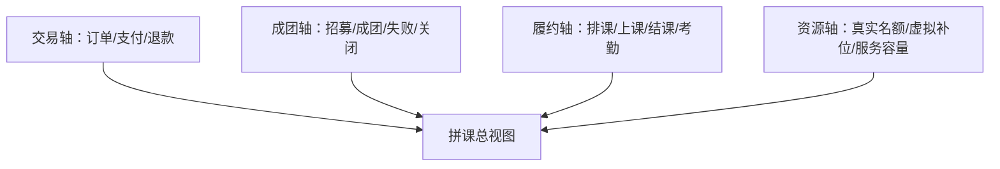

# 1. 文档目的

本文承接：

- [14-C-compatible-B-营销架构演进方案](./14-C-compatible-B-营销架构演进方案.md)
- [15-P1-营销场景出数解释协议](./15-P1-营销场景出数解释协议.md)
- [16-P2-营销事件目录与规则触发边界](./16-P2-营销事件目录与规则触发边界.md)
- [17-P3-积分资产账与退款原路回退方案](./17-P3-积分资产账与退款原路回退方案.md)

P5 要回答的问题是：

```text
拼课为什么是复杂玩法样板？
它和普通拼团、秒杀、优惠券、积分任务有什么本质区别？
哪些能力应该抽成通用玩法骨架，哪些必须留在拼课专属履约层？
```

本文不修改代码和数据库。涉及 Prisma schema、订单退款、排课资源、积分 lot、优惠券退还、任务调度的后续实现，都需要单独确认。

# 2. 核心结论

拼课不应被理解为“拼团换个名字”。它是一个 L4 复合玩法：

```text
订单交易 + 成团规则 + 虚拟补位 + 服务容量 + 排课资源 + 考勤履约 + 权益资产 + 退款补偿
```

当前项目里，拼课已经是营销模块最适合作为复杂玩法样板的能力。原因是它天然覆盖了多个边界：

- 有玩法配置：`COURSE_GROUP_BUY`
- 有玩法实例：`PlayInstance`
- 有团队聚合：团长实例 + 成员实例
- 有团队投影：真实人数、虚拟人数、有效人数、状态
- 有虚拟补位：自动、团长手动、后台手动
- 有课程履约：排课、上课、结课、考勤
- 有营销出数：首页 / 商品页可展示拼课队伍
- 有订单支付和退款
- 有优惠券与积分可能参与抵扣

所以 P5 的核心策略是：

```text
让拼课成为复杂玩法样板，而不是让拼课复杂度污染所有玩法。
```

也就是：

- 通用玩法层抽“实例、状态、事件、权益、解释、补偿”。
- 拼课专属层保留“团队、虚拟补位、排课、考勤、课程履约”。
- 简单玩法仍保持克制，不强行接入拼课的全套模型。

# 3. 当前事实

## 3.1 已有代码基础

当前项目已有拼课专属能力：

- 玩法注册：`apps/backend/src/module/marketing/play/play.registry.ts`
- 玩法策略：`apps/backend/src/module/marketing/play/course-group-buy.service.ts`
- 拼课服务：`apps/backend/src/module/marketing/course-group/course-group.service.ts`
- 团队状态：`apps/backend/src/module/marketing/course-group/services/team-state.service.ts`
- 团队投影：`apps/backend/src/module/marketing/course-group/services/team-projection.service.ts`
- 团队重算：`apps/backend/src/module/marketing/course-group/services/team-reconcile.service.ts`
- 虚拟补位：`apps/backend/src/module/marketing/course-group/services/virtual-fill.service.ts`
- 课程履约：`apps/backend/src/module/marketing/course-group/services/team-course-runtime.service.ts`
- 自动补位任务：`course-group-auto-fill.scheduler.ts`
- 团队重算任务：`course-group-reconcile.scheduler.ts`
- 库存 / 名额引擎：`MarketingStockService`

当前 Prisma 已有：

- `PlayInstance`
- `CourseGroupBuyExtension`
- `CourseSchedule`
- `CourseAttendance`
- `MktUserAsset`

## 3.2 已有设计优点

当前设计已经有几个正确方向：

- `COURSE_GROUP_BUY` 在 `PLAY_REGISTRY` 中标记为 `hasInstance / hasState / canFail`。
- 拼课默认库存模式是 `LAZY_CHECK`，没有套用秒杀的强锁定。
- 团队状态不只靠 `PlayInstance.status`，还引入了 `runtimeStatus`。
- 虚拟补位通过 audit fact 追加，不是直接篡改真实成员。
- 团队投影区分 `realMemberCount / virtualMemberCount / effectiveMemberCount`。
- `formedByVirtual` 明确表达“虚拟补位促成成团”。
- 课程履约以团长扩展作为团队课程中心。
- 虚拟成员不进入真实考勤成员集合。

这些已经比普通拼团更接近“复杂玩法事实模型”。

## 3.3 主要缺口

当前缺口不在于没有功能，而在于边界还需要进一步冻结：

- 成团、开课、上课、结课、已履约还需要更清楚的状态轴。
- 服务容量、排课资源、虚拟补位还没有统一资源分类。
- 虚拟补位对展示、成团、佣金、考勤、退款的影响需要固定政策。
- 拼课事件目录还未完整对齐 P2。
- 拼课退款对积分、优惠券、课程权益、虚拟补位的影响还未形成闭环。
- 通用玩法骨架和拼课专属模型的边界还容易漂移。

# 4. 拼课的本质边界

拼课至少有四条独立轴线，不能混成一个状态。



## 4.1 交易轴

交易轴回答：

```text
用户是否付款？是否退款？优惠券和积分是否处理完成？
```

典型状态：

- 待支付。
- 已支付。
- 已取消。
- 已退款。

交易轴应由订单和营销集成链路保证强一致，不能靠拼课事件异步补。

## 4.2 成团轴

成团轴回答：

```text
团队是否达到玩法规则要求？
```

典型状态：

- 招募中。
- 已成团。
- 成团失败。
- 已关闭。

成团轴可以参考 `PlayInstance.status`，但不能完全等同。

## 4.3 履约轴

履约轴回答：

```text
课程服务是否已经安排、开始、完成？
```

典型状态：

- 未排课。
- 已排课。
- 上课中。
- 已结课。
- 已取消。

这个轴是服务商品和实物商品的关键区别。

## 4.4 资源轴

资源轴回答：

```text
这个团队占用了哪些真实资源？
```

至少包括：

- 真实学员名额。
- 虚拟补位名额。
- 老师时间。
- 教室 / 场地。
- 课程课时。
- 可考勤成员。

虚拟补位只影响“有效人数”和展示，不应伪装成真实订单、真实考勤、真实佣金。

# 5. 状态模型

P5 推荐将拼课状态分为三层。

## 5.1 PlayInstanceStatus

这是通用玩法实例状态：

- `PENDING_PAY`
- `PAID`
- `ACTIVE`
- `SUCCESS`
- `TIMEOUT`
- `FAILED`
- `REFUNDED`

它适合表达实例生命周期，但不足以表达课程履约。

## 5.2 TeamStatus

这是团队招募与成团状态：

- `RECRUITING`
- `FORMED`
- `FAILED`
- `CLOSED`

它来自团队投影，不应只靠历史字段 `currentCount`。

## 5.3 CourseRuntimeStatus

这是课程履约状态：

- `NOT_SCHEDULED`
- `SCHEDULED`
- `IN_CLASS`
- `FINISHED`
- `CANCELLED`

当前代码已有 `IN_CLASS / FINISHED / CLOSED`，建议未来补齐 `NOT_SCHEDULED / SCHEDULED`，让“已成团但还没排课”和“已开始上课”可解释。

## 5.4 展示状态

C 端展示状态可以是聚合结果：

| 展示状态 | 来源                                  |
| -------- | ------------------------------------- |
| 招募中   | TeamStatus = RECRUITING               |
| 已成团   | TeamStatus = FORMED 且未进入课程      |
| 待排课   | TeamStatus = FORMED 且无 schedule     |
| 已排课   | TeamStatus = FORMED 且有有效 schedule |
| 上课中   | CourseRuntimeStatus = IN_CLASS        |
| 已结课   | CourseRuntimeStatus = FINISHED        |
| 已失败   | TeamStatus = FAILED                   |
| 已关闭   | TeamStatus = CLOSED 或 runtime CLOSED |

这个展示状态要进入 P1 的场景出数解释，否则首页上“同一个拼课商品为什么一会儿可参团、一会儿不可参团”无法排查。

# 6. 资源分类

拼课必须区分四类资源。

## 6.1 玩法名额

玩法名额是规则上的人数：

- `minCount`
- `maxCount`
- `remainingRealSlots`
- `effectiveMemberCount`

它用于判断是否成团、是否可继续参团。

## 6.2 真实支付名额

真实支付名额来自真实用户订单：

- 真实用户支付。
- 可退款。
- 可参与考勤。
- 可参与佣金。
- 可获得课程权益。

这是财务和履约的基础。

## 6.3 虚拟补位名额

虚拟补位名额是运营策略：

- 可参与成团判断。
- 可参与展示热度。
- 不参与真实订单。
- 不参与考勤。
- 默认不参与佣金。
- 不占用真实课程权益。

它不是库存，也不是服务容量。

## 6.4 履约容量

履约容量是服务资源：

- 老师。
- 教室。
- 时间段。
- 课时。
- 最大可上课人数。

履约容量和玩法名额相关，但不是同一个东西。

例如：

```text
拼课 maxCount = 12
教室容量 = 10
```

这不是前端展示问题，而是配置冲突。发布或开团前应拦截。

# 7. 虚拟补位政策

虚拟补位是拼课最容易产生误解的部分，必须固定政策。

## 7.1 可影响什么

虚拟补位可以影响：

- 有效人数。
- 是否成团。
- C 端热度展示。
- 成团来源标记。
- 团队推荐权重。

## 7.2 不应影响什么

虚拟补位默认不影响：

- 真实支付金额。
- 真实订单数量。
- 优惠券核销。
- 积分抵扣。
- 课程考勤。
- 分佣结算。
- 用户课程权益数量。

如果未来某个业务要让虚拟补位影响分佣或成本，应作为单独政策显式配置，不能默认发生。

## 7.3 透明度

推荐透明度分层：

| 角色          | 可见内容                             |
| ------------- | ------------------------------------ |
| 普通 C 端访客 | 只看团队人数和是否可加入             |
| 团长          | 可按需查看成员是否虚拟，取决于配置   |
| 门店 / 后台   | 可看虚拟补位明细、来源、操作人、原因 |
| 审计 / 风控   | 可看完整 append-only audit           |

当前代码已有 `leaderCanInspectVirtualMembers` 和后台虚拟补位审计，这是正确方向。

## 7.4 自动补位

自动补位需要满足：

- 活动开启 `enableVirtualFill`。
- 到达 `virtualFillWindowMinutes`。
- 团队仍未达到 `minCount`。
- 真实剩余名额允许补位。
- 幂等锁保护。
- 每次补位追加 audit。

自动补位后，应触发团队重算，并记录：

- 补位数量。
- 补位来源：`AUTO`。
- 是否导致成团。
- 是否 `formedByVirtual`。

# 8. 排课与履约

拼课和实物库存最大的差异是：

```text
实物商品卖出即接近履约完成。
课程服务成团后才进入履约准备。
```

## 8.1 成团不等于履约

成团只说明：

```text
人数达到规则，可以组织课程。
```

它不说明：

- 老师已安排。
- 教室已安排。
- 课表已生成。
- 学员已上课。
- 服务已完成。

因此 `team_formed` 不应直接等于 `service_fulfilled`。

## 8.2 排课资源

排课至少需要：

- 上课日期。
- 开始时间。
- 结束时间。
- 课时数。
- 地址。
- 老师。
- 教室 / 场地。
- 最大容量。

当前 `CourseSchedule` 具备日期、时间、课时、状态、备注，但老师和教室维度还没有显式模型。当前阶段可先保留现有模型，但要在文档中承认缺口。

## 8.3 考勤

考勤应该只针对真实履约成员。

当前 `TeamCourseRuntimeService.markAttendance` 已经校验“仅真实履约成员可标记到课”，这是拼课样板里非常重要的边界。

后续建议：

- 考勤和 schedule 强绑定。
- 每个 schedule 下记录每个真实成员出勤。
- 虚拟成员永远不能出现在考勤名单中。
- 完课奖励、分佣、课时消耗以考勤或课程完成事实为准。

# 9. 订单、退款、优惠券、积分

拼课不是孤立玩法，它必须遵守 P2 和 P3 的资产边界。

## 9.1 下单

参团下单时：

- 优惠券锁定仍由订单营销集成处理。
- 积分冻结仍由订单营销集成处理。
- 拼课只负责校验团队是否可加入。
- 支付前不应把成员计入真实已支付人数。

## 9.2 支付

支付成功后：

- 订单营销处理核销券、扣积分、发消费积分。
- 玩法实例进入 paid / active。
- 拼课团队重算。
- 如果达到成团条件，进入成团处理。
- 生成或确认课程扩展记录。

支付成功是拼课重算的重要触发点，但支付资产处理不能交给拼课事件异步完成。

## 9.3 退款

退款时要区分阶段：

| 阶段         | 退款影响                           |
| ------------ | ---------------------------------- |
| 未支付       | 取消订单，不进团队真实成员         |
| 已支付未成团 | 退出团队，退券 / 退积分 / 释放名额 |
| 已成团未排课 | 可能影响成团，需要重算或门店处理   |
| 已排课未上课 | 释放履约容量，可能需要补位或改期   |
| 已上课       | 退款变成售后，不应简单回滚成团     |
| 已结课       | 退款是售后账务，不回滚履约事实     |

所以拼课退款不能只有一个 `REFUNDED` 状态。应根据履约阶段选择处理策略。

## 9.4 积分和优惠券

积分按 P3：

- 抵扣积分退款要走 lot / allocation。
- 消费赠送积分要按订单退款扣回或记欠账。

优惠券按现有链路：

- 未使用取消应解锁。
- 已核销退款应退券或按政策失效。

拼课层不直接处理这些资产，只接收订单营销集成的处理结果，然后更新团队投影。

# 10. 拼课事件目录

P2 中建议补充拼课事件。P5 进一步固定事件语义。

| eventType                           | 触发时机           | 可触发动作               | 不应做什么               |
| ----------------------------------- | ------------------ | ------------------------ | ------------------------ |
| `course_group.team_created`         | 开团成功后         | 触点、展示刷新           | 不发最终权益             |
| `course_group.member_joined`        | 真实用户支付参团后 | 团队重算、触点           | 不替代支付资产处理       |
| `course_group.virtual_filled`       | 虚拟补位追加后     | 团队重算、审计           | 不生成订单 / 考勤 / 佣金 |
| `course_group.team_formed`          | 团队投影达到成团   | 课程扩展、排课准备、通知 | 不等于已履约             |
| `course_group.team_failed`          | 招募失败或关闭     | 退款提醒、补偿处理       | 不直接改资金             |
| `course_group.schedule_bound`       | 生成或绑定课表后   | 上课通知                 | 不改变订单支付状态       |
| `course_group.class_started`        | 门店确认上课       | 运行状态、通知           | 不代表完课               |
| `course_group.attendance_confirmed` | 考勤确认后         | 完课奖励、统计           | 不给虚拟成员奖励         |
| `course_group.class_finished`       | 结课后             | 课时消耗、复购触点       | 不回滚成团               |

这些事件进入事件目录后，才能支撑：

- P1 的场景解释。
- P2 的规则触发白名单。
- P3 的积分奖励和退款扣回。
- 后续分佣、任务、触点。

# 11. 通用玩法骨架

拼课里可以抽象给其他复杂玩法的能力：

## 11.1 可抽象能力

| 能力                  | 通用程度 | 说明                           |
| --------------------- | -------- | ------------------------------ |
| PlayInstance 生命周期 | 高       | 所有实例型玩法共用             |
| 玩法配置校验          | 高       | 每个玩法有自己的 RulesDto      |
| 状态流转钩子          | 高       | 支付、成功、失败、退款         |
| 事件发射              | 高       | 进入 P2 事件目录               |
| 运行事实 audit        | 中       | 复杂玩法需要 append-only facts |
| 投影重算              | 中       | 拼课、分销成长、任务链适用     |
| 补偿任务              | 中       | 复杂玩法适用                   |
| 场景出数解释          | 高       | 所有 C 端展示都需要            |

## 11.2 不应抽象能力

| 能力               | 原因                   |
| ------------------ | ---------------------- |
| 虚拟补位           | 拼课特有或少数玩法特有 |
| 排课               | 课程服务特有           |
| 考勤               | 服务履约特有           |
| 老师 / 教室容量    | 教培场景特有           |
| 团长可查看虚拟成员 | 拼课策略特有           |
| formedByVirtual    | 虚拟补位语义特有       |

不应为了复用，把这些都塞进通用 `PlayTemplate`。

# 12. 与其他玩法的关系

## 12.1 秒杀

秒杀是 L2 实例型玩法：

- 强库存。
- 支付成功即接近成功。
- 不需要团队投影。
- 不需要排课考勤。

它应该复用 PlayInstance 和事件目录，但不接入拼课履约模型。

## 12.2 会员升级

会员升级是 L2 / L3 之间：

- 支付后授予会员权益。
- 基本无失败成团。
- 无服务容量。

它可以复用权益发放和订单集成，不需要团队模型。

## 12.3 新人礼包 / 签到

这是 L1 权益型玩法：

- 不一定需要 PlayInstance。
- 更适合事件规则触发发券 / 发积分。
- 不需要排课、成团、补位。

所以不要让拼课的复杂度反向拖重签到和领券。

## 12.4 未来分销成长

分销成长可能接近 L4：

- 有关系链。
- 有阶梯目标。
- 有佣金。
- 有风控。
- 有补偿。

它可以参考拼课的“事实 audit + 投影重算 + 补偿任务”，但不复用虚拟补位和排课。

# 13. 数据表影响

P5 暂不建议立刻新增表。当前已有：

- `PlayInstance`
- `CourseGroupBuyExtension`
- `CourseSchedule`
- `CourseAttendance`

## 13.1 现有模型强化档

继续使用当前表：

- 团队 facts 存在 `instanceData.courseGroupTeam`。
- 虚拟补位 audit 继续 append-only。
- 排课和考勤继续用扩展表。

优点：

- 不触发 Prisma schema 变更。
- 适合本地开发继续迭代。

缺点：

- JSON audit 查询能力有限。
- 复杂审计和报表不方便。
- 事件目录无法直接关联专用团队事实表。

## 13.2 完整档

未来可考虑新增：

```text
mkt_course_group_team
mkt_course_group_member
mkt_course_group_virtual_fill
mkt_course_group_runtime_event
mkt_course_group_resource_booking
```

但不建议当前就硬拆，因为：

- 当前已存在可运行链路。
- 还没有足够多真实运营数据证明查询压力。
- 过早拆表会拖慢主线。

推荐：

```text
先保持当前模型，补齐状态语义、事件目录、解释协议和退款政策。
等拼课进入高频运营，再拆专用团队事实表。
```

# 14. 前后台影响

## 14.1 C 端

C 端要重点展示：

- 是否可开团。
- 是否可参团。
- 剩余真实名额。
- 团队状态。
- 上课时间 / 地点。
- 团长和成员展示。
- 虚拟补位展示策略。
- 不可加入原因。

不应展示：

- 后台完整虚拟补位 audit。
- 风控判断。
- 佣金内部计算。

## 14.2 后台 / 门店端

后台要能处理：

- 团队列表。
- 团队详情。
- 成员列表。
- 虚拟补位新增 / 撤销。
- 成团来源。
- 排课列表。
- 考勤。
- 关闭团队。
- 成员失败处理。
- 重算与异常。

后台要回答：

```text
这个团为什么成团？
有没有虚拟补位？
真实付费人数是多少？
是否已排课？
哪些人可考勤？
退款会影响什么？
```

# 15. 风险与取舍

## 15.1 虚拟补位合规风险

虚拟补位会影响用户感知，必须审计：

- 谁补位。
- 什么时候补位。
- 补了几个。
- 为什么补。
- 是否导致成团。
- 团长是否可见。

## 15.2 过度抽象风险

如果把拼课所有能力都抽成通用玩法，会导致：

- 简单玩法变重。
- 规则配置难懂。
- 订单和履约边界混乱。

推荐只抽稳定骨架，不抽拼课专属语义。

## 15.3 履约与退款风险

课程已经开始后，退款不能简单回滚成团，否则会破坏历史事实。

推荐：

- 未履约前：可回滚团队投影。
- 履约中：走售后策略。
- 已结课：只做财务售后，不改履约事实。

## 15.4 数据一致性风险

当前团队投影依赖实例和 JSON facts。需要靠重算任务兜底：

- 支付成功后重算。
- 虚拟补位后重算。
- 定时重算补偿。
- driftFlags 暴露不一致。

# 16. 实施分析

本节基于当前代码扫描结果补充，不直接修改代码或 Prisma schema。

## 16.1 当前代码切入点

拼课主链路已经比其他玩法成熟，代码集中在：

| 责任                            | 当前文件                                                                                 | 判断                                                                                  |
| ------------------------------- | ---------------------------------------------------------------------------------------- | ------------------------------------------------------------------------------------- |
| 拼课 C / admin / store 聚合服务 | `apps/backend/src/module/marketing/course-group/course-group.service.ts`                 | 承载开团、参团、详情、补位、排课状态、关闭团队                                        |
| 玩法策略                        | `apps/backend/src/module/marketing/play/course-group-buy.service.ts`                     | `@PlayStrategy('COURSE_GROUP_BUY')`，处理自动补位、人工补位、重算、付款成功等玩法逻辑 |
| 团队投影                        | `apps/backend/src/module/marketing/course-group/services/team-projection.service.ts`     | 从真实成员和虚拟补位 audit 计算有效人数、展示状态、driftFlags                         |
| 重算补偿                        | `apps/backend/src/module/marketing/course-group/services/team-reconcile.service.ts`      | 写回 projection、记录 reconcile audit                                                 |
| 虚拟补位                        | `apps/backend/src/module/marketing/course-group/services/virtual-fill.service.ts`        | 以 append-only audit 维护虚拟成员增删                                                 |
| 排课与考勤                      | `apps/backend/src/module/marketing/course-group/services/team-course-runtime.service.ts` | 以团长扩展作为课程履约中心，虚拟成员不进入考勤                                        |
| 分佣视图                        | `apps/backend/src/module/marketing/course-group/services/commission.service.ts`          | 读取规则生成分佣提示，汇总真实订单分佣证据                                            |
| 定时任务                        | `apps/backend/src/module/marketing/course-group/scheduler/**`                            | 自动补位和重算                                                                        |
| 数据模型                        | `apps/backend/prisma/models/80-marketing.prisma`                                         | `PlayInstance`、`CourseGroupBuyExtension`、`CourseSchedule`、`CourseAttendance`       |

前端和后台入口包括：

- `apps/admin-web/src/views/marketing/course-group/**`
- `apps/miniapp-client/src/api/course-group.ts`
- `apps/miniapp-client/src/pages/course-group/**`
- `apps/miniapp-client/src/pages/product/components/course-group-*.vue`

## 16.2 当前模型优点

当前拼课已经有几个值得保留的设计：

1. 团队事实以 `PlayInstance` 团长实例为中心。
2. 真实成员来自真实订单 / 参与实例，不和虚拟成员混表。
3. 虚拟补位通过 `courseGroupTeam.facts.audits.virtualFill` append-only 记录。
4. `TeamProjectionService` 统一计算真实人数、虚拟人数、有效人数、是否虚拟成团。
5. `TeamCourseRuntimeService` 明确“虚拟成员不进入排课与考勤”。
6. 管理端和门店端已经有关闭团队、补位、移除补位、上课、结课、考勤入口。
7. 单测已经覆盖虚拟补位、投影、重算、虚拟成员不可考勤等关键边界。

这说明 P5 不需要重写拼课，而是要把拼课沉淀成复杂玩法方法论。

## 16.3 四条轴线落点

拼课至少有四条轴线：

| 轴线   | 当前落点                                                           | 说明                         |
| ------ | ------------------------------------------------------------------ | ---------------------------- |
| 交易轴 | 订单、`PlayInstance.status`、支付成功回调                          | 解决真实用户是否付款         |
| 成团轴 | `TeamProjectionService`、`effectiveMemberCount`、`formedByVirtual` | 解决人数是否达到 minCount    |
| 履约轴 | `CourseGroupBuyExtension`、`CourseSchedule`、`CourseAttendance`    | 解决课程是否排课、上课、结课 |
| 资源轴 | `StorePlayConfig.rules`、服务容量、虚拟补位规则、分佣证据          | 解决容量、补位、佣金和异常   |

当前风险在于：

```text
PlayInstance.status 容易被误用成唯一状态。
```

后续应明确：

- `PlayInstance.status` 是交易 / 实例状态。
- `projection.status.baseStatus` 是团队成团状态。
- `projection.status.runtimeStatus` 是课程履约状态。
- `displayStatus` 是面向前后台的综合状态。

不要把“已上课 / 已结课”写回成“成团成功 / 失败”的简单状态。

## 16.4 虚拟补位实现分析

当前虚拟补位的实现比较合理：

```text
ADD audit -> 投影有效人数增加
REMOVE audit -> 投影有效人数减少
active virtual members = audit reduce 后的结果
```

它没有把虚拟成员写成真实订单成员，也没有让虚拟成员进入考勤和分佣。

后续需要补强的不是数据结构，而是解释和策略：

| 问题               | 建议                                                 |
| ------------------ | ---------------------------------------------------- |
| 自动补位为什么发生 | 写入 reason、触发窗口、缺口人数                      |
| 人工补位谁操作     | 保留 createdByType / createdById                     |
| 是否导致成团       | `formedByVirtual = true` 时后台显著展示              |
| 是否可撤销         | 仅 `RECRUITING` 阶段可撤销，成团或履约后不能简单撤销 |
| C 端是否可见       | 普通用户只看进度，团长或后台可查看来源解释           |

这正好回应“服务和实物库存区别”的问题：

```text
实物库存不能靠虚拟补位补出真实库存；
服务容量可以通过运营策略补足成团展示，但不能补出真实考勤和真实分佣。
```

## 16.5 排课与履约实现分析

当前 `CourseGroupBuyExtension`、`CourseSchedule`、`CourseAttendance` 已经把课程履约从普通玩法中拆出来。

`TeamCourseRuntimeService` 的关键边界是：

```text
团详情履约以团长扩展作为团队课程中心，虚拟成员不进入排课与考勤。
```

这条边界要继续保留。

服务类玩法和实物类玩法的差异在这里最明显：

| 类型       | 实物商品            | 拼课 / 课程服务            |
| ---------- | ------------------- | -------------------------- |
| 库存对象   | SKU 数量            | 老师、教室、时间、名额     |
| 锁定时机   | 下单 / 支付前后强锁 | 成团后才确定履约资源       |
| 失败后处理 | 释放库存 / 退款     | 失败退款、补位、改期、转班 |
| 履约证明   | 发货 / 签收         | 排课 / 考勤 / 课时完成     |
| 退款影响   | 库存和资金          | 资金、课时、考勤事实、分佣 |

因此 P5 不能只看“库存扣减”，必须看履约事实。

## 16.6 分佣和财务证据分析

当前 `CourseGroupService` 已经区分：

- `realPaidAmount`
- `commissionBaseAmount`
- `commissionAmount`
- `financeEvidenceReady`

这比只展示“成团人数”更可靠。

后续拼课作为样板时，要保留两个原则：

1. 虚拟成员不参与分佣。
2. 分佣依据来自真实订单和结算证据，不来自展示人数。

如果虚拟补位导致成团，但真实付费人数不足，后台必须能看到：

```text
effectiveMemberCount 达标；
realPaidMemberCount 未达标；
formedByVirtual = true；
financeEvidenceReady 可能为 false。
```

这样才能避免运营以为“成团人数 = 可分佣人数”。

## 16.7 事件与解释对齐

P5 后续应接入 P2 事件目录，但不要让事件替代强一致动作。

建议补充或规范这些事件：

```text
COURSE_GROUP_OPENED
COURSE_GROUP_JOINED
COURSE_GROUP_FORMED
COURSE_GROUP_FAILED
COURSE_GROUP_CLOSED
COURSE_GROUP_AUTO_FILLED
COURSE_GROUP_MANUAL_FILLED
COURSE_GROUP_VIRTUAL_FILL_REMOVED
COURSE_GROUP_CLASS_STARTED
COURSE_GROUP_CLASS_FINISHED
COURSE_GROUP_ATTENDANCE_MARKED
```

这些事件可用于：

- 后台审计。
- 触点消息。
- 场景出数解释。
- 风险告警。
- 统计分析。

不应用于：

- 替代订单支付。
- 替代退款。
- 替代排课写入。
- 替代考勤写入。

P1 的场景 explain 也应能引用拼课原因：

```text
不可加入：团队已满 / 已成团 / 已上课 / 已关闭 / 活动下架
可展示：正在招募 / 即将成团 / 已补位成团
降级：团队投影 drift / financeEvidenceReady=false
```

## 16.8 数据模型判断

当前不建议立刻拆出独立 `course_group_team` 主表。

原因：

- `PlayInstance + instanceData.courseGroupTeam` 已经承载了可运行事实。
- `CourseGroupBuyExtension` 已经承载课程履约。
- 单测已经围绕现有结构形成保护。
- 当前主要风险是解释和边界，而不是表结构完全不可用。

但后续若拼课规模扩大，可以评估：

```text
course_group_team
course_group_virtual_fill_audit
course_group_projection_snapshot
course_group_runtime_transition
```

进入这些表结构改造前，需要单独按高风险 schema 流程确认。

## 16.9 前后台影响

后台应继续强化这些能力：

- 团队详情显示四条轴线。
- 虚拟补位 audit 只给后台 / 门店端可见。
- 真实人数、虚拟人数、有效人数分开展示。
- 分佣金额和真实支付金额分开展示。
- 排课、考勤、上课、结课和关闭团队有清晰边界。
- driftFlags 和 financeEvidenceReady 能触发异常提示。

C 端应控制展示边界：

- 普通用户看进度、状态、可参团原因。
- 团长可看到更详细的虚拟补位说明。
- 不展示内部风控和分佣细节。
- 不把虚拟成员伪装成真实付费用户的履约事实。

## 16.10 验证分析

后续 P5 实施至少验证：

| 场景         | 验证点                                           |
| ------------ | ------------------------------------------------ |
| 自主开团     | 团长实例直接进入活动中，`payRequired=false`      |
| 真实参团支付 | 真实成员计入 `realPaidMemberCount`               |
| 自动补位     | 只在窗口内、缺口存在时补位                       |
| 人工补位     | 权限和阶段校验正确                               |
| 移除补位     | 仅招募阶段可移除                                 |
| 虚拟成团     | `formedByVirtual = true`，真实人数和有效人数分离 |
| 排课         | 只基于团长扩展中心                               |
| 考勤         | 虚拟成员不可考勤                                 |
| 分佣         | 虚拟成员不参与分佣                               |
| 关闭团队     | 返回 CLOSED 展示状态，不误判普通失败             |
| 重算         | driftFlags 能暴露旧计数不一致                    |

当前已有相关单测文件：

- `apps/backend/src/module/marketing/course-group/__tests__/course-group.service.spec.ts`
- `apps/backend/src/module/marketing/course-group/__tests__/team-projection.service.spec.ts`
- `apps/backend/src/module/marketing/course-group/__tests__/team-reconcile.service.spec.ts`
- `apps/backend/src/module/marketing/course-group/__tests__/team-course-runtime.service.spec.ts`
- `apps/backend/src/module/marketing/course-group/__tests__/virtual-fill.service.spec.ts`

## 16.11 文件级执行顺序

如果进入代码实施，建议顺序：

```text
1. apps/backend/src/module/marketing/events
   补拼课事件目录，先只做白名单和 payload schema。

2. apps/backend/src/module/marketing/course-group/services/team-projection.service.ts
   固化四轴状态字段和 driftFlags 说明。

3. apps/backend/src/module/marketing/course-group/services/virtual-fill.service.ts
   补 reason / audit 字段标准和解释口径。

4. apps/backend/src/module/marketing/course-group/services/team-course-runtime.service.ts
   保持虚拟成员不可考勤边界，补验证用例。

5. apps/backend/src/module/marketing/course-group/course-group.service.ts
   输出更清晰的 team explain 字段。

6. apps/backend/src/module/marketing/resolution
   场景出数把拼课不可加入原因纳入 trace。

7. apps/admin-web/src/views/marketing/course-group/**
   增加四轴展示、补位审计、异常提示。

8. apps/miniapp-client/src/pages/course-group/**
   控制 C 端展示边界，保留 traceId / source。
```

# 17. 阶段路线

## P5.1 概念冻结

目标：

- 固定拼课四条轴线：交易、成团、履约、资源。
- 固定真实成员和虚拟成员边界。

改哪些模块：

- 文档。
- 后续事件目录和状态文案。

不改哪些模块：

- 不改 Prisma。
- 不改订单支付退款。
- 不改积分和优惠券。

数据表影响：

- 无。

验证方式：

- 用现有拼课流程逐步映射四条轴线。

是否迁移历史数据：

- 否。

## P5.2 状态与事件对齐

目标：

- 把拼课事件补入 P2 事件目录。
- 把展示状态接入 P1 出数解释。

改哪些模块：

- `marketing/events`
- `course-group`
- `resolution`

不改哪些模块：

- 不改资产账。

数据表影响：

- 无，先用代码常量。

验证方式：

- 开团、参团、补位、成团、排课、考勤事件能解释。

是否迁移历史数据：

- 否。

## P5.3 虚拟补位治理

目标：

- 固定自动补位、手动补位、撤销补位的审计和展示边界。

改哪些模块：

- `VirtualFillService`
- 自动补位任务。
- 后台团队详情。
- C 端团长查看。

不改哪些模块：

- 不让虚拟成员进入订单、考勤、佣金。

数据表影响：

- 暂无，继续使用 append-only audit。

验证方式：

- 虚拟补位导致成团时 `formedByVirtual = true`。
- 虚拟成员不能考勤。
- 后台可查补位 audit。

是否迁移历史数据：

- 否。

## P5.4 排课履约补齐

目标：

- 明确已成团、已排课、上课中、已结课的状态转换。

改哪些模块：

- `TeamCourseRuntimeService`
- `CourseSchedule`
- `CourseAttendance`
- 后台排课 / 考勤页面。

不改哪些模块：

- 不重做课程商品模型。

数据表影响：

- 现有模型强化档无。
- 若要老师 / 教室资源，需要后续新增资源表，单独确认。

验证方式：

- 成团后未排课能展示待排课。
- 有排课才能考勤。
- 虚拟成员不能考勤。
- 结课后状态不被退款回滚。

是否迁移历史数据：

- 否。

## P5.5 退款与售后策略

目标：

- 根据履约阶段决定退款影响。

改哪些模块：

- 订单营销集成。
- 拼课团队重算。
- 积分 / 优惠券退款策略。

不改哪些模块：

- 不把退款资产处理交给拼课事件异步完成。

数据表影响：

- 依赖 P3 积分 lot / allocation。

验证方式：

- 未成团退款。
- 已成团未排课退款。
- 已排课退款。
- 已上课退款。
- 已结课售后。

是否迁移历史数据：

- 老订单按旧策略兼容。

# 18. 逻辑矫正

需要先纠正几个容易误判的点：

1. “拼课就是拼团”：不准确。拼课还有课程履约、排课、考勤和服务容量。
2. “成团就是履约完成”：不准确。成团只是组织课程的前置条件。
3. “虚拟补位就是库存”：不准确。虚拟补位是玩法策略，不是真实库存、订单或服务容量。
4. “真实人数和有效人数可以混用”：不准确。有效人数可含虚拟补位，真实人数才对应订单、考勤、佣金。
5. “退款就是把实例改成 REFUNDED”：不完整。退款要看履约阶段，并处理券、积分、课程权益和团队投影。
6. “复杂拼课能力应该全部抽成通用玩法”：不建议。只抽通用骨架，拼课专属履约语义留在专属模块。

# 19. 注释审查与注释方案

如果后续进入代码实现，注释应集中在以下位置：

- 团队投影：说明真实人数、虚拟人数、有效人数的区别。
- 虚拟补位：说明它只影响成团和展示，不参与订单、考勤、佣金。
- 课程运行态：说明成团状态和履约状态是两条轴线。
- 退款处理：说明不同履约阶段的处理策略。
- 场景出数：说明拼课不可加入原因要进入解释协议。

不建议增加的注释：

- 不在页面组件里解释完整拼课状态机。
- 不用 TODO 代替退款和补位政策。
- 不在通用 PlayTemplate 上塞拼课专属规则说明。

# 20. 下一步建议

P5 完成后，营销模块这轮设计的主骨架已经形成：

```text
P1 场景解释
P2 事件目录
P3 积分资产账
P5 拼课复杂玩法样板
```

下一步建议补一份收束文档：

```text
19-营销模块阶段实施顺序与取舍清单.md
```

这份文档不再扩展新模型，而是把 P1 / P2 / P3 / P5 转成可以执行的阶段任务、风险清单和“不做事项”。

# 21. 2026-04-28 低风险实施回写

本次已完成 P5 的事件语义和监听入口对齐，不涉及拼课表结构、退款资金链路、排课表迁移或 C 端页面改造。

已落地代码：

- `apps/backend/src/module/marketing/events/marketing-event.types.ts`
  - 新增 `course_group.*` 专用事件：
    - `course_group.team_created`
    - `course_group.member_joined`
    - `course_group.virtual_filled`
    - `course_group.team_formed`
    - `course_group.team_failed`
    - `course_group.schedule_bound`
    - `course_group.class_started`
    - `course_group.attendance_confirmed`
    - `course_group.class_finished`
- `apps/backend/src/module/marketing/events/marketing-event.catalog.ts`
  - 将拼课事件纳入 P2 事件目录。
  - `team_formed` 可触点但不触发积分。
  - `attendance_confirmed` 可触发积分或任务。
  - `virtual_filled` 只进入风控、统计、审计，不触发积分、优惠券或触点。
- `apps/backend/src/module/marketing/events/marketing-event.listener.ts`
  - 增加拼课事件监听入口，统一记录最近事件和日级统计。
  - 触点派发仍由 catalog scope 控制。
- `apps/backend/src/module/marketing/events/touchpoint-orchestrator.service.ts`
  - 增加拼课事件到触点编码映射。

验证已执行：

```text
pnpm --filter @apps/backend test -- marketing-event.catalog.spec.ts marketing-event.listener.spec.ts touchpoint-orchestrator.service.spec.ts marketing-event.emitter.spec.ts
pnpm typecheck:backend
```

边界仍保持：

- 没有把虚拟补位变成订单成员。
- 没有让虚拟成员进入考勤、佣金或积分奖励。
- 没有把成团等同于履约完成。
- 没有让拼课事件替代支付、退款、排课资源占用等强一致动作。

# 22. 2026-04-28 C 端拼课不可加入原因回写

本次完成 S4/P5 的第二段落地：把拼课“能不能参团”从布尔值升级为结构化原因，并接入 P1 场景出数 explain。

## 22.1 已落地代码

- `apps/backend/src/module/marketing/course-group/services/team-state.service.ts`
  - 新增 `CourseGroupJoinBlockReasonCode` 和 `resolveJoinDecision`。
  - 统一输出 `joinable / reasonCode / reasonText`。
  - 原 `canJoin` 保留，但内部改为复用结构化判断。
- `apps/backend/src/module/marketing/course-group/course-group.service.ts`
  - `getJoinPreview` 返回 `reasonCode / reasonText / joinBlockReasonCode / joinBlockReasonText`。
  - 团队列表和详情的 `TeamSummary` 增加不可加入原因。
- `apps/backend/src/module/marketing/resolution/services/course-group-scene-explain.service.ts`
  - 场景主推活动为 `COURSE_GROUP` / `COURSE_GROUP_BUY` 时，批量读取团队实例。
  - 使用 `TeamReconcileService` 的投影结果判断招募、成团、补位成团、已上课、已关闭等原因。
  - 返回 `courseGroupJoinExplain` 和通用 `explain[]`。
- `apps/backend/src/module/marketing/resolution/services/primary-offer-resolver.service.ts`
  - 主推活动裁决后、次级权益合并前注入拼课 explain。
- `apps/backend/src/module/client/marketing/scene/vo/client-scene.vo.ts`
  - OpenAPI 增加 `ClientSceneExplainVo` 和 `ClientCourseGroupJoinExplainVo`。
- `apps/miniapp-client/src/api/marketing.ts`
  - 从 `@libs/common-types` 消费 `courseGroupJoinExplain` 契约。
- `apps/miniapp-client/src/pages/index/components/home-aggregate-section.vue`
  - 首页场景卡片识别 `COURSE_GROUP_BUY`。
  - 展示拼课 explain 文案，支持不同账户看到不同参团解释。
- `apps/miniapp-client/src/api/course-group.ts`
  - 归一化团队列表、详情和 join-preview 的不可加入原因。
- `apps/miniapp-client/src/pages/course-group/**`
  - 团队卡片、团队详情、参团预检 toast 展示后端原因。

## 22.2 明确不做

- 不新增 Prisma model、migration 或 seed。
- 不迁移历史拼课实例。
- 不把排课地址缺失直接变成参团阻断条件。
- 不把服务容量强行映射为实物库存。
- 不在小程序二次判断团队是否可加入。
- 不把拼课团队 explain 扩展成完整推荐系统。

## 22.3 逻辑矫正

这次实现里刻意保留一个边界：`storeReady` 可以作为展示和开团条件，但没有直接变成参团阻断。

原因是：

- 服务商品的履约条件不是单一库存字段。
- 排课地址、老师、教室、课时容量属于履约资源。
- 一个已存在团队能否继续参团，当前更应该由团队状态、剩余名额、用户是否已加入、活动是否下架决定。
- 如果后续业务要求“未排课不可参团”，应进入 P5.4 排课履约补齐，和老师 / 教室 / 课时容量一起建模，而不是在 join-preview 里偷偷加条件。

因此当前 reason code 先覆盖：

```text
JOINABLE
NO_RECRUITING_TEAM
VIEWER_ALREADY_JOINED
TEAM_FULL
TEAM_FORMED
TEAM_IN_CLASS
TEAM_FINISHED
TEAM_FAILED
TEAM_CLOSED
ACTIVITY_OFF_SHELF
UNKNOWN
```

`STORE_NOT_READY` 已预留，但不作为当前参团主链路的默认阻断。

## 22.4 验证记录

已执行：

```text
pnpm --filter @apps/backend test -- course-group.service.spec.ts course-group-scene-explain.service.spec.ts primary-offer-resolver.service.spec.ts
pnpm typecheck:backend
pnpm dev:backend
pnpm generate-types
pnpm --filter @apps/miniapp-client test -- src/api/course-group.spec.ts src/composables/use-scene-marketing.spec.ts
pnpm lint:h5
pnpm typecheck:h5
```

验证结论：

- join-preview 能返回可参团、已加入、已成团等结构化原因。
- 场景 explain 能区分暂无可加入团队、即将成团、已补位成团。
- OpenAPI 已由 `pnpm dev:backend` 运行时刷新，再通过 `pnpm generate-types` 生成共享类型。
- `pnpm lint:h5` 通过，但仍有一个既有 UnoCSS 顺序 warning，文件不在本次改动范围。

## 22.5 注释审查与注释方案

本次没有新增大段解释性注释，原因是核心边界已通过类型和方法名表达：

- `resolveJoinDecision` 表示原因由后端统一裁决。
- `CourseGroupSceneExplainService` 表示场景 explain 只补解释，不改出数。
- `ClientCourseGroupJoinExplainVo` 表示 C 端拿到的是可展示解释，不是完整团队状态机。

后续若进入 P5.4 排课履约补齐，需要在排课资源判断处补注释，说明：

- 排课资源与实物库存不同。
- 老师 / 教室 / 时间窗是服务容量。
- 虚拟补位不占用真实履约资源。

# 23. 2026-04-28 S13/P5.4 排课资源闭环回写

S13 后，P5.4 不再停留在“后续确认老师、教室、时间窗、服务容量”的设计判断，而是先落第一层履约证据模型。

已落地：

- `CourseSchedule`
  - 新增 `teacherId / teacherName`。
  - 新增 `classroomId / classroomName`。
  - 新增 `location`。
  - 新增 `capacity / serviceCapacity`。
  - 新增 `resourceSnapshot`。
- 成团生成排课
  - 从 `StorePlayConfig.rules` 读取老师、教室、地点、容量。
  - 没有配置专门排课时间时，仍沿用默认 `09:00-17:00`。
  - `resourceSnapshot.source = STORE_PLAY_RULES`，说明当前资源来自玩法配置快照。
- 后台拼课详情
  - 课程总览展示老师/教室/容量绑定排课数。
  - 排课列表展示老师、教室、履约地点和容量口径。

关键取舍：

- 先做排课资源快照，不做完整排班资源域。
- 不新增老师、教室、时间窗主数据表，避免把拼课样板直接升级成排班中台。
- 退款影响先能看到“该订单对应课程排课占用了什么资源”，后续再扩展为调课/释放容量/补位策略。
- 虚拟补位仍不进入考勤、分佣和真实履约容量。

逻辑矫正：

- 服务容量不是实物库存，不能用强锁库存模型解释。
- 排课容量也不是单纯名额，至少包含老师、教室、时间窗和服务可承载人数。
- 当前 `StorePlayConfig.rules` 可以承载第一阶段资源快照，但长期不能作为排班主数据。

仍未覆盖：

- 未做老师/教室资源主数据。
- 未做跨团同一老师/教室同一时间窗冲突检测。
- 未做调课、停课、补课和退款释放容量的状态机。
- 未执行 `prisma migrate dev/deploy`。

验证：

- `pnpm --filter @apps/backend test -- team-course-runtime.service.spec.ts`
- `pnpm typecheck:backend`
- `pnpm dev:backend`
- `pnpm generate-types`
- `pnpm typecheck:admin`
- `pnpm verify:admin-view-types`
