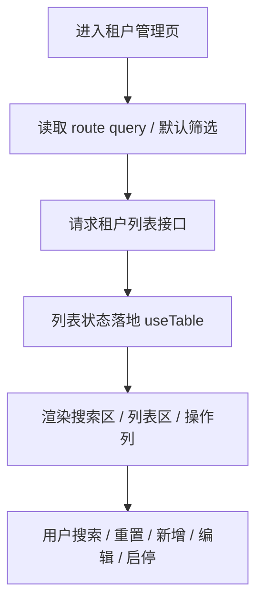
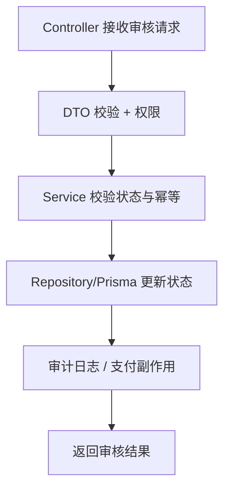
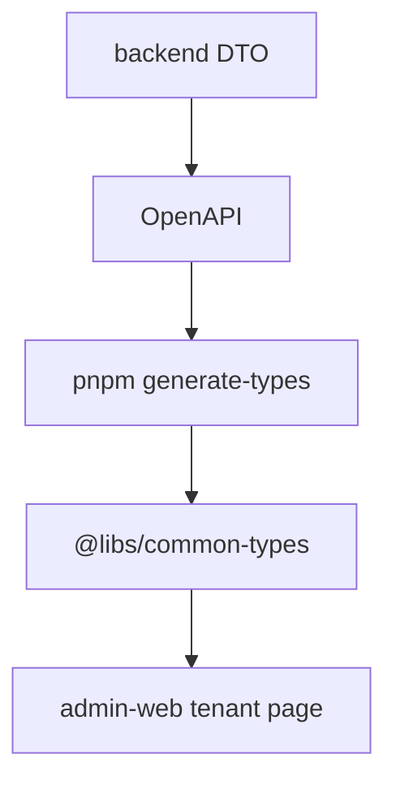

# AI 输出协议示例（AGENT_OUTPUT_PROTOCOL_EXAMPLES）

本文档只提供最小示例骨架。真实任务以 `docs/governance/AGENT_OUTPUT_PROTOCOL.md` 为入口，完整模板正文见 `docs/governance/AGENT_OUTPUT_TEMPLATES.md`，并按 L1 / L2 / L3 分级增减细节。

## 1. 任务识别与分级示例

```md
## 任务识别与分级

**任务原文**

> 给租户管理页新增套餐筛选，并同步后端查询。

**任务类型**

- [x] 页面梳理 / 页面改动
- [x] 接口 / DTO / VO / 返回字段改动

**涉及范围**

- backend：租户列表查询 DTO / Service
- admin-web：租户管理页搜索区与列表请求
- libs：OpenAPI 生成类型
- 是否 cross-app：是

**风险等级**

- [x] L3 深度

**是否命中高风险**

- [x] tenant / 多租户
- [x] 跨 app 契约

**主模板**

- 接口 / DTO / VO / 契约改动

**辅助模板**

- 页面梳理
- 高风险域识别与停手确认
```

## 2. 页面梳理示例

````md
## 页面梳理

**任务定义**

- 页面：`apps/admin-web/src/views/system/tenant/index.vue`
- 目标：梳理租户管理页搜索、列表、启停与套餐展示流程。
- 当前问题：搜索态、列表态和接口参数的来源需要确认。

**关键代码位置**
| 文件 | 作用 | 证据等级 |
|---|---|---|
| `apps/admin-web/src/views/system/tenant/index.vue` | 页面编排与表格操作 | 代码确认 |
| `apps/admin-web/src/views/system/tenant/modules/tenant-search.vue` | 搜索表单 | 代码确认 |
| `apps/admin-web/src/service/api/system/tenant.ts` | 页面 API 调用 | 代码确认 |

**Mermaid 页面流程图**



**逻辑矫正**

- 当前必须确认搜索表单、route query 与列表请求是否同源，避免重置后筛选残留。

**注释审查与注释方案**

- 若存在 route query 到搜索态的 watch，应说明同步边界；普通字段赋值不补注释。

**测试与回归建议**

- `pnpm typecheck:admin`
- `pnpm verify:admin-view-types`
````

## 3. 后端模块梳理示例

````md
## 后端模块梳理

**任务定义**

- 模块：提现审核
- 目标：确认审核、支付发起、审计日志之间的真实闭环。
- 当前问题：审核通过与支付执行边界可能耦合过深。

**关键代码位置**
| 文件 | 作用 | 证据等级 |
|---|---|---|
| `apps/backend/src/module/finance/withdrawal/withdrawal.controller.ts` | 审核入口 | 代码确认 |
| `apps/backend/src/module/finance/withdrawal/withdrawal-audit.service.ts` | 审核编排 | 代码确认 |
| `apps/backend/src/module/finance/withdrawal/withdrawal.repository.ts` | 状态读写 | 代码确认 |

**Mermaid 后端流程图**



**逻辑矫正**

- 审核成功和支付执行应区分事实源；支付失败不能反向污染审核事实。

**注释审查与注释方案**

- 事务边界、状态切换和支付副作用触发时机必须补注释。
````

## 4. 接口 / DTO / VO / 契约改动示例

````md
## 接口 / DTO / VO / 契约改动

**任务定义**

- 接口：租户列表查询
- 契约变化：新增 `packageId` 筛选字段
- 目标：backend 查询、OpenAPI 类型与 admin-web 搜索请求一致。

**Mermaid 契约影响链路图**



**字段级兼容性分析**
| 字段 | 当前类型 | 新类型 | 是否必填 | 兼容风险 | 前端影响 |
|---|---|---|---|---|---|
| `packageId` | 无 | `string?` | 否 | 低；新增可选筛选 | 搜索表单与请求参数新增 |

**实现顺序**

1. backend DTO / Service
2. `pnpm generate-types`
3. admin-web 搜索表单与请求参数
4. backend + admin-web 验证
````

## 5. 高风险停手示例

```md
## 高风险域识别与停手确认

**命中高风险域**

- [x] tenant / 多租户
- [x] 跨 app 契约

**是否需要停手确认**

- 结论：需要。
- 原因：租户筛选语义和跨 app 类型链路同时变化，必须先确认影响面、生成类型和前端适配顺序。

**需求反驳**

- 更小范围方案：若只是前端展示，不应改 backend 契约；若需要真实筛选，则必须走契约链路。
- 兼容性：新增可选字段兼容旧调用，但前端不能手写重复类型。

**应转入的专项模板**

- 主模板：接口 / DTO / VO / 契约改动
- 辅助模板：页面梳理
```

## 6. 菜单-权限-接口一致性示例

```md
## 菜单-权限-接口一致性

**当前链路证据**
| 对象 | 路径 / 位置 | 作用 | 证据等级 |
|---|---|---|---|
| 菜单 seed | `apps/backend/prisma/seeds/**` | 菜单事实源 | 预计改动区域 |
| admin-web 路由 | `apps/admin-web/src/router/**` | 页面路由 | 预计改动区域 |
| backend Controller | `apps/backend/src/module/**/**.controller.ts` | 权限保护 | 预计改动区域 |

**权限链路**

- 页面按钮权限：待确认
- API 调用权限：待确认
- Controller 权限：待确认
- 菜单 perms：待确认
- 是否一致：证据不足，需读取代码后判断

**实施顺序**

1. 菜单 seed
2. backend 权限
3. admin-web 路由 / 页面
4. service/api
5. 验证
```

## 7. 数据修复 / 回填 / 迁移治理示例

```md
## 数据修复 / 回填 / 迁移治理

**需求有效性审查**

- 是否真的需要修数据：需先证明代码修复无法自动恢复历史数据。
- 是否可通过补偿任务解决：需要看是否已有事实源和可重放事件。
- 是否命中高风险：若涉及支付、租户或资金字段，必须先停手确认。

**Dry-run 方案**
| 检查项 | 查询口径 | 预估影响行数 | 风险 | 是否可自动修复 |
|---|---|---|---|---|
| 错误状态订单 | 以订单状态机和支付单为事实源 | dry-run 后才可得 | 状态误判 | 待确认 |

**红线**

- 未 dry-run 不实施。
- 未确认事实源不实施。
- 不可幂等不直接跑。
```

## 8. 工程治理示例

```md
## 工程治理 / AI 开发链路变更审查

**需求反驳与范围收敛**

- 当前需求：更新 AI 输出模板体系。
- 不应一次性做：新增脚本、改 CI、改 package scripts。
- 应现在解决：协议正文和示例脱节，模板缺少高风险分流、工程治理、数据修复、菜单权限。

**当前项目治理链路**

- 根 AGENTS.md：任务分类、高风险停手、验证门禁。
- docs/governance/AGENT_OUTPUT_PROTOCOL.md：输出模板事实源。
- docs/governance/AGENT_OUTPUT_TEMPLATES.md：完整模板正文。
- docs/governance/AGENT_OUTPUT_PROTOCOL_EXAMPLES.md：骨架示例。

**推荐方案与实施顺序**

1. 更新协议正文。
2. 同步示例文件。
3. 检查路径、frontmatter、引用。
```

## 9. Mock 数据示例

```text
针对 `fetchOrderDetail` 生成 Mock：
- 先读取真实类型定义与调用场景。
- 如果用户要求“直接可用 Mock”，最终只输出 JSON。
- 覆盖待支付、已支付、已取消、部分退款、金额为 0、空明细等状态。
```

## 10. 交付说明示例

```md
## 交付说明

**1. 本次改了什么**

- 一句话业务语义：更新 AI 输出协议到 v0.2 模板体系。
- 核心改动：新增任务识别、高风险分流、工程治理、菜单权限、数据修复、长耗时任务等模板。
- 是否完成目标：已完成协议正文和示例同步。

**2. 改动文件**
| 文件 | 改动摘要 | 原因 |
|---|---|---|
| `docs/governance/AGENT_OUTPUT_PROTOCOL.md` | 协议正文升级 | 作为入口事实源 |
| `docs/governance/AGENT_OUTPUT_TEMPLATES.md` | 模板正文升级 | 承载完整模板 |
| `docs/governance/AGENT_OUTPUT_PROTOCOL_EXAMPLES.md` | 示例升级 | 防止示例落后 |

**7. 验证结果**
| 验证 | 是否执行 | 结果 | 说明 |
|---|---|---|---|
| 文档路径检查 | 是 | 通过 | 确认引用文件存在 |
| 代码验证 | 否 | 未执行 | 仅文档改动 |
```
