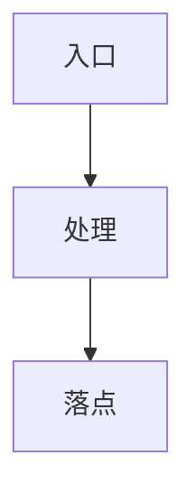
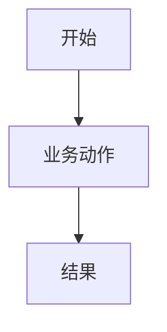
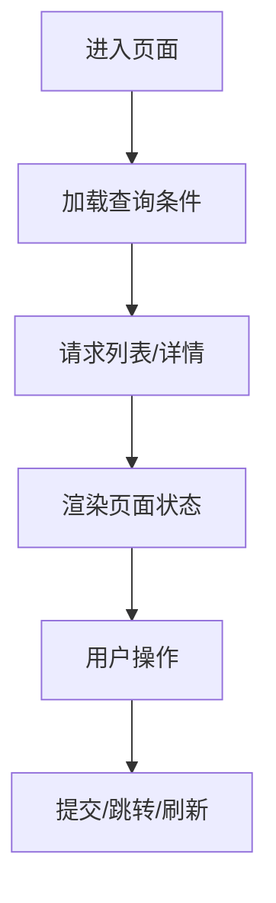
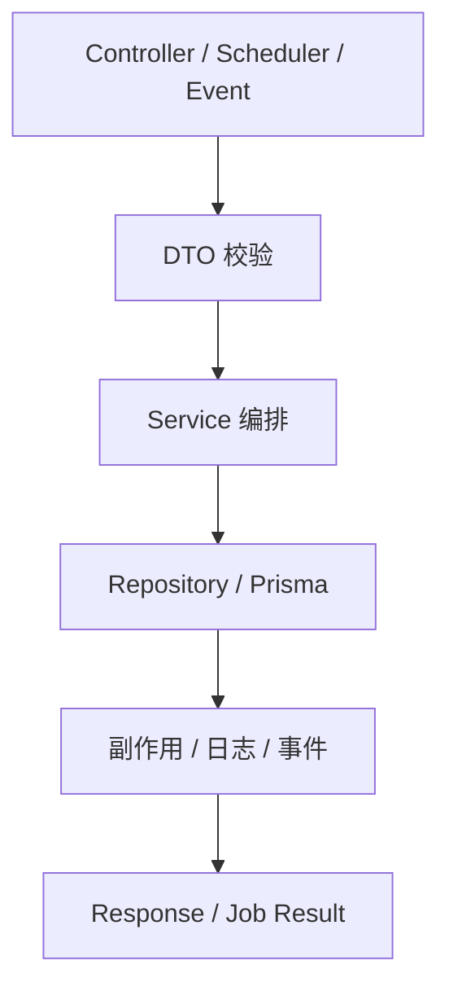
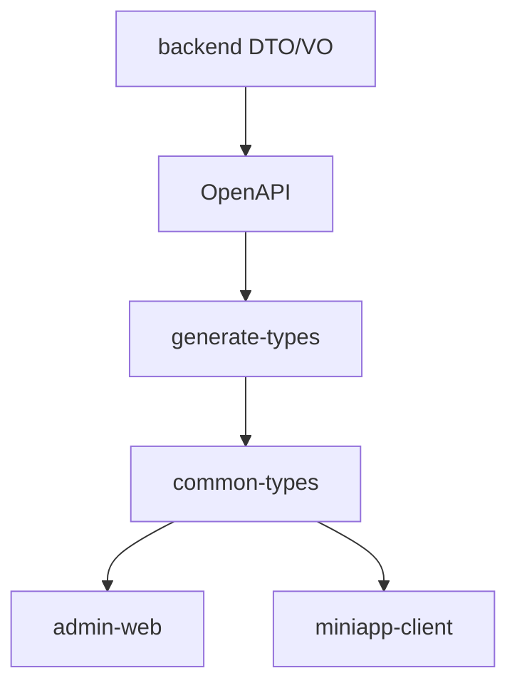
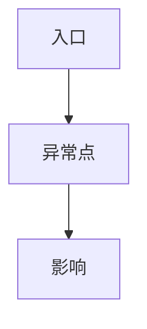
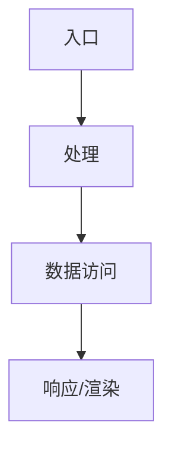
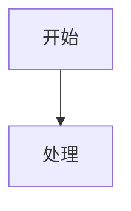

# AI 输出模板库（AGENT_OUTPUT_TEMPLATES）

本文件存放 docs/governance/AGENT_OUTPUT_PROTOCOL.md 引用的可复制模板正文。使用模板前，先按协议入口完成任务识别、输出分级、高风险分流和真实代码路径判断。

## 00. 模板体系使用规则

规则事实源见 docs/governance/AGENT_OUTPUT_PROTOCOL.md 的 模板使用规则 和 强制规则。本文件只承载模板正文，避免入口协议过长。

## 模板索引

| 编号 | 模板                           | 用途                                             |
| ---- | ------------------------------ | ------------------------------------------------ |
| 00   | 模板体系使用规则               | 判定、分级、组合、真实路径规则                   |
| 01   | 任务识别与分级                 | 任何协议输出前的任务归类                         |
| 02   | 高风险域识别与停手确认         | 高风险分流、需求反驳、验证面                     |
| 03   | 统一主模板                     | 实施前分析、通用分析、通用交付骨架               |
| 04   | 证据与不确定性公共块           | 代码证据、文档证据、推测、盲区                   |
| 05   | 逻辑矫正公共块                 | 业务语义、职责、状态/字段漂移、上下游            |
| 06   | 注释审查与注释方案公共块       | 必补、必改、必删、不应注释                       |
| 07   | 需求澄清 / 技术方案            | 需求审查、业务目标、方案初设                     |
| 08   | 页面梳理                       | 页面、组件、路由、权限、状态与交互               |
| 09   | 后端模块梳理                   | Controller / Service / Repository / Job / Worker |
| 10   | 方案设计 / 方案比选            | 多方案权衡、决策矩阵、落地顺序                   |
| 11   | Mock 数据                      | 真实契约下的 Mock 与边界覆盖                     |
| 12   | 函数改动分析                   | 函数、hook、service 方法、工具函数               |
| 13   | 接口 / DTO / VO / 契约改动     | backend -> OpenAPI -> common-types -> 前端       |
| 14   | 代码理解                       | 解释特定代码对象、输入输出、依赖与风险           |
| 15   | 测试生成 / Harness             | 测试类型、fixture、Given/When/Then               |
| 16   | 重构评审                       | 职责、重复、类型漂移、测试缺口                   |
| 17   | 异常排查                       | 现象、日志、根因排序、止血与长期修复             |
| 18   | 性能优化                       | 瓶颈证据、资源隔离、优化与压测                   |
| 19   | SQL / Prisma / 索引            | 查询语义、租户软删、索引与执行计划               |
| 20   | 长耗时 / 高吞吐任务隔离        | Queue / Worker / 独立进程 / 背压                 |
| 21   | 高风险交易链路 / 可靠性审查    | 交易状态机、副作用、补偿、审计                   |
| 22   | 菜单-权限-接口一致性           | 菜单 seed、路由、按钮权限、Controller 权限       |
| 23   | 数据修复 / 回填 / 迁移治理     | dry-run、事实源、幂等、回滚、验账                |
| 24   | 工程治理 / AI 开发链路变更审查 | AGENTS、playbooks、scripts、CI、验证门禁         |
| 25   | 设计评审 / Review              | findings 优先、风险面、问题与验证建议            |
| 26   | 文档蓝图 / 知识沉淀            | 文档必要性、SoT、生命周期与迁移                  |
| 27   | 代码迁移 / 跨语言转换          | 行为等价、类型映射、架构适配                     |
| 28   | 交付说明                       | 改动、影响、验证、残余风险                       |
| 29   | 会话终结技术备忘               | 捕捉代码外的决策、妥协与假设                     |
| 30   | 模板组合规则                   | 主模板与辅助模板搭配                             |

## 公共模板

### 5.1 任务识别与分级

```md
## 任务识别与分级

**任务原文**

> {用户原始需求}

**任务类型**

- [ ] 需求澄清 / 技术方案
- [ ] 页面梳理 / 页面改动
- [ ] 后端模块梳理 / 后端改动
- [ ] 函数 / hook / service 方法改动
- [ ] 接口 / DTO / VO / 返回字段改动
- [ ] Mock 数据
- [ ] 测试生成 / 测试补强
- [ ] 异常排查
- [ ] 性能优化
- [ ] SQL / Prisma / 索引设计
- [ ] 重构评审
- [ ] 设计评审 / review
- [ ] 文档蓝图 / 知识沉淀
- [ ] 工程治理 / AI 开发链路治理
- [ ] 菜单-权限-接口一致性
- [ ] 数据修复 / 回填 / 迁移
- [ ] 运行时隔离 / 队列 / Worker / 批量任务
- [ ] 高风险交易链路 / 可靠性审查
- [ ] 实施交付说明
- [ ] 会话终结技术备忘

**涉及范围**

- backend：
- admin-web：
- miniapp-client：
- libs：
- scripts：
- docs：
- 是否 cross-app：

**风险等级**

- [ ] L1 轻量
- [ ] L2 标准
- [ ] L3 深度

**是否命中高风险**

- [ ] finance / payment / auth
- [ ] tenant / 多租户
- [ ] Prisma schema / migration / seed
- [ ] 字典治理
- [ ] 定时任务
- [ ] 队列 / Worker
- [ ] 跨 app 契约
- [ ] 订单 / 支付 / 退款 / 库存 / 佣金 / 钱包
- [ ] 批量导入导出 / 报表 / 文件处理
- [ ] 数据修复 / 回填 / 迁移
- [ ] 状态机 / 幂等 / 并发 / 补偿

**主模板**

- {选择一个主模板}

**辅助模板**

- {按需列出辅助模板}

**输出模式**

- [ ] 分析模式：只分析，不改代码
- [ ] 方案模式：给方案，不实施
- [ ] 实施前分析：确认改动路径和风险
- [ ] 交付模式：说明已完成内容
```

### 5.2 高风险域识别与停手确认

```md
## 高风险域识别与停手确认

**命中高风险域**

- [ ] finance / payment / auth
- [ ] tenant / 多租户
- [ ] Prisma schema / migration / seed
- [ ] 字典治理
- [ ] 定时任务
- [ ] 队列 / Worker
- [ ] 跨 app 契约
- [ ] 订单 / 支付 / 退款 / 库存 / 佣金 / 钱包
- [ ] 批量导入导出 / 报表 / 文件处理
- [ ] 数据修复 / 回填 / 迁移

**是否需要停手确认**

- 结论：
- 原因：

**需求反驳**

- 这个改动是否必要：
- 是否有更小范围方案：
- 是否会破坏兼容性：
- 是否会引入资金、身份、租户或数据风险：
- 是否应该暂缓：

**应转入的专项模板**

- 主模板：
- 辅助模板：

**禁止事项**

- 不顺手重构无关代码。
- 不绕过租户 / 权限。
- 不直接改生产数据。
- 不跳过行为测试。
- 不只跑 typecheck / lint 就宣称完成。
- 不把明显问题留给直接上下游。

**必须验证**

- 权限：
- 租户：
- 幂等：
- 并发：
- 失败路径：
- 回滚 / 补偿：
- 高风险集成链路：
```

### 5.3 统一主模板

````md
## 统一主模板

**1. 任务定义**

- 用户要解决的问题：
- 本次回答目标：
- 当前处于：分析 / 方案 / 实施前 / 交付 / review

**2. 范围与边界**

- 涉及 app / 模块：
- 明确包含：
- 明确不包含：
- 是否 cross-app：
- 是否命中高风险：

**3. 证据与不确定性**

- 已由代码确认：
- 已由文档确认：
- 合理推测但未验证：
- 未发现实现：
- 明确缺失：
- 当前盲区：

**4. 关键代码位置**
| 路径 | 作用 | 证据等级 |
|---|---|---|
| | | |

**5. 当前实现与真实流程**

- 当前入口：
- 当前主链路：
- 当前数据读写：
- 当前返回 / 展示：
- 当前副作用：

**6. 数据 / 状态 / 依赖流转**



**7. 用户操作或系统动作**

- 用户动作：
- 系统动作：
- 后台任务：
- Worker / Queue：
- 外部回调：

**8. 逻辑矫正**

- 本次必须修：
- 本次建议修：
- 本次不处理：
- 不处理原因：
- 残余风险：

**9. 注释审查与注释方案**

- 缺失注释：
- 误导 / 过时注释：
- 低价值复述注释：
- 必须补注释位置：
- 不应补注释位置：

**10. 兼容性影响**

- 类型层：
- 调用层：
- 运行时：
- 数据层：
- 跨端层：
- 历史数据：
- migration / seed / 字典：

**11. 方案对比或改动方案**

- 方案 A：
- 方案 B：
- 方案 C：
- 推荐方案：
- 不选其他方案的原因：

**12. 测试与回归建议**

- 静态门禁：
- smoke：
- 行为测试：
- 集成 / E2E：
- 人工链路验证：
- 未覆盖风险：

**13. 实施落点或交付结果**

- 若未实施：建议改动顺序
- 若已实施：实际改动文件、验证、未验证项、残余风险
````

### 5.4 证据与不确定性公共块

```md
## 证据与不确定性

**已由代码确认**
| 结论 | 文件 / 位置 | 说明 |
|---|---|---|
| | | |

**已由文档确认**
| 结论 | 文档 | 说明 |
|---|---|---|
| | | |

**合理推测但未验证**
| 推测 | 推测依据 | 需要验证 |
|---|---|---|
| | | |

**未发现实现**
| 搜索对象 | 搜索范围 | 结论 |
|---|---|---|
| | | |

**明确缺失**
| 缺失项 | 影响 | 建议 |
|---|---|---|
| | | |

**当前盲区**

- 未读取：
- 未运行：
- 未确认：
- 需要用户确认：
```

### 5.5 逻辑矫正公共块

```md
## 逻辑矫正

**当前实现是否符合业务语义**

- 结论：
- 证据：
- 风险：

**职责分层是否合理**

- Controller / 页面：
- Service / store / hook：
- Repository / Prisma：
- Queue / Worker：
- 字典 / 常量 / 共享类型：

**参数、状态、返回值、文案、字典是否漂移**
| 对象 | 当前表现 | 应有语义 | 是否漂移 | 处理建议 |
|---|---|---|---|---|
| | | | | |

**直接上下游是否需要同步收敛**

- 上游：
- 当前点：
- 下游：
- 是否本次闭环：

**分流结论**

- 本次必须修：
- 本次建议修：
- 本次不处理：
- 不处理原因：
- 残余风险：
```

### 5.6 注释审查与注释方案公共块

```md
## 注释审查与注释方案

**需要补注释的位置**
| 位置 | 注释目的 | 原因 |
|---|---|---|
| | | |

**需要修改的注释**
| 位置 | 当前问题 | 修改方向 |
|---|---|---|
| | | |

**需要删除的低价值注释**
| 位置 | 删除原因 |
|---|---|
| | |

**必须解释的内容**

- 数据流：
- 状态切换：
- 边界条件：
- 失败语义：
- 兼容逻辑：
- 历史包袱：
- 事务 / 锁：
- 租户来源：
- 权限保护：
- 页面复杂联动：
- 提交流程：
- 映射逻辑：
- 队列 / Worker 幂等：
- 补偿策略：

**不应注释的内容**

- 语法本身
- 普通变量赋值
- 显而易见的 if / for
- 与代码逐行重复的解释
```

## 业务输出模板

### 6.1 需求澄清 / 技术方案

````md
## 需求澄清 / 技术方案

**1. 需求原文**

> {需求原文}

**2. 需求有效性审查**

- 可能错误：
- 可能遗漏：
- 可能过度设计：
- 更小方案：
- 必须做：
- 可以做：
- 暂缓做：
- 不建议做：
- 适用场景：
- 不适用场景：

**3. 业务目标**

- 要解决的业务问题：
- 成功条件：
- 用户影响：
- 运营影响：
- 财务影响：
- 客服影响：
- 平台影响：
- 租户影响：
- SLA / 时效要求：
- 准确性要求：
- 业务例外：

**4. 用户故事**
| 角色 | 目标 | 价值 | 验收标准 |
|---|---|---|---|
| | | | |

**5. 领域实体与关系**
| 实体 | 关键字段 | 关系 | 事实源 |
|---|---|---|---|
| | | | |

**6. 业务流程 / 状态机**



**7. 涉及 app / 模块**

- backend：
- admin-web：
- miniapp-client：
- libs：
- scripts：
- docs：

**8. API / DTO / VO 初步设计**
| 接口 | 方法 | 入参 | 出参 | 说明 |
|---|---|---|---|---|
| | | | | |

**9. 数据结构 / 字典 / 任务影响**

- Prisma model：
- migration：
- seed：
- 字典：
- 定时任务：
- Queue / Worker：
- 报表 / 导入导出：
- 文件处理：

**10. 工作负载判断**

- 是否长耗时：
- 是否批量：
- 是否文件处理：
- 是否复杂计算：
- 是否第三方批量调用：
- 是否可同步执行：
- 是否需要 Queue：
- 是否需要 Worker：
- 是否需要独立进程 / 独立服务：

**11. 方案对比**
| 方案 | 改动范围 | 优点 | 缺点 | 风险 | 验证成本 |
|---|---|---|---|---|---|
| A | | | | | |
| B | | | | | |
| C | | | | | |

**12. 推荐方案**

- 推荐：
- 原因：
- 为什么不选其他方案：
- 短期方案：
- 长期演进：

**13. 逻辑矫正**

- 本次必须修：
- 本次建议修：
- 本次不处理：
- 残余风险：

**14. 注释审查与注释方案**

- 必须补注释：
- 不应补注释：
- 需要解释的状态 / 事务 / 租户 / 权限 / 兼容逻辑：

**15. 测试与验收**

- 静态门禁：
- 行为测试：
- 集成 / E2E：
- 人工链路：
- 验收标准：

**16. 待确认问题**

1.
2.
3.
````

### 6.2 页面梳理

````md
## 页面梳理

**1. 任务定义**

- 页面：
- 目标：
- 当前问题：

**2. 页面范围**

- 主页面：
- 子组件：
- 弹窗 / 抽屉：
- store / hook：
- API：
- 路由 / 菜单 / 权限：

**3. 关键代码位置**
| 文件 | 作用 | 证据等级 |
|---|---|---|
| | | |

**4. Mermaid 页面流程图**



**5. 页面数据流转**

- 入参来源：
- route query：
- store：
- API 请求参数：
- API 响应落点：
- 展示字段：
- 判断字段：
- 提交体映射：

**6. 用户可执行操作**
| 操作 | 入口 | 处理逻辑 | 成功反馈 | 失败反馈 |
|---|---|---|---|---|
| | | | | |

**7. 页面状态**

- 列表态：
- 详情态：
- 表单态：
- 空态：
- 错误态：
- 加载态：
- 禁用态：
- 权限态：

**8. 外链与页面跳转**

- 路由：
- query / params：
- 返回刷新：
- 跳转失败处理：
- 权限限制：

**9. 用户可见语义**

- 状态：
- 类型：
- 支付状态：
- 结算状态：
- 字典：
- 是否存在原始 code 直出：
- 是否多处映射不一致：

**10. admin-web 特有检查**

- 页面模式：
- `index.vue` 是否只负责编排：
- `modules/*` 拆分是否合理：
- `useTable` / `NDataTable`：
- 搜索 / 列表 / 详情 / 导出语义一致：
- `verify:admin-view-types` 是否需要：

**11. miniapp 特有检查**

- H5 / MP 影响：
- 页面重进语义：
- onLoad / onShow：
- 安全区 / scroll-view / tabbar：
- 分享态：
- 登录态 / token 刷新：
- 支付 / 订单 / 回跳：

**12. 逻辑矫正**

- 本次必须修：
- 本次建议修：
- 本次不处理：
- 残余风险：

**13. 注释审查与注释方案**

- 模板逻辑分区注释：
- watch / computed / 提交映射注释：
- 错误处理注释：
- 不应补的逐行注释：

**14. 兼容性与回归风险**

- 类型：
- API：
- 路由：
- 权限：
- 字典：
- 跨端：
- 历史数据：

**15. 测试与回归建议**

- typecheck：
- view types：
- 组件行为：
- 页面流程：
- E2E：
- 人工验证：
- 未覆盖风险：

**16. 若进入实施：改动落点**
| 文件 | 改动 | 是否必须 |
|---|---|---|
| | | |
````

### 6.3 后端模块梳理

````md
## 后端模块梳理

**1. 任务定义**

- 模块：
- 目标：
- 当前问题：

**2. 模块范围**

- Controller：
- DTO：
- VO：
- Service：
- Repository：
- Prisma model：
- Queue / Worker：
- Scheduler / Job：
- Event：
- Test：

**3. 关键代码位置**
| 文件 | 作用 | 证据等级 |
|---|---|---|
| | | |

**4. Mermaid 后端流程图**



**5. 请求 / 任务 / 事件入口**

- HTTP：
- Scheduler：
- Event：
- Queue：
- Worker：
- Callback：

**6. 核心业务流转**

- 当前流程：
- 真实业务闭环：
- 中断点：
- 失败路径：
- 幂等点：

**7. 数据写入与读取路径**

- 读取：
- 写入：
- 事务：
- 锁：
- 租户条件：
- 软删：
- 分页 / 排序：
- 批量语义：

**8. 状态与副作用**

- 状态字段：
- 状态流转：
- 副作用：
- 日志 / 审计：
- 通知：
- 事件：
- 任务：

**9. 上下游调用关系**

- 上游：
- 当前模块：
- 下游：
- 跨域依赖：
- 是否存在循环依赖：
- 是否应该抽 QueryService / Port / Event：

**10. HTTP / Worker 边界**

- 必须同步完成：
- 应投递队列：
- Worker 执行：
- 定时任务触发：
- 是否需要独立进程：
- 是否需要独立服务：
- 是否有队列堆积风险：

**11. 权限、租户、事务、幂等**

- 权限：
- tenantId 来源：
- 前端 tenantId 是否可信：
- 事务边界：
- 幂等 key：
- 并发控制：
- 重试策略：

**12. 逻辑矫正**

- 本次必须修：
- 本次建议修：
- 本次不处理：
- 残余风险：

**13. 注释审查与注释方案**

- 事务：
- 锁：
- 租户来源：
- 状态切换：
- 失败语义：
- 兼容逻辑：
- 副作用：

**14. 兼容性影响**

- API：
- DTO / VO：
- common-types：
- admin-web：
- miniapp-client：
- 数据：
- seed / migration：
- job：
- 日志 / 导出 / 统计：

**15. 测试与回归建议**

- backend typecheck：
- service 行为测试：
- controller / e2e：
- 权限 / 租户：
- 幂等 / 并发：
- 失败路径：
- 任务 / Worker：
- 未覆盖风险：

**16. 若进入实施：改动落点**
| 文件 | 改动 | 是否必须 |
|---|---|---|
| | | |
````

### 6.4 方案设计 / 方案比选

```md
## 方案设计 / 方案比选

**1. 任务定义**

- 需求：
- 当前目标：
- 输出目标：

**2. 需求有效性审查**

- 是否真的应该做：
- 是否有更小方案：
- 是否过度设计：
- 必须做：
- 可以做：
- 暂缓做：
- 不建议做：

**3. 目标与约束**

- 业务目标：
- 技术约束：
- 架构约束：
- 数据约束：
- 时效 / SLA：
- 准确性：
- 权限 / 租户：
- 兼容性：

**4. 当前实现问题**

- 代码问题：
- 业务语义问题：
- 状态问题：
- 性能问题：
- 运行时隔离问题：
- 测试问题：
- 可观测性问题：

**5. 方案 A / B / C**

- 描述：
- 改动范围：
- 优点：
- 缺点：
- 风险：
- 兼容性：
- 验证成本：
- 适用场景：
- 不适用场景：

**6. 同步 / 异步 / Worker 对比**
| 模式 | 适用 | 优点 | 缺点 | 风险 |
|---|---|---|---|---|
| HTTP 同步 | | | | |
| Queue + Worker | | | | |
| 独立服务 / 多进程 | | | | |

**7. 决策矩阵**
| 维度 | 权重 | 方案 A | 方案 B | 方案 C |
|---|---:|---|---|---|
| 改动成本 | | | | |
| 风险 | | | | |
| 可维护性 | | | | |
| 性能 | | | | |
| 兼容性 | | | | |
| 验证成本 | | | | |

**8. 推荐方案**

- 推荐：
- 原因：
- 为什么不选其他方案：
- 短期落地：
- 长期演进：

**9. 逻辑矫正**

- 本次必须修：
- 本次建议修：
- 本次不处理：
- 残余风险：

**10. 注释与可维护性影响**

- 必须补注释：
- 需要抽象的边界：
- 不建议抽象的部分：

**11. 落地顺序**

1.
2.
3.

**12. 测试与回归建议**

- 静态门禁：
- 行为测试：
- 集成 / E2E：
- 人工验证：
- 未覆盖风险：
```

### 6.5 Mock 数据

````md
## Mock 数据

**执行前要求**

- 读取真实请求：
- 读取真实响应类型：
- 读取调用场景：
- 确认分页结构：
- 确认字典 / 状态文本：
- 确认业务约束：

**覆盖要求**

- 详情接口至少 5 组：
- 列表至少 5 条：
- 分支状态全覆盖：
- 边界值：`0`、负数、`null`、空字符串、空数组、缺字段、嵌套对象为空
- 搜索入参：
- 创建入参：
- 更新入参：
- 状态机前后约束：
- 中文业务字段自然：

**最终输出规则**

- 如果用户要求“直接可用 Mock”，最终只输出 JSON。
- 不在可直接消费的 JSON 外混入说明。
- 若 JSON 要被接口直接消费，不添加 `_meta`、`coverage` 等非契约字段。
- 若用户要求解释覆盖面，先输出“覆盖说明”，再单独输出 JSON。

**最终 JSON**

```json
{}
```
````

### 6.6 函数改动分析

```md
## 函数改动分析

**1. 任务定义**

- 函数：
- 变更目标：
- 当前问题：

**2. 函数位置与职责**
| 文件 | 函数 | 当前职责 |
|---|---|---|
| | | |

**3. 直接调用点**
| 调用方 | 调用方式 | 是否受影响 |
|---|---|---|
| | | |

**4. 间接调用点**
| 链路 | 说明 | 风险 |
|---|---|---|
| | | |

**5. 动态调用风险**

- 字符串调用：
- 配置驱动：
- 回调传递：
- 反射 / registry：
- 事件 / 策略：
- 测试 / mock：

**6. 搜索方法**

- 函数名：
- 导出名：
- 别名：
- 类型引用：
- 字符串：
- 测试：
- fixture：
- e2e：

**7. 参数变更影响**

- 新增参数：
- 删除参数：
- 参数顺序：
- 可选改必填：
- 默认值：
- 空值：
- 泛型：
- 返回值：
- TypeScript 能发现：
- TypeScript 发现不了：

**8. 逻辑矫正**

- 本次必须修：
- 本次建议修：
- 本次不处理：
- 残余风险：

**9. 注释审查与注释方案**

- 函数注释：
- 调用侧注释：
- 边界说明：
- 兼容说明：

**10. 兼容性问题**

- 运行时：
- 测试：
- mock：
- 跨包 export：
- public API：

**11. 测试与回归建议**

- 单测：
- 调用方测试：
- 边界：
- 失败路径：
- 未覆盖风险：

**12. 若进入实施：关联闭环改动点**
| 文件 | 改动 | 原因 |
|---|---|---|
| | | |
```

### 6.7 接口 / DTO / VO / 契约改动

````md
## 接口 / DTO / VO / 契约改动

**1. 任务定义**

- 接口：
- 契约变化：
- 目标：

**2. 接口位置与契约职责**
| 文件 | 对象 | 职责 |
|---|---|---|
| | | |

**3. Mermaid 契约影响链路图**



**4. backend 受影响点**

- Controller：
- DTO：
- VO：
- Service：
- Repository：
- Prisma：
- seed：
- test：

**5. generate-types / 共享类型影响**

- 是否需要 generate-types：
- common-types 影响：
- common-constants 影响：
- 前端是否禁止手写重复契约：

**6. admin-web 受影响点**

- service/api：
- 页面：
- 搜索：
- 列表：
- 详情：
- 导出：
- 字典 / 映射：
- 权限：

**7. miniapp-client 受影响点**

- api：
- 页面：
- store：
- 组件：
- 支付 / 订单 / 回跳：
- H5 / MP：

**8. 字段级兼容性分析**
| 字段 | 当前类型 | 新类型 | 是否必填 | 默认值 | 兼容风险 | 前端影响 | 字典/文案影响 |
|---|---|---|---|---|---|---|---|
| | | | | | | | |

**9. 变更类型**

- 新增字段：
- 删除字段：
- 改必填：
- 改枚举：
- 改默认值：
- 改语义：
- 替换字段：
- 保留旧字段：
- 双写 / 双读：
- deprecate：

**10. 异步任务契约**

- 是否从同步改异步：
- 创建任务接口：
- 返回 jobId：
- 查询进度接口：
- 任务状态枚举：
- 失败原因结构：
- 取消接口：
- 重试接口：
- 下载结果接口：
- 权限 / 租户：

**11. 逻辑矫正**

- 本次必须修：
- 本次建议修：
- 本次不处理：
- 残余风险：

**12. 注释审查与注释方案**

- DTO 字段注释：
- VO 字段注释：
- 前端字段映射注释：
- 状态 / 字典注释：

**13. 方案对比**

- 兼容旧字段：
- 新增字段：
- 废弃字段：
- 双写 / 双读：
- 一次性切换：

**14. 测试与回归建议**

- backend DTO / VO 测试：
- generate-types 验证：
- admin-web 行为测试：
- miniapp 行为测试：
- 字典 / 文案一致性：
- 兼容性测试：
- 未覆盖风险：

**15. 实现顺序**

1. backend
2. generate-types
3. common-types / common-constants
4. admin-web
5. miniapp-client
6. 测试与验证
````

### 6.8 代码理解

```md
## 代码理解

**1. 代码位置**
| 文件 | 代码对象 | 作用 |
|---|---|---|
| | | |

**2. 输入输出**

- 输入：
- 输出：
- 异常：
- 副作用：

**3. 核心职责**

- 主要做什么：
- 不应该负责什么：
- 所属业务域：

**4. 执行流程**

1.
2.
3.

**5. 数据 / 状态变化**

- 读取：
- 写入：
- 状态：
- 缓存：
- 事件：
- 任务：

**6. 关键依赖**

- Service：
- Repository：
- DTO / VO：
- store / hook：
- 外部服务：
- 配置：

**7. 设计意图**

- 为什么这样设计：
- 复用的模式：
- 历史兼容：

**8. 潜在坑**

- 空值：
- 并发：
- 权限：
- 租户：
- 状态漂移：
- 类型漂移：
- 过度耦合：

**9. 逻辑矫正**

- 当前合理：
- 当前不合理：
- 建议调整：
- 不建议调整：

**10. 注释审查**

- 缺注释：
- 注释误导：
- 低价值注释：
- 建议补充：

**11. 后续改动风险**

- 调用方：
- 数据：
- 前端：
- 测试：
```

### 6.9 测试生成 / Harness

```md
## 测试生成 / Harness

**1. 被测对象**

- 文件：
- 函数 / 方法 / 页面 / 链路：
- 业务目标：

**2. 当前行为**

- happy path：
- 边界：
- 失败路径：
- 副作用：
- 状态变化：

**3. 风险路径**

- 权限：
- 租户：
- 幂等：
- 并发：
- 重复消费：
- 延迟消息：
- 补偿失败：
- 空值：
- 历史数据：

**4. 测试类型选择**

- 静态门禁：
- backend service 行为测试：
- controller / e2e：
- admin-web 组件 / 页面行为：
- miniapp H5 / MP 人工流程：
- Playwright / E2E：
- 队列 / Worker：
- 任务触发：
- 数据修复 dry-run：

**5. Harness 需求**

- fixture：
- fake clock：
- mock provider：
- fake payment callback：
- fake queue consumer：
- task trigger：
- concurrency runner：
- tenant context：
- auth context：
- import/export sample file：
- dry-run harness：

**6. Given / When / Then 用例**
| 场景 | Given | When | Then | 级别 |
|---|---|---|---|---|
| | | | | |

**7. 必须覆盖**

- 正常路径：
- 异常路径：
- 边界条件：
- 并发 / 幂等：
- 多租户隔离：
- 权限：
- 重复消费：
- 补偿失败：
- Worker 重启：
- 队列堆积：

**8. 不允许作为完成证明**

- 只跑 typecheck / lint
- 只有 smoke
- 只有 happy path
- 只断言 URL / method
- readFileSync + toContain 作为主测试
- 大量 any / @ts-nocheck
- 过度 mock 掩盖真实行为

**9. 推荐验证命令**

- backend：
- admin-web：
- miniapp：
- dict / job：
- cross-app：

**10. 未覆盖风险**

- 未覆盖：
- 原因：
- 后续建议：
```

### 6.10 重构评审

```md
## 重构评审

**1. 当前职责**

- 当前代码负责：
- 不应负责：
- 所属层级：

**2. 问题清单**
| 问题 | 位置 | 影响 | 严重度 |
|---|---|---|---|
| | | | |

**3. 重点关注**

- 职责混杂：
- 重复代码：
- 可读性：
- 类型漂移：
- 状态语义散落：
- 性能：
- 测试缺口：
- 循环依赖：
- 跨域直接写：

**4. 重构分级**

- 本次必须修：
- 建议单独重构：
- 不建议动：
- 不处理原因：

**5. 重构方案 A / B**

- 做法：
- 改动范围：
- 优点：
- 缺点：
- 风险：

**6. 推荐方案**

- 推荐：
- 原因：
- 不选其他方案原因：

**7. 兼容性影响**

- API：
- 类型：
- 数据：
- 前端：
- 测试：

**8. 注释审查**

- 必须补：
- 必须改：
- 必须删：

**9. 测试补强**

- 当前缺口：
- 必须补：
- 可后续补：

**10. 可选示例**

- 只给结构示意，不直接实施。
```

### 6.11 异常排查

````md
## 异常排查

**1. 异常现象**

- 用户看到：
- 系统日志：
- 影响范围：
- 发生时间：
- 是否可复现：

**2. 堆栈 / 日志关键片段**

```text
{日志}
```

**3. 最可能根因排序**
| 排名 | 根因 | 依据 | 置信度 |
|---|---|---|---|
| 1 | | | |
| 2 | | | |
| 3 | | | |

**4. 需要检查的文件 / 链路**
| 文件 / 模块 | 检查点 | 原因 |
|---|---|---|
| | | |

**5. 当前链路**



**6. 直接影响**

- 用户：
- 运营：
- 财务：
- 租户：
- 平台：
- 数据：

**7. 临时止血方案**

- 操作：
- 风险：
- 回滚：

**8. 长期修复方案**

- 根因修复：
- 结构调整：
- 测试补强：
- 可观测性：

**9. 数据修复**

- 影响范围定位：
- 修复依据：
- dry-run：
- 幂等：
- 验账：
- 审计：

**10. 验证方式**

- 复现：
- 修复验证：
- 回归验证：
- 未覆盖风险：

**11. 仍需确认**

1.
2.
````

### 6.12 性能优化

````md
## 性能优化

**1. 性能问题描述**

- 现象：
- 影响范围：
- 触发条件：
- 数据规模：
- 并发规模：

**2. 当前链路**



**3. 疑似瓶颈**

- N+1：
- 循环内 DB：
- 无分页：
- 大对象：
- 大文件：
- 重复渲染：
- 同步长任务：
- 队列堆积：
- DB 连接池：
- event loop 阻塞：

**4. 证据**
| 证据 | 来源 | 说明 |
|---|---|---|
| | | |

**5. 资源隔离判断**

- 是否阻塞 HTTP：
- 是否阻塞 event loop：
- 是否占满 DB 连接：
- 是否占用大量内存：
- 是否需要 Queue：
- 是否需要 Worker：
- 是否需要独立进程：
- 是否需要独立服务：

**6. 优化方案**

- 批量化：
- 分页 / cursor：
- 索引：
- 缓存：
- 预聚合：
- 读写分离：
- 异步化：
- 限流 / 背压：
- 前端虚拟列表 / 懒加载：
- miniapp 图片 / 滚动优化：

**7. 一致性与兼容性风险**

- 数据一致性：
- 实时性：
- 缓存失效：
- 历史数据：
- 跨端展示：

**8. 测试与压测建议**

- 小数据：
- 大数据：
- 并发：
- 队列堆积：
- 超时：
- Worker 重启：
- 回归：

**9. 不建议优化的部分**

- 原因：
- 保留风险：
````

### 6.13 SQL / Prisma / 索引

````md
## SQL / Prisma / 索引

**1. 查询需求**

- 业务目标：
- 查询对象：
- 使用场景：
- 数据规模：

**2. 涉及表 / Prisma model**
| 表 / model | 作用 | 数据规模 |
|---|---|---|
| | | |

**3. 过滤、排序、分页**

- where：
- orderBy：
- page / cursor：
- groupBy：
- aggregate：
- join / include：

**4. 租户与软删语义**

- tenantId 来源：
- 是否跨租户：
- 软删字段：
- 权限条件：
- 是否允许前端传 tenantId：

**5. 当前查询写法**

```ts
{只贴伪代码/片段，不直接生成实现}
```

**6. 推荐 SQL / Prisma 写法**

- 推荐方式：
- 原因：
- 避免点：

**7. 索引建议**
| 索引 | 类型 | 字段顺序 | 原因 | 写入成本 |
|---|---|---|---|---|
| | B-tree / 复合 / 唯一 | | | |

**8. 执行计划关注点**

- 是否走索引：
- 是否回表：
- 是否 filesort：
- 是否全表扫描：
- 是否锁表：
- 是否大 offset：

**9. 分页优化**

- offset 适用：
- cursor 适用：
- 覆盖索引：
- 搜索条件组合：

**10. 历史数据 / migration 影响**

- 是否需要 migration：
- 是否需要 backfill：
- 是否需要停机：
- 是否高风险确认：

**11. 验证**

- explain：
- 小数据：
- 大数据：
- 并发：
- 回归：
````

### 6.14 长耗时 / 高吞吐任务隔离

```md
## 长耗时 / 高吞吐任务隔离

**1. 任务定义**

- 任务：
- 触发方：
- 目标：
- 用户是否等待结果：

**2. 工作负载分类**

- CPU 密集：
- IO 密集：
- DB 密集：
- 网络密集：
- 文件密集：
- 混合型：
- 单次数据量：
- 峰值并发：
- 是否可拆分：
- 是否可重试：
- 是否强实时：

**3. 同步链路是否允许**

- 是否允许 HTTP 同步执行：
- 最大可接受响应时间：
- 不允许同步执行原因：
- 是否会拖慢 API 进程：
- 是否会导致接口卡顿 / 超时 / 服务假死：

**4. 执行模型**

- HTTP 只创建任务并返回 jobId：
- Queue：
- Worker：
- 定时任务：
- 独立进程：
- 独立服务：
- 多进程部署：
- API / Worker 资源隔离：

**5. 触发机制**
| 触发方式 | 触发条件 | 任务 payload | 幂等键 | 失败重试 | 死信 | 兜底 |
|---|---|---|---|---|---|---|
| | | | | | | |

**6. 任务状态机**
| 状态 | 含义 | 可进入条件 | 可退出条件 |
|---|---|---|---|
| pending | | | |
| running | | | |
| success | | | |
| failed | | | |
| partial_success | | | |
| retrying | | | |
| cancelled | | | |

**7. 幂等与并发控制**

- 幂等 key：
- jobId / operationId：
- 重复提交：
- 分布式锁：
- 乐观锁：
- Worker 并发：
- 租户级并发：
- 重试去重：
- 重复消费：
- 唯一索引：

**8. 数据一致性**

- 主事务：
- 任务投递一致性：
- outbox：
- inbox：
- 任务表：
- 失败补偿：
- 可恢复策略：

**9. 资源治理**

- 队列并发：
- 队列堆积阈值：
- DB 连接池：
- chunk size：
- 文件大小限制：
- 内存上限：
- 超时：
- 限流：
- 背压：
- 死信队列：
- 是否支持暂停 / 恢复：

**10. 接口契约**
| 接口 | 作用 |
|---|---|
| 创建任务 | |
| 查询进度 | |
| 取消任务 | |
| 重试任务 | |
| 下载结果 | |

**11. 用户体验**

- loading：
- 进度条：
- 后台任务页：
- 失败原因：
- 结果下载：
- 文件过期：
- 操作日志：

**12. 可观测性**

- 任务日志：
- 指标：
- 告警：
- 队列堆积：
- Worker 健康：
- 业务对象追踪：
- 补偿看板：

**13. 方案对比**

- 方案 A：直接队列
- 方案 B：队列 + 兜底扫描
- 方案 C：事件 + outbox / inbox
- 推荐方案：

**14. 测试与验证**

- 小数据：
- 大数据：
- 并发提交：
- 重复提交：
- 中途失败：
- Worker 重启：
- 队列堆积：
- 部分成功：
- 租户隔离：
- 权限：
- payload 兼容：
```

### 6.15 高风险交易链路 / 可靠性审查

```md
## 高风险交易链路 / 可靠性审查

**1. 需求有效性审查**

- 可能错误：
- 可能遗漏：
- 可能过度设计：
- 更小方案：
- 必须做：
- 可以做：
- 暂缓做：
- 不建议做：
- 适用场景：
- 不适用场景：

**2. 业务目标与成功条件**

- 业务问题：
- 成功条件：
- 用户影响：
- 运营影响：
- 财务影响：
- 客服影响：
- 平台影响：
- 租户影响：
- SLA：
- 准确性：
- 业务例外：

**3. 当前项目链路**

- 已由代码确认：
- 已由文档确认：
- 合理推测但未验证：
- 未发现实现：
- 明确缺失：

**关键路径**
| 对象 | 文件 / 模块 | 作用 | 证据等级 |
|---|---|---|---|
| Controller | | | |
| Service | | | |
| Repository | | | |
| DTO / VO | | | |
| Prisma model | | | |
| Queue / Job | | | |
| Event | | | |
| 前端页面 | | | |
| 菜单权限 | | | |

**4. 业务域归属与事实源**
| 字段/状态/动作 | 事实源业务域 | 允许写入模块 | 允许读取模块 | 跨域方式 | 禁止事项 | 需要的 harness |
|---|---|---|---|---|---|---|
| | | | | | | |

**5. 状态机与并发**
| 当前状态 | 事件 | 目标状态 | 是否允许 | 执行条件 | 失败处理 |
|---|---|---|---|---|---|
| | | | | | |

**并发 / 竞态检查**

- 支付回调：
- 自动任务：
- 重复提交：
- 并发请求：
- 重复消费：
- 延迟消息晚到：
- CAS：
- 幂等 key：
- 分布式锁：
- 事务：
- outbox / inbox：
- 谁赢：
- 输的一方如何处理：

**6. 跨域副作用与补偿**
| 副作用 | 负责域 | 触发时机 | 成功条件 | 失败处理 | 幂等策略 | 是否告警 |
|---|---|---|---|---|---|---|
| 库存 | | | | | | |
| 优惠券 | | | | | | |
| 积分 | | | | | | |
| 营销实例 | | | | | | |
| 活动名额 | | | | | | |
| 履约单 | | | | | | |
| 佣金 | | | | | | |
| 钱包 | | | | | | |
| 支付单 | | | | | | |
| 通知 | | | | | | |
| 操作日志 | | | | | | |

**7. 多租户、权限与端边界**

- tenantId 来源：
- 前端 tenantId 是否可信：
- 是否允许跨租户：
- 允许角色：
- 后台能做：
- C 端能做：
- Worker 能做：
- 系统任务能做：
- 是否存在平台菜单 / 租户菜单混用：
- Worker 是否越权访问后台能力：

**8. 可靠性设计**

- 主链路：
- 兜底链路：
- 重试：
- 死信：
- 补偿扫描：
- 日志：
- 告警：
- 限流：
- 分片：
- 批量大小：
- 队列堆积保护：
- feature flag：
- 按租户开关：
- 灰度：
- 降级：
- 主链路失败后如何恢复：

**9. 异常分级与处置**
| 异常场景 | 等级 | 影响 | 自动处理 | 人工处理 | 告警 | 数据修复方式 |
|---|---|---|---|---|---|---|
| | P0/P1/P2/P3 | | | | | |

**10. 数据修复与追溯**

- 错误数据定位：
- 影响范围：
- 修复事实源：
- dry-run：
- 幂等脚本：
- 修复前验账：
- 修复后验账：
- 审计日志：
- 操作记录：

**11. 回滚、止血与降级**

- feature flag：
- 按租户关闭：
- 只读模式：
- 只记录不执行：
- 误处理回滚：
- 队列暂停：
- 队列恢复：
- 人工补偿入口：

**12. Harness / 测试方案**
| 场景 | Given | When | Then | 验证级别 |
|---|---|---|---|---|
| happy path | | | | |
| 失败路径 | | | | |
| 边界条件 | | | | |
| 并发 / 幂等 | | | | |
| 多租户隔离 | | | | |
| 权限 | | | | |
| 重复消费 | | | | |
| 补偿失败 | | | | |

**13. 可观测性与运营闭环**

- 日志：
- 指标：
- 告警：
- 看板：
- 单个业务对象链路追踪：
- 失败后运营入口：
- 客服查询入口：
- 操作日志：
- 审计日志：
- 业务事件时间线：
- 补偿任务看板：

**14. 注释审查与注释方案**

- 事务：
- 锁：
- 状态切换：
- 租户来源：
- 兼容逻辑：
- 异常路径：
- 重试 / 幂等：
- 补偿：

**15. 方案对比与取舍**
| 方案 | 改动范围 | 优点 | 缺点 | 风险 | 验证成本 | 兼容性 |
|---|---|---|---|---|---|---|
| A | | | | | | |
| B | | | | | | |
| C | | | | | | |

**16. 实现步骤**
| 顺序 | 文件 / 模块 | 改动 | 必须 / 后续 |
|---|---|---|---|
| 1 | | | |
```

### 6.16 菜单-权限-接口一致性

```md
## 菜单-权限-接口一致性

**1. 需求有效性审查**

- 这个能力应该作为菜单、按钮、隐藏路由，还是不应该暴露？
- 是平台菜单还是租户菜单？
- 是否应该进入租户套餐？
- 权限是否过宽或过细？

**2. 当前链路证据**
| 对象 | 路径 / 位置 | 作用 | 证据等级 |
|---|---|---|---|
| 菜单 seed | | | |
| admin-web 路由 | | | |
| 页面 component | | | |
| service/api | | | |
| backend Controller | | | |
| RequirePermission | | | |

**3. 菜单事实源**
| 菜单名称 | menuId | parentId | path | component | perms | menuType | visible | 平台/租户 | 页面是否存在 | 接口是否存在 |
|---|---|---|---|---|---|---|---|---|---|---|
| | | | | | | | | | | |

**4. 权限链路**

- 页面按钮权限：
- API 调用权限：
- Controller 权限：
- 菜单 perms：
- 是否一致：
- 是否存在接口无权限保护：

**5. 租户与套餐影响**

- 平台租户是否可见：
- 普通租户是否可见：
- 套餐菜单是否同步：
- 是否有越权风险：

**6. 前端页面影响**

- 页面路径：
- 路由 name：
- i18n：
- 空态：
- 错态：
- 加载态：
- 权限态：

**7. 不一致风险**
| 风险 | 位置 | 影响 | 修复方案 | 是否阻断 |
|---|---|---|---|---|
| | | | | |

**8. Harness / 测试**

- 菜单 component 存在性：
- perms 与 RequirePermission 对齐：
- 页面 API 权限：
- 平台 / 租户可见性：
- 隐藏菜单权限：
- 租户套餐同步：

**9. 实施顺序**

1. 菜单 seed
2. backend 权限
3. admin-web 路由 / 页面
4. service/api
5. 验证
```

### 6.17 数据修复 / 回填 / 迁移治理

```md
## 数据修复 / 回填 / 迁移治理

**1. 需求有效性审查**

- 是否真的需要修数据？
- 是修代码更合适，还是修数据更合适？
- 是否可通过补偿任务解决？
- 是否存在误判风险？
- 是否命中资金 / 支付 / 租户 / 权限高风险？

**2. 当前数据链路**
| 对象 | 路径 / 表 / 模型 | 作用 | 证据等级 |
|---|---|---|---|
| Prisma model | | | |
| Repository | | | |
| Service | | | |
| seed | | | |
| migration | | | |
| 业务入口 | | | |

**3. 影响范围**

- 表：
- 字段：
- 租户：
- 历史数据：
- 业务链路：
- 资金 / 支付 / 订单 / 库存 / 权限影响：

**4. 修复事实源**

- 以哪个事实源为准：
- 可追溯依据：
- 事件：
- 日志：
- 操作记录：
- 支付单：
- 订单快照：
- 无法自动判断的数据：

**5. Dry-run 方案**
| 检查项 | 查询口径 | 预估影响行数 | 风险 | 是否可自动修复 |
|---|---|---|---|---|
| | | | | |

**6. 修复策略**

- 分批：
- 幂等：
- 锁：
- 事务：
- 操作日志：
- 人工确认：
- 按租户灰度：
- 是否可暂停：
- 是否可恢复：

**7. 回滚策略**

- 修复前备份：
- 是否记录旧值：
- 是否可逆：
- 回滚脚本是否幂等：
- 部分失败处理：

**8. 验账与校验**

- 修复前查询口径：
- 修复后查询口径：
- 如何证明修复正确：
- 如何证明没有跨租户污染：
- 是否需要财务对账：

**9. Harness / 测试**

- dry-run 测试：
- 幂等测试：
- 部分失败测试：
- 回滚测试：
- 多租户隔离测试：
- 大数据量分批测试：

**10. 实施步骤**

1. 查影响范围
2. dry-run
3. 小范围修复
4. 验账
5. 全量修复
6. 再验账
7. 清理临时脚本
8. 交付说明

**11. 红线**

- 未 dry-run 不实施。
- 未确认事实源不实施。
- 不可幂等不直接跑。
- 涉及资金 / 支付 / 租户必须高风险确认。
- 不直接裸写生产数据。
```

### 6.18 工程治理 / AI 开发链路变更审查

```md
## 工程治理 / AI 开发链路变更审查

**适用范围**

- AGENTS.md
- .codex/playbooks
- docs/governance
- package scripts
- scripts/\*
- format / lint / typecheck / test / verify
- CI / 本地 / AI 工作流
- 验证门禁
- 工程治理脚本

**1. 需求反驳与范围收敛**

- 这个治理需求是否过大？
- 哪些问题应该现在解决？
- 哪些不应该一次性平台化？
- 是否会把 package scripts、scripts、playbooks、AGENTS.md 职责混在一起？
- 是否已有规则或脚本可复用？
- 是否会增加 AI 困惑？

**2. 当前项目治理链路**

- 根 AGENTS.md：
- 子 app AGENTS.md：
- .codex/playbooks：
- docs/governance：
- package.json：
- scripts 目录：
- CI：
- verify：
- generate-types：

**3. 工程事实源表**
| 治理对象 | 当前事实源 | 消费方 | 是否重复 | 风险 | 建议归属 |
|---|---|---|---|---|---|
| AI 上下文入口 | | | | | |
| 任务分类规则 | | | | | |
| 格式化规则 | | | | | |
| lint 规则 | | | | | |
| typecheck 入口 | | | | | |
| 单 app 验证入口 | | | | | |
| cross-app 验证入口 | | | | | |
| OpenAPI / common-types 生成链路 | | | | | |
| package scripts | | | | | |
| scripts 治理脚本 | | | | | |
| 交付说明模板 | | | | | |
| 高风险变更门禁 | | | | | |
| Harness 注册表 | `scripts/harness-manifest.mjs` | scripts / CI | | | `pnpm harness:manifest:check` |

**3.1 Harness 三端检查清单（模板 24 专用）**

- [ ] `pnpm harness:manifest:check` — 检查项登记与 package script 一致
- [ ] `pnpm harness:docs` — 必需上下文文档存在
- [ ] 新增检查脚本已写入 manifest，且含 `*.spec.mjs`（如适用）
- [ ] 大任务文档/playbook 变更已评估 exec-plan 与 `session-orchestration.md`
- [ ] 未把语义规则只写在 Cursor/Copilot 适配层而未链回 canonical

**4. 分层验证模型**

- 是否区分静态门禁、smoke、行为测试、集成 / E2E：
- 哪些命令是基础验证：
- 哪些命令只能算 smoke：
- 哪些场景必须跑完整链路：
- 哪些验证应暴露在 package scripts：
- 哪些只保留在 scripts 内部：

**5. package scripts 治理**

- 命名是否一致：
- 是否重复入口：
- 是否废弃入口：
- 是否语义不清：
- 是否区分 format / lint / typecheck / test / verify / generate-types：
- 面向人、CI、AI 的入口是否清晰：
- 是否需要弃用策略：

**6. AI 上下文入口治理**

- 每类任务应该先读哪些文件：
- backend-only：
- admin-web-only：
- miniapp-only：
- cross-app：
- doc-only：
- review-only：
- 是否存在规则分散、重复、冲突：
- 如何避免 AI 跳过上下文扫描：

**7. 格式化与代码风格治理**

- 统一 formatter：
- 是否存在多个 formatter：
- format 与 lint 是否分离：
- pre-commit / CI / 手动命令：
- 格式化失败是否阻断合并：

**8. Harness / 自动化检查**

- 需要哪些治理脚本：
- 哪些已有脚本应复用：
- 是否需要新增：
- 每个脚本输入：
- 输出：
- 失败条件：

**9. 兼容性与迁移**

- CI 影响：
- 开发者习惯影响：
- AI 工作流影响：
- 文档命令影响：
- 是否保留旧命令别名：
- 是否需要 deprecate 提示：
- 是否更新 README / AGENTS / playbooks / docs/governance：

**10. 风险、回滚与验收**

- 治理脚本误报：
- CI 时间变长：
- AI 因入口过多更困惑：
- 灰度启用：
- 回滚到旧 scripts：
- 验收标准：

**11. 方案对比**
| 方案 | 范围 | 优点 | 缺点 | 风险 |
|---|---|---|---|---|
| 轻量整理 | | | | |
| 中度治理 | | | | |
| 重度治理 | | | | |

**12. 推荐方案与实施顺序**

1.
2.
3.
```

### 6.19 设计评审 / Review

```md
## 设计评审 / Review

**Findings**
按严重度排序。

| 严重度   | 问题 | 位置 | 影响 | 建议 |
| -------- | ---- | ---- | ---- | ---- |
| Critical |      |      |      |      |
| High     |      |      |      |      |
| Medium   |      |      |      |      |
| Low      |      |      |      |      |

**重点风险面**

- 行为回归：
- 数据一致性：
- 多租户隔离：
- 权限：
- 支付 / 资金 / 认证：
- 契约与类型漂移：
- 用户可见语义漂移：
- 批量语义：
- 删除语义：
- 测试缺口：
- 低质量测试：
- 运行时隔离：
- Worker / Queue：
- 可观测性：

**Open questions / assumptions**
只放证据不足、需要确认的问题。

1.
2.
3.

**逻辑矫正**

- 本次必须修：
- 建议修：
- 可暂缓：
- 不建议做：

**注释审查**

- 缺失：
- 误导：
- 低价值：
- 建议：

**验证建议**

- 当前验证是否足够：
- 不足：
- 建议补充：

**简短总结**

- 结论：
- 最大风险：
- 下一步：
```

### 6.20 文档蓝图 / 知识沉淀

````md
## 文档蓝图 / 知识沉淀

**1. 文档目的**

- 要沉淀什么：
- 读者：
- 使用场景：

**2. 文档必要性审查**

- 是否真的需要新增文档：
- 是否已有主文档可以更新：
- 是否应该写入 ADR：
- 是否应该写入 domain：
- 是否应该写入 delivery：
- 是否应该写入 deploy/（部署脚本与配置，非 docs/）：
- 是否应该写入 development：
- 是否应该写入 process-spec：
- 是否应该写入代码注释 / OpenAPI：
- 是否只是临时分析，不应落盘：
- 是否需要维护者确认：

**3. 是否已有单一事实源**
| 主题 | 现有文档 | 是否主文档 | 建议归属目录 | status | doc_type | last_verified | 是否需要新建 | 是否需要删除/合并 |
|---|---|---|---|---|---|---|---|---|
| | | | | | | | | |

**4. 文档生命周期**

- draft / active / deprecated / archived：
- 适用版本：
- 过期条件：
- 交付完成后是否删除：
- 删除前需要迁移到哪里：

**5. 与代码 / 契约一致性**

- 路径是否真实：
- 命令是否真实：
- 接口是否真实：
- 状态 / 字段是否真实：
- 菜单 / 脚本是否真实：
- 是否与代码冲突：
- 应改文档还是改代码：

**6. frontmatter**

```yaml
---
title:
status:
doc_type:
last_verified:
---
```

**7. 章节结构**

1. 标题和简介
2. 背景
3. 关键术语
4. 当前链路
5. 设计方案
6. Mermaid 流程图
7. API 示例
8. 状态机
9. 风险与约束
10. 常见问题
11. 维护边界

**8. 关键术语表**
| 术语 | 定义 | 事实源 |
|---|---|---|
| | | |

**9. Mermaid 流程图**



**10. 示例请求 / 响应**

- 请求：
- 响应：
- 错误：

**11. 常见问题与避坑**

- FAQ：
- 易错点：
- 反例：

**12. 清理与迁移方案**

- 哪些旧文档应删除：
- 哪些内容应合并：
- 哪些链接要更新：
- 是否需要 git rm：
- PR 中如何说明收敛位置：

**13. 验收与回归**

- 全仓链接：
- 文档路径：
- 索引：
- 与 AGENTS / playbooks / package scripts 一致性：
- 是否需要治理脚本：
````

### 6.21 代码迁移 / 跨语言转换

```md
## 代码迁移 / 跨语言转换

**1. 源代码信息**

- 源语言：
- 源框架：
- 源代码职责：
- 输入：
- 输出：
- 异常：

**2. 目标环境**

- 目标语言：
- 目标框架：
- 目标层级：
- 是否 backend / admin-web / miniapp：
- 是否需要 NestJS service / Prisma repository / Vue composable：

**3. 行为等价要求**

- 必须保持：
- 可以调整：
- 不应保留：

**4. 类型映射**
| 源类型 | 目标类型 | 注意事项 |
|---|---|---|
| | | |

**5. 依赖替代**
| 源依赖 | 目标替代 | 风险 |
|---|---|---|
| | | |

**6. 异常语义**

- 源异常：
- 目标异常：
- 用户可见错误：
- 日志：

**7. 架构适配**

- Controller：
- DTO：
- Service：
- Repository：
- Queue / Worker：
- 前端组件：
- store / hook：

**8. 兼容性风险**

- 类型：
- 运行时：
- 数据：
- 性能：
- 权限 / 租户：

**9. 测试对照**
| 源行为 | 目标 Given | When | Then |
|---|---|---|---|
| | | | |

**10. 输出规则**

- 先输出迁移方案。
- 用户确认后再输出代码。
- 不直接生成未确认的大段实现。
```

## 交付与会话结束模板

### 7.1 交付说明

````md
## 交付说明

**1. 本次改了什么**

- 一句话业务语义：
- 核心改动：
- 是否完成目标：

**2. 改动文件**
| 文件 | 改动摘要 | 原因 |
|---|---|---|
| | | |

**3. 影响范围**

- backend：
- admin-web：
- miniapp-client：
- libs：
- scripts：
- docs：
- API / DTO / VO：
- 数据：
- 字典：
- 任务：
- Queue / Worker：
- 权限 / 菜单：

**4. 核心 diff 摘要**

- 契约：
- 业务逻辑：
- 状态机：
- 前端展示：
- 测试：
- 注释：

**5. 逻辑矫正完成情况**

- 已完成：
- 未完成：
- 未完成原因：
- 残余风险：

**6. 注释审查完成情况**

- 已补：
- 已改：
- 已删：
- 未处理：

**7. 验证结果**
| 验证 | 是否执行 | 结果 | 说明 |
|---|---|---|---|
| typecheck | | | |
| lint | | | |
| unit test | | | |
| e2e | | | |
| generate-types | | | |
| dict governance | | | |
| manual flow | | | |

**8. 未执行验证与风险**
| 未执行项 | 风险 | 建议 |
|---|---|---|
| | | |

**9. 部署 / 回滚注意事项**

- 环境变量：
- migration：
- seed：
- feature flag：
- Worker：
- 队列：
- 定时任务：
- 回滚方式：

**10. 残留问题**

- 必须后续：
- 可选优化：
- 不建议继续扩展：

**11. 开发者下一步**

1. 本地执行：`…`
2. 预期结果：exit 0 / …
3. 若通过：新对话粘贴 §12 Prompt
4. 若失败：不要进入下一 Phase

**12. 下一会话 Prompt**

```text
（可复制；首行指向 docs/exec-plans/active/<TASK-ID>.md Phase N）
```
````

> 大任务格式以 `docs/exec-plans/templates/HANDOFF.md` 为准。

````

### 7.2 会话终结技术备忘

> 大任务跨会话：优先使用 `docs/exec-plans/templates/HANDOFF.md` 并更新 active plan；本节用于决策/妥协备忘，不替代 exec-plan WIP。

```md
## 会话终结技术备忘

**一、功能实现概述**

- 实现了什么功能：
- 解决了什么问题：
- 核心实现路径：
- 关键文件：
- 关键技术 / 框架能力：
- 数据层：
- 查询策略：
- 索引决策：
- N+1 规避：
- 事务边界：
- 性能关键点：

**二、被否定的路径**

- 放弃方案：
- 放弃原因：
- 不能从最终代码推断出的失败推理：

**三、决策背后的约束**

- 时间压力：
- 历史代码：
- 即将重构：
- 用户偏好：
- 如果约束消失，应如何调整：

**四、实现妥协点**

- 本该做：
- 实际做：
- 原因：
- 后续应改位置：

**五、隐含假设**

- 数据规模：
- 调用频率：
- 上游行为：
- 运行环境：
- 租户 / 权限：
- 队列 / Worker：

**六、发现的地雷**

- 框架行为：
- Prisma 陷阱：
- 类型推断：
- 运行时副作用：
- 绕过方式：
- 是否临时：

**七、明确不处理的边界**

- 不覆盖场景：
- 决策理由：
- 何时重新评估：

**八、用户在会话中表达的偏好或判断**

- 明确偏好：
- 明确排斥：
- 对未来任务约束：

**输出规则**

- 无会话独有信息的节可省略。
- “功能实现概述”和“实现妥协点”不可省略。
- 不记录闲聊、猜测、未经确认的用户偏好、敏感信息。
````

## 30. 模板组合规则

模板组合规则事实源见 docs/governance/AGENT_OUTPUT_PROTOCOL.md 的 模板组合规则。使用时先选一个主模板，再按高风险、cross-app、契约、页面、测试或交付需要叠加辅助模板。
